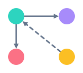
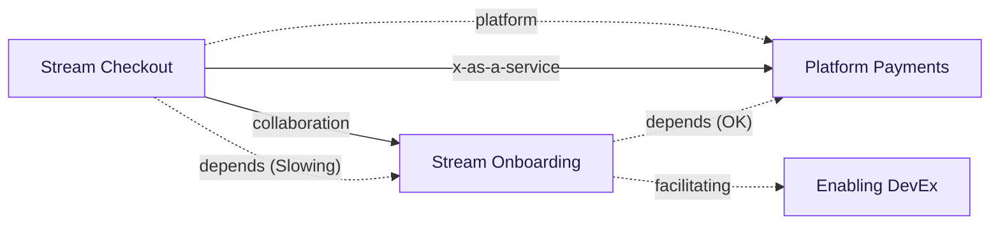
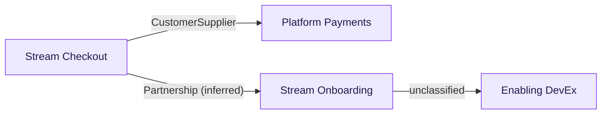
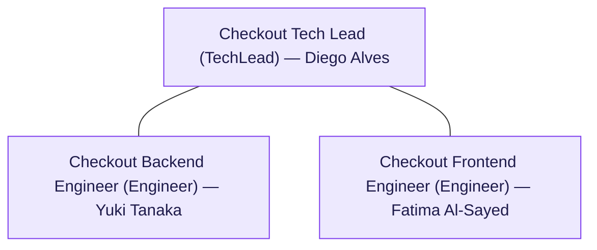

<div align="center">
  <br>
  <h1>TeamAPI</h1>
  <blockquote>Your org chart, compiled.</blockquote>

  [](https://github.com/JGalego/TeamAPI/actions/workflows/ci.yml) [](LICENSE)  
</div>

Inspired by [Team Topologies](https://teamtopologies.com/) and Domain-Driven Design, this toolchain turns a **Team API as Code** spec into organigrams, a REST API, and an MCP server for LLM assistants.

## Packages

| Package | Purpose |
|---|---|
| [`@teamapi/schema`](packages/schema) | Zod schemas + inferred types for the extended spec. |
| [`@teamapi/core`](packages/core) | `$ref` resolution, org graph, cognitive load, context mapping, Mermaid/DOT diagram generation. |
| [`@teamapi/rest-api`](packages/rest-api) | Read-only Fastify REST API over a resolved org graph. |
| [`@teamapi/mcp-server`](packages/mcp-server) | MCP server exposing the same data as tools. |
| [`@teamapi/cli`](packages/cli) | `teamapi` CLI: validate, render, scaffold, serve-api, serve-mcp. |

## Quick start

```bash
pnpm install
pnpm build

teamapi validate "examples/acme-org/**/teamapi.yml"
teamapi render "examples/acme-org/**/teamapi.yml" --scope topology
teamapi serve-api "examples/acme-org/**/teamapi.yml" --port 3000
teamapi serve-mcp "examples/acme-org/**/teamapi.yml"     # point Claude Desktop/Code at this command
```

(CI/non-interactive builds skip the link automatically. Prefer not to have `build` touch your global
npm links at all? The same example org is also wired up as root scripts that need no linking:
`pnpm example:validate`, `pnpm example:render`, `pnpm example:serve-api`, `pnpm example:serve-mcp`.)

## Examples

Everything below is generated live from [`examples/acme-org/`](examples/acme-org): a platform team
(payments + ledger), two stream-aligned teams (checkout, onboarding), and one enabling team (devex).

**Team-interaction organigram** — `teamapi render "examples/acme-org/**/teamapi.yml" --scope topology`



**DDD context map** — same interactions, reinterpreted as DDD relationships: explicit
`contextMappingPattern`s are used where a team declares one, otherwise inferred from the Team
Topologies interaction mode (`x-as-a-service` → Open Host Service, `collaboration` → Partnership;
`facilitating` is left unclassified — it's coaching, not a runtime integration).
`teamapi render "examples/acme-org/**/teamapi.yml" --scope context-map`



**Role hierarchy** — `roles[]`/`reportsTo` annotated with the `members[]` filling each seat, laid
out top-down like a conventional org chart (manager above, reports below, plain connectors).
`teamapi render "examples/acme-org/**/teamapi.yml" --scope hierarchy --team stream-checkout`



**REST API** — `curl http://127.0.0.1:3000/cognitive-load`

```json
[
  {
    "teamId": "platform-payments",
    "total": 18,
    "label": "elevated",
    "assessment": {
      "intrinsic": 7,
      "extraneous": 5,
      "germane": 6,
      "notes": "PCI compliance scope adds real intrinsic complexity; onboarding docs need work."
    }
  },
  {
    "teamId": "stream-checkout",
    "total": 18,
    "label": "overloaded",
    "assessment": {
      "intrinsic": 6,
      "extraneous": 8,
      "germane": 4,
      "notes": "High extraneous load from juggling three upstream integrations (payments, onboarding, fulfillment) with inconsistent contracts; a strong candidate for an anticorruption layer."
    }
  },
  {
    "teamId": "stream-onboarding",
    "total": 11,
    "label": "sustainable",
    "assessment": { "intrinsic": 4, "extraneous": 2, "germane": 5, "notes": "Well-bounded domain, low incidental complexity." }
  }
]
```

**MCP** — an assistant calling `find_service_owner` with `{ "serviceName": "checkout-api" }`:

```json
{
  "teamId": "stream-checkout",
  "service": {
    "name": "checkout-api",
    "versioning": { "type": "semantic" },
    "repository": "https://github.com/acme-example/checkout-api",
    "boundedContext": {
      "ubiquitousLanguage": [
        { "term": "Cart", "definition": "An in-progress, unpaid order" },
        { "term": "Order", "definition": "A cart that has been placed and paid for" }
      ],
      "aggregates": ["Cart", "Order"],
      "publishedEvents": ["OrderPlaced"],
      "subscribedEvents": ["ChargeAuthorized", "ApplicantActivated"]
    }
  }
}
```

## CLI

After `pnpm build` (see [Quick start](#quick-start)) `teamapi` is on your PATH — run commands
directly as `teamapi <command> ...` from anywhere. If you built with `CI=true` (linking is skipped
there), use `pnpm teamapi <command> ...` from the repo root instead.

- `teamapi validate <patterns...>` — resolve every `$ref` transitively and report unresolved refs.
- `teamapi render <patterns...> --scope topology|hierarchy|context-map [--format mermaid|dot] [--team <id>] [--out <file>]`
- `teamapi scaffold <id> --type <type> [--name <name>] --out <file>` — generate a minimal, schema-valid document.
- `teamapi serve-api <patterns...> [--port 3000]`
- `teamapi serve-mcp <patterns...>`

## REST API

`GET /teams`, `/teams/:id`, `/teams/:id/interactions`, `/teams/:id/dependencies`, `/teams/:id/roles`,
`/services`, `/services/:name`, `/search?q=`, `/graph`, `/diagrams/topology`, `/diagrams/hierarchy/:teamId`,
`/context-map`, `/cognitive-load`, `/cognitive-load/:teamId`, `/health`.

Interactive docs (Swagger UI, with a "Try it out" button for every endpoint) are served at
**`/docs`** once `serve-api` is running (e.g. `http://127.0.0.1:3000/docs`); the raw OpenAPI 3
document is at `/docs/json`.

## MCP tools

`list_teams`, `get_team`, `get_team_roles`, `get_team_cognitive_load`, `find_service_owner`,
`list_services`, `get_team_interactions`, `get_context_map`, `render_org_diagram`, `search_org`,
`get_org_graph`, `get_org_cognitive_load_report`.
