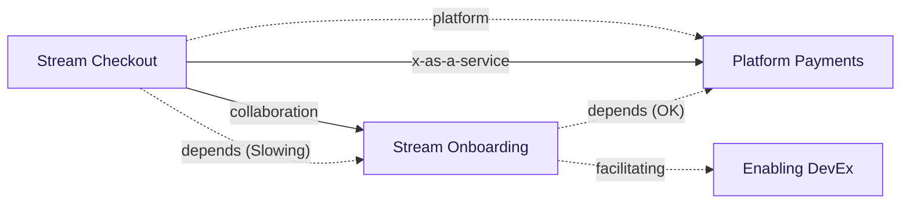
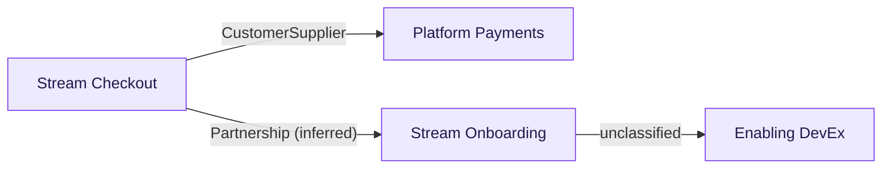
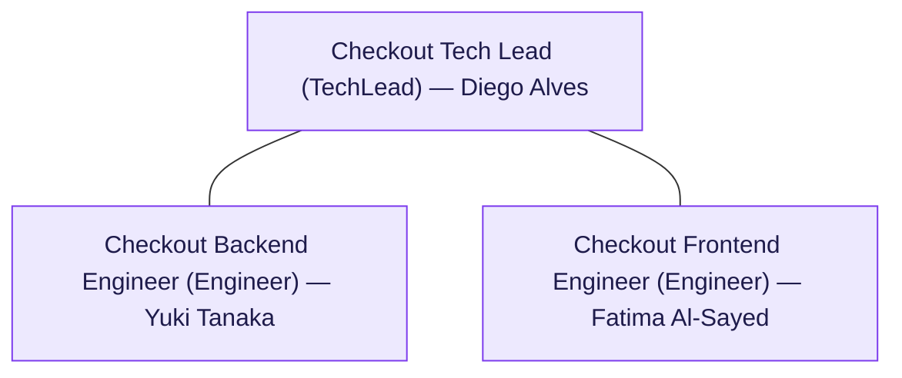
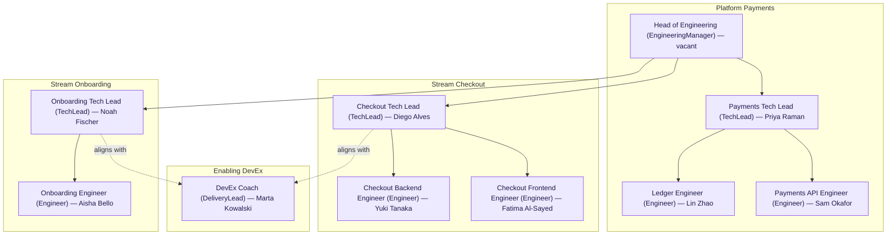

<div align="center">
  <br>
  <h1>TeamAPI</h1>
  <p>Your org chart, compiled.</p>

  [](https://github.com/JGalego/TeamAPI/actions/workflows/ci.yml) [](LICENSE)  
</div>

Write your org as a **Team API as Code** spec — one YAML file per team — and this toolchain turns it into organigrams, a REST API, an MCP server for LLM assistants, and config for other tools like [CrewAI](https://crewai.com/).

Inspired by [Team Topologies](https://teamtopologies.com/) and [Domain-Driven Design (DDD)](https://en.wikipedia.org/wiki/Domain-driven_design).

## 🧭 Contents

- [🚀 Quick start](#quick-start)
- [📦 What you get](#what-you-get)
- [📊 Diagrams](#diagrams)
  - [🔀 Team-interaction organigram](#team-interaction-organigram)
  - [🗺️ DDD context map](#ddd-context-map)
  - [🧑‍💼 Role hierarchy](#role-hierarchy)
  - [🏢 Org-wide role hierarchy](#org-wide-role-hierarchy)
- [🔌 REST API](#rest-api)
- [🤖 MCP tools](#mcp-tools)
- [💬 Chat](#chat)
- [⚙️ Generators](#generators)
  - [▶️ Running it](#running-it)
- [💻 CLI reference](#cli-reference)

<a id="quick-start"></a>

## 🚀 Quick start

Install dependencies and build every package

```bash
pnpm install
pnpm build
```

Then run any `teamapi` command against **ACME Org**, the small sample company bundled with this repo at [`examples/acme-org`](examples/acme-org):

```bash
teamapi validate examples/acme-org
teamapi render examples/acme-org --scope topology
teamapi serve-api examples/acme-org --port 3000
teamapi serve-mcp examples/acme-org     # point Claude Desktop/Code at this command
```

ACME Org is a small, fictional e-commerce company that ships payments and checkout software. Platform Payments runs the payments and ledger services that everyone else depends on; Stream Checkout owns the cart and checkout flow; Stream Onboarding handles sign-up and KYC; and Enabling DevEx coaches the other three on testing and delivery practices. Every example in this README runs against ACME Org, so you can try everything below right now — no setup beyond the two commands above.

<a id="what-you-get"></a>

## 📦 What you get

Render [diagrams](#diagrams) from the spec — team-interaction organigrams, DDD context maps, and role hierarchies — as Mermaid or DOT. Query it live through a read-only [REST API](#rest-api) with interactive Swagger docs, or an [MCP server](#mcp-tools) that exposes the same data as tools an LLM assistant can call. [Chat](#chat) with a team or a specific team member instead of querying it directly. Or turn it into config for other tools, like [CrewAI](https://docs.crewai.com/), with the built-in [generators](#generators). See the [CLI reference](#cli-reference) for every command and flag.

<a id="diagrams"></a>

## 📊 Diagrams

Four kinds of diagram, rendered from ACME Org's resolved org graph as Mermaid or DOT: run `teamapi render <patterns> --scope <scope>`, where `<scope>` is `topology`, `context-map`, `hierarchy` (needs `--team <id>`), or `org-hierarchy`. Add `--format dot` for Graphviz, or `--out <file>` to write to disk instead of stdout.

<a id="team-interaction-organigram"></a>

#### 🔀 Team-interaction organigram: `--scope topology`

Who talks to whom, and how tightly.



<a id="ddd-context-map"></a>

#### 🗺️ DDD context map: `--scope context-map`

The same relationships, focused on how the underlying software should actually fit together.

Reinterprets the same interactions as DDD relationships: an explicit `contextMappingPattern` wins where a team declares one, otherwise it's inferred from the Team Topologies interaction mode (`x-as-a-service` → Open Host Service, `collaboration` → Partnership; `facilitating` is left unclassified — it's coaching, not a runtime integration).



<a id="role-hierarchy"></a>

#### 🧑‍💼 Role hierarchy: `--scope hierarchy --team stream-checkout`

Who reports to whom on one team, and who's actually sitting in each seat.

`roles[]`/`reportsTo` annotated with the `members[]` filling each seat, laid out top-down like a conventional org chart (manager above, reports below).



<a id="org-wide-role-hierarchy"></a>

### 🏢 Org-wide role hierarchy: `--scope org-hierarchy`

The same reporting lines, zoomed out to the whole company.

Every team's roles, grouped into one box per team: a solid `reports to` arrow for formal reporting (`reportsTo`/`reportsToRef`, same-team or cross-team) and a dashed `aligns with` arrow for `alignsWith` (dotted-line/matrix relationships, e.g. a community-of-practice lead a role coordinates with but doesn't report to).



<a id="rest-api"></a>

## 🔌 REST API

Prefer clicking over typing? `teamapi serve-api examples/acme-org --port 3000` spins up a live REST API over ACME Org. Open **`/docs`** for a full Swagger UI — every endpoint has a "Try it out" button — or grab `/docs/json` for the raw OpenAPI spec.

| Endpoint | Returns |
|---|---|
| `GET /teams`, `/teams/:id` | Team list / a single team |
| `GET /teams/:id/interactions`, `/teams/:id/dependencies`, `/teams/:id/roles` | Team detail slices |
| `GET /services`, `/services/:name` | Service catalog |
| `GET /search?q=` | Free-text search across teams, services, roles, members |
| `GET /graph` | The full resolved org graph |
| `GET /diagrams/topology`, `/diagrams/hierarchy/:teamId`, `/diagrams/org-hierarchy` | Diagram data |
| `GET /context-map` | DDD context map |
| `GET /cognitive-load`, `/cognitive-load/:teamId` | Cognitive load assessments |
| `GET /health` | Health check |

**Example:** <code>curl http://127.0.0.1:3000/cognitive-load</code>

```json
[
  {
    "teamId": "platform-payments",
    "total": 18,
    "label": "elevated",
    "assessment": {
      "intrinsic": 7,
      "extraneous": 5,
      "germane": 6,
      "notes": "PCI compliance scope adds real intrinsic complexity; onboarding docs need work."
    }
  },
  {
    "teamId": "stream-checkout",
    "total": 18,
    "label": "overloaded",
    "assessment": {
      "intrinsic": 6,
      "extraneous": 8,
      "germane": 4,
      "notes": "High extraneous load from juggling three upstream integrations (payments, onboarding, fulfillment) with inconsistent contracts; a strong candidate for an anticorruption layer."
    }
  },
  {
    "teamId": "stream-onboarding",
    "total": 11,
    "label": "sustainable",
    "assessment": { "intrinsic": 4, "extraneous": 2, "germane": 5, "notes": "Well-bounded domain, low incidental complexity." }
  }
]
```

<a id="mcp-tools"></a>

## 🤖 MCP tools

Prefer just asking? `teamapi serve-mcp examples/acme-org` starts an MCP server you can point Claude Desktop or Claude Code at. Then ask about ACME Org like you'd ask a colleague — "who owns checkout-api?", "which team's overloaded?" — no query language needed.

`list_teams`, `get_team`, `get_team_roles`, `get_team_cognitive_load`, `find_service_owner`, `list_services`, `get_team_interactions`, `get_context_map`, `render_org_diagram`, `search_org`, `get_org_graph`, `get_org_cognitive_load_report`.

**Example:** an assistant calling <code>find_service_owner</code> with <code>{ "serviceName": "checkout-api" }</code>

```json
{
  "teamId": "stream-checkout",
  "service": {
    "name": "checkout-api",
    "versioning": { "type": "semantic" },
    "repository": "https://github.com/acme-example/checkout-api",
    "boundedContext": {
      "ubiquitousLanguage": [
        { "term": "Cart", "definition": "An in-progress, unpaid order" },
        { "term": "Order", "definition": "A cart that has been placed and paid for" }
      ],
      "aggregates": ["Cart", "Order"],
      "publishedEvents": ["OrderPlaced"],
      "subscribedEvents": ["ChargeAuthorized", "ApplicantActivated"]
    }
  }
}
```

<a id="chat"></a>

## 💬 Chat

Want to talk to a team instead of querying it? `teamapi chat examples/acme-org --team stream-checkout` starts an interactive session where the assistant speaks as that team — or, with `--member <id>`, as one specific person on it. It's backed by a live tool-use loop over the same org-graph operations the MCP server exposes, so it can accurately answer questions about any team, not just its own. Requires `ANTHROPIC_API_KEY` in your environment.

```bash
export ANTHROPIC_API_KEY=sk-ant-...
teamapi chat examples/acme-org --team stream-checkout --member diego-alves
```

**Example:**

```
Chatting as Diego Alves (model: claude-opus-4-8). Type 'exit' or Ctrl+D to quit.

You> is payments overloaded right now?
Diego Alves> Checked Platform Payments' latest self-assessment — they're running "elevated,"
not overloaded. PCI compliance scope is adding real intrinsic load, and their onboarding docs
could use work, but nothing critical right now.
```

<a id="generators"></a>

## ⚙️ Generators

Want your teams to double as AI agents? `teamapi generate crewai examples/acme-org --out ./crews` turns each team into a [CrewAI](https://docs.crewai.com/) crew — roles become agents, responsibilities become tasks. Give a responsibility an optional `doneWhen` and it becomes that task's `expected_output`; without one, you get a generic status-report stand-in instead.

**Example:** <code>crews/platform-payments/agents.yaml</code>

```yaml
tech_lead:
  role: Payments Tech Lead
  goal: >-
    Ensure that Payments platform architecture; On-call escalation point.
  backstory: >-
    You are the Payments Tech Lead (TechLead) on Platform Payments, which focuses on: Provide
    payment processing and ledger capabilities as internal platform services. The team owns:
    payments-api, ledger.
```

<a id="running-it"></a>

### ▶️ Running it

`crewai create crew acme_payments` scaffolds a project with its own `config/agents.yaml` and `config/tasks.yaml` — replace those with ours, then wire them up in `crew.py`:

```python
from crewai import Agent, Crew, Process, Task
from crewai.project import CrewBase, agent, crew, task

@CrewBase
class AcmePaymentsCrew:
    agents_config = "config/agents.yaml"
    tasks_config = "config/tasks.yaml"

    @agent
    def head_of_engineering(self) -> Agent:
        return Agent(config=self.agents_config["head_of_engineering"])

    @agent
    def tech_lead(self) -> Agent:
        return Agent(config=self.agents_config["tech_lead"])
    # ...one @agent method per key in agents.yaml

    @task
    def tech_lead_task_2(self) -> Task:
        return Task(config=self.tasks_config["tech_lead_task_2"])
    # ...one @task method per key in tasks.yaml

    @crew
    def crew(self) -> Crew:
        return Crew(
            agents=[self.tech_lead()],     # everyone except the manager
            tasks=self.tasks,
            process=Process.hierarchical,  # this crew's "process" in org.yaml
            manager_agent=self.head_of_engineering(),  # this crew's "managerAgent"
        )

AcmePaymentsCrew().crew().kickoff()
```

For a crew `org.yaml` marks `sequential` (most of them), skip `process`/`manager_agent` entirely — just `Crew(agents=self.agents, tasks=self.tasks)`.

<a id="cli-reference"></a>

## 💻 CLI reference

After `pnpm build` (see [Quick start](#quick-start)) `teamapi` is on your PATH — run commands directly as `teamapi <command> ...` from anywhere. If you built with `CI=true` (linking is skipped there), use `pnpm teamapi <command> ...` from the repo root instead.

| Command | Purpose |
|---|---|
| `teamapi validate <patterns...>` | Resolve every `$ref` transitively and report unresolved refs |
| `teamapi render <patterns...> --scope topology\|hierarchy\|context-map\|org-hierarchy [--format mermaid\|dot] [--team <id>] [--out <file>]` | Render a diagram |
| `teamapi scaffold <id> --type <type> [--name <name>] --out <file>` | Generate a minimal, schema-valid document |
| `teamapi generate crewai <patterns...> [--team <id>] --out <dir>` | Generate CrewAI agent/task config |
| `teamapi serve-api <patterns...> [--port 3000]` | Start the REST API |
| `teamapi serve-mcp <patterns...>` | Start the MCP server |
| `teamapi chat <patterns...> --team <id> [--member <id>] [--model <id>]` | Chat as a team or team member (requires `ANTHROPIC_API_KEY`) |

`<patterns...>` accepts file paths, globs, or a directory (auto-discovers every `teamapi.yml`/`.yaml` under it).
