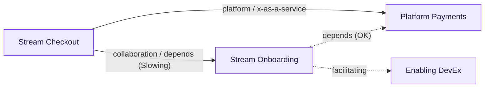
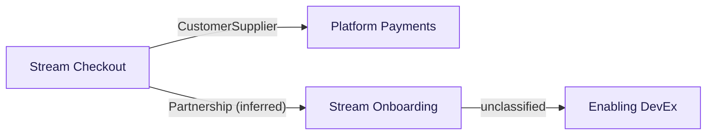
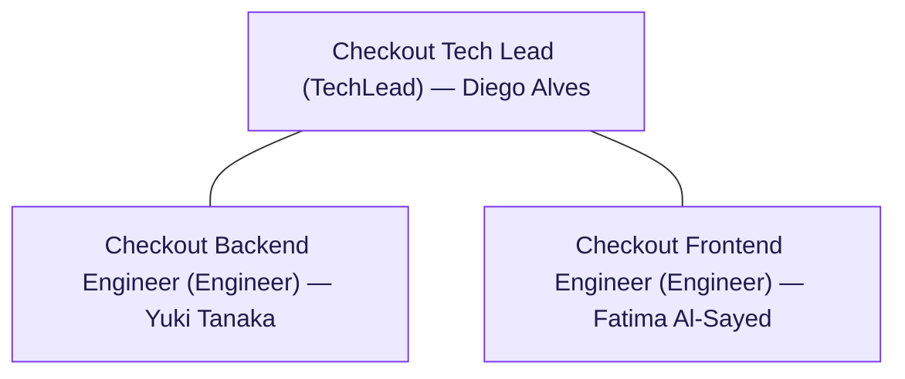
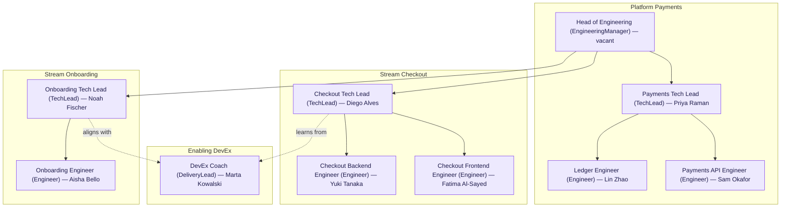

<div align="center">
  <picture>
    <source media="(prefers-reduced-motion: reduce)" srcset="docs/assets/logo.svg">
    
  </picture><br>
  <h1>TeamAPI</h1>
  <p>Who owns this? Just <code>curl</code> your org.</p>

[](https://github.com/JGalego/TeamAPI/actions/workflows/ci.yml)
[](https://www.npmjs.com/package/@jgalego/teamapi)
[](https://socket.dev/npm/package/@jgalego/teamapi)
[](LICENSE)
[](https://nodejs.org)
[](https://www.typescriptlang.org)

</div>

Every team has an API: what it owns, who's accountable for what, how to ask it for things, how much it can take on. Usually this information is scattered across wikis, onboarding docs, and people's heads, where it drifts out of date.

[Team API as Code](docs/spec/teamapi-extended-v1.md) solves this by writing it all down: one `teamapi.yml` per team declaring `services`, `roles`, `members`, `interactions`, and `cognitiveLoad` — reviewed in pull requests and versioned in git.

**TeamAPI** makes that spec executable. It renders diagrams, serves a read-only REST API and an MCP server for LLM assistants, gives any team a chat persona, and generates config for tools like [CrewAI](https://crewai.com/) and [Backstage](https://backstage.io/).

The format is a superset of [TeamTopologies/TeamAPI-As-Code](https://github.com/TeamTopologies/TeamAPI-As-Code), adding roles, people, and cognitive load. The concept comes from [Team Topologies](https://teamtopologies.com/); the bounded-context and context-map vocabulary from [Domain-Driven Design](https://en.wikipedia.org/wiki/Domain-driven_design).

> 📖 Everything below is also published, with navigation and a version for each release, at **[teamapi.dev/latest](https://teamapi.dev/latest/)**. If you are on an older version, read that version's page rather than this one — this file describes `main`.

## 🧭 Contents

- [🚀 Quick start](#quick-start)
- [📚 Examples](#examples)
- [🧠 AI-native team knowledge](#ai-native)
- [📊 Diagrams](#diagrams)
  - [🔀 Team-interaction organigram](#team-interaction-organigram)
  - [🗺️ DDD context map](#ddd-context-map)
  - [🧑‍💼 Role hierarchy](#role-hierarchy)
  - [🏢 Org-wide role hierarchy](#org-wide-role-hierarchy)
- [🔌 REST API](#rest-api)
  - [📄 Paging and caching](#rest-api)
  - [🔎 Semantic search](#rest-api)
  - [📈 Scale](#scale)
- [🖥️ Dashboard](#dashboard)
- [✏️ Proposals](#proposals)
- [🐳 Docker](#docker)
- [🤖 MCP tools](#mcp-tools)
  - [🌐 One endpoint for the whole org](#mcp-http)
- [💬 Chat](#chat)
  - [🔀 Which model](#chat)
  - [🤖 One question, one answer](#chat)
- [⚙️ Generators](#generators)
  - [▶️ Running it](#running-it)
  - [🗂️ Backstage catalog](#backstage-catalog)
  - [👥 CODEOWNERS](#codeowners)
  - [🤖 AGENTS.md](#agents-md)
  - [🚢 Port](#port)
  - [📡 OpenTelemetry](#opentelemetry)
- [📥 Import](#import)
- [🔄 Sync with GitHub teams](#apply)
- [✍️ Write back to Slack, Okta and PagerDuty](#apply-to)
- [💻 CLI reference](#cli-reference)
  - [🤖 Machine-readable output](#machine-readable)
  - [🔀 Versions and migration](#migrate)
  - [🧹 Formatting](#fmt)
  - [⚙️ Project config](#config)
  - [⚔️ Name conflicts](#name-conflicts)
- [✍️ Editor support](#editor-support)
- [🕰️ Org history](#org-history)
  - [📉 Trends](#org-history)
- [🕳️ Gaps](#gaps)
  - [🧾 Severity overrides and waivers](#gap-rules)
- [📋 Policy](#policy)
- [🧩 Topology](#topology)
- [🫥 Shadow AI](#shadow-ai)
- [🔁 CI integration](#ci-integration)
  - [🛰️ Drift watch](#drift-watch)
  - [📮 Weekly digest](#digest)
- [🔗 Paperclip](#paperclip)
- [💬 Slack](#slack)
- [📟 PagerDuty](#pagerduty)
- [🪪 Okta](#okta)
- [📈 Metrics](#metrics)
- [🩺 Checking an integration](#doctor)
- [🤝 Contributing](#contributing)

<a id="quick-start"></a>

## 🚀 Quick start

Install the CLI from npm:

```bash
npm install -g @jgalego/teamapi
```

Or clone and build from source:

```bash
git clone https://github.com/JGalego/TeamAPI.git && cd TeamAPI
pnpm install
pnpm build
```

Start your own org repository:

```bash
teamapi init my-org
cd my-org
teamapi validate      # no arguments needed — teamapi.config.yml says where to look
```

That writes a `teamapi.config.yml`, a CI workflow, VS Code settings binding the documents to the [published schema](#editor-support), a README, and a first stream-aligned and platform team. Every command in this README then works in that directory with no arguments.

Or try it against the sample org bundled with this repo, [`examples/acme-org`](examples/acme-org):

```bash
teamapi validate examples/acme-org
teamapi render examples/acme-org --scope topology
teamapi serve-api examples/acme-org --port 3000
teamapi serve-mcp examples/acme-org     # point Claude Desktop/Code at this command
```

[Examples](#examples) covers ACME Org and the other sample orgs, each modeled on a real company's topology.

<a id="examples"></a>

## 📚 Examples

Every example in this README runs against **ACME Org** ([`examples/acme-org`](examples/acme-org)), a small fictional e-commerce company: Platform Payments runs the `payments-api` and `ledger` services everyone else depends on, Stream Checkout owns the cart and checkout flow, Stream Onboarding handles sign-up and KYC, and Enabling DevEx coaches the other three on testing and delivery practices.

Five more fictional-but-recognizable orgs ship alongside it. Four model a real-world team topology; the fifth models a real-world failure mode:

| Example                                                  | Modeled after                        | Shape                                                                                                                           |
| -------------------------------------------------------- | ------------------------------------ | ------------------------------------------------------------------------------------------------------------------------------- |
| [`examples/reelstream-org`](examples/reelstream-org)     | Netflix-style streaming platform     | Full-cycle stream team (Recommendations) + a delivery platform team + a chaos-engineering enabling team                         |
| [`examples/meridian-pay-org`](examples/meridian-pay-org) | Stripe-style payments infrastructure | A billing stream team, a ledger/payments platform team, and a `complicated-subsystem` fraud-scoring team it can't safely absorb |
| [`examples/cartwell-org`](examples/cartwell-org)         | Amazon-style marketplace             | Two-pizza, single-threaded-owner teams (Search, Fulfillment) plus a seller-enablement team                                      |
| [`examples/wavelength-org`](examples/wavelength-org)     | Spotify-style squads/chapters        | A playlists squad, an audio-platform team, and a cross-squad chapter-coaching team                                              |
| [`examples/driftwood-org`](examples/driftwood-org)       | An org whose AI outran its org chart | Deliberately broken: an orphaned event contract, agents owned by someone who left, a vacant seat two teams report into          |

They work with every command in this README. Swap in the path, e.g. `teamapi render examples/meridian-pay-org --scope topology`. Driftwood validates cleanly like the rest but is built to fail [`teamapi gaps`](#gaps), making it the example for seeing findings from a new check.

<a id="ai-native"></a>

## 🧠 AI-native team knowledge

A team includes the AI agents working alongside its people, and the knowledge they all draw on. Both live as optional sections in the same `teamapi.yml` document as everything else:

| Section               | What it is                                                                                                                                                                             |
| --------------------- | -------------------------------------------------------------------------------------------------------------------------------------------------------------------------------------- |
| `agents[]`            | AI assistants treated as first-class team participants — provider, model, role, capabilities, permissions.                                                                             |
| `memory[]`            | Persistent organizational memory: architecture decisions, conventions, lessons learned, recurring issues.                                                                              |
| `specifications[]`    | Specification-driven-development artifacts — requirements/design/tasks/acceptance criteria, with a lifecycle, reviewers, approvals, and linked PRs/issues.                             |
| `steeringDocuments[]` | Coding standards, API conventions, security guidelines, architecture principles — inherited **organization → team → project** by walking the existing `platform` team-reference chain. |
| `prompts[]`           | A version-controlled, renderable prompt library (`{{variable}}` templating, with history).                                                                                             |
| `playbooks[]`         | Ordered operational procedures — incident response, release, onboarding — with required roles and automation hooks.                                                                    |
| `policies[]`          | Machine-readable governance (PR requirements, required approvals, security/dependency policy) for external automation to enforce.                                                      |
| `knowledgeBase[]`     | ADRs, FAQs, meeting notes, runbooks, design docs.                                                                                                                                      |
| `workflows[]`         | Process state machines (e.g. testing → approval → deployment → announcement), independent of any particular CI/CD system.                                                              |
| `sessions[]`          | A record of AI collaboration sessions: objective, prompts used, artifacts produced, decisions made.                                                                                    |

Every section is optional, so documents written before they existed keep validating unchanged. No migration is required. Like the rest of the toolchain, these sections are read-only: edited in git, never `POST`ed.

**Worked example: agents follow the same team boundaries as services.** In `examples/acme-org`, `platform-payments` runs a five-agent fleet (`architecture-reviewer`, `test-generator`, `security-scanner`, `docs-writer`, `compliance-auditor`). Each agent has a narrow enough scope that three can review the same OAuth pull request in parallel without contradicting each other; `memory/conways-law-for-agents` records why that split replaced a single do-everything agent. `stream-onboarding`, the only team touching raw KYC data, carries a `policies/no-agents-on-applicant-pii` entry and no `agents[]` at all. Its `GET /teams/stream-onboarding/agents` response is therefore a documented `[]`.

**Context bundles**: `POST /context` (or the `get_context_bundle` MCP tool) takes a goal such as `{ "goal": "Implement OAuth" }`, optionally scoped to one `teamId`. It returns the matching entries from those sections along with the scoped team's related teams, members, and services. Ranking uses keyword overlap, and each hit includes the `matchedTerms` behind its score. One call gives an assistant the task-specific part of the graph.

It also returns `seams[]`, listing every pair of teams spanned by the matched entries. Each item includes the declared interaction mode, or `undeclared: true` when neither team declares an edge to the other. Without that list, a scoped bundle can make a cross-team goal look as though it belongs to one team. An undeclared seam warns that the work is crossing a line nobody wrote down.

**The knowledge graph** (`GET /knowledge-graph`, `GET /knowledge-graph/:nodeId/traverse`, or the `get_knowledge_graph`/`traverse_knowledge_graph` MCP tools) links every team, person, agent, and document by ownership, role, team topology, and resolved cross-team `$ref` edges, for visualization or traversal tooling to consume.

Each section gets the same read-only REST shape — `GET /<plural>`, `GET /teams/:id/<plural>`, `GET /teams/:id/<plural>/:resourceId`, e.g. `/teams/platform-payments/prompts/code-review` — plus a matching `list_*`/`get_*` MCP tool pair, and all of them are covered by `GET /search?q=`. `POST /teams/:id/prompts/:promptId/render` (or `render_prompt`) fills a prompt's `{{variable}}` placeholders. Field-by-field reference: [`docs/spec/teamapi-extended-v1.md`](docs/spec/teamapi-extended-v1.md).

<a id="diagrams"></a>

## 📊 Diagrams

`teamapi render <patterns> --scope <scope>` renders the resolved org graph as Mermaid or DOT, where `<scope>` is `topology`, `context-map`, `hierarchy` (needs `--team <id>`), or `org-hierarchy`. Add `--format dot` for Graphviz, `--out <file>` to write to disk instead of stdout, or `--with-agents` to include declared agents in `org-hierarchy`. The diagrams below are ACME Org's.

<a id="team-interaction-organigram"></a>

### 🔀 Team-interaction organigram: `--scope topology`

Who talks to whom, and how tightly.


```mermaid
flowchart LR
  enabling_devex["Enabling DevEx"]
  platform_payments["Platform Payments"]
  stream_checkout["Stream Checkout"]
  stream_onboarding["Stream Onboarding"]
  stream_checkout -->|"platform / x-as-a-service"| platform_payments
  stream_checkout -->|"collaboration / depends (Slowing)"| stream_onboarding
  stream_onboarding -.->|"facilitating"| enabling_devex
  stream_onboarding -.->|"depends (OK)"| platform_payments
  classDef default fill:#ede9fe,stroke:#7c3aed,stroke-width:1px,color:#1e1b4b;
```

<a id="ddd-context-map"></a>

### 🗺️ DDD context map: `--scope context-map`

This view maps the same relationships to DDD patterns, showing how the underlying software should fit together. A team's explicit `contextMappingPattern` takes precedence. When none is declared, TeamAPI infers one from the Team Topologies interaction mode (`x-as-a-service` → `OpenHostService`, `collaboration` → `Partnership`). `facilitating` remains unclassified because it describes coaching, not a runtime integration.


```mermaid
flowchart LR
  enabling_devex["Enabling DevEx"]
  platform_payments["Platform Payments"]
  stream_checkout["Stream Checkout"]
  stream_onboarding["Stream Onboarding"]
  stream_checkout -->|"CustomerSupplier"| platform_payments
  stream_checkout -->|"Partnership (inferred)"| stream_onboarding
  stream_onboarding -->|"unclassified"| enabling_devex
  classDef default fill:#ede9fe,stroke:#7c3aed,stroke-width:1px,color:#1e1b4b;
```

<a id="role-hierarchy"></a>

### 🧑‍💼 Role hierarchy: `--scope hierarchy --team stream-checkout`

Who reports to whom on one team, and who's actually sitting in each seat: `roles[]`/`reportsTo` annotated with the `members[]` filling them, laid out top-down like a conventional org chart.


```mermaid
flowchart TD
  backend_engineer["Checkout Backend Engineer (Engineer) — Yuki Tanaka"]
  frontend_engineer["Checkout Frontend Engineer (Engineer) — Fatima Al-Sayed"]
  tech_lead["Checkout Tech Lead (TechLead) — Diego Alves"]
  tech_lead --- backend_engineer
  tech_lead --- frontend_engineer
  classDef default fill:#ede9fe,stroke:#7c3aed,stroke-width:1px,color:#1e1b4b;
```

<a id="org-wide-role-hierarchy"></a>

### 🏢 Org-wide role hierarchy: `--scope org-hierarchy`

The same reporting lines, zoomed out to the whole company, one box per team. A solid arrow is formal reporting (`reportsTo`/`reportsToRef`, same-team or cross-team); a dashed one is `alignsWith`, for the ties the hierarchy doesn't draw.

Add `--with-agents` to draw each team's declared `agents[]` too, hanging off the human whose `ownerId` names them by a dotted "supervises" edge. Agents are drawn as participants but never as boxes in the chart — an agent placed in the hierarchy the way a person is would imply accountability sits with it, when it never does. An agent nobody owns gets no incoming edge and visibly floats, which is exactly what it is.

Each `alignsWith[]` entry takes an optional `kind` — `aligns-with` (the default), `advises`, `learns-from`, or `community-of-practice` — naming the informal network work actually travels along. Those relationships tend to exist for months before anyone draws a box for them, so `teamapi gaps` also reports how many cross-team role relationships the reporting lines explain, and how many they don't.


```mermaid
flowchart TD
  subgraph enabling_devex["Enabling DevEx"]
    enabling_devex__coach["DevEx Coach (DeliveryLead) — Marta Kowalski"]
  end
  subgraph platform_payments["Platform Payments"]
    platform_payments__head_of_engineering["Head of Engineering (EngineeringManager) — vacant"]
    platform_payments__ledger_engineer["Ledger Engineer (Engineer) — Lin Zhao"]
    platform_payments__payments_engineer["Payments API Engineer (Engineer) — Sam Okafor"]
    platform_payments__tech_lead["Payments Tech Lead (TechLead) — Priya Raman"]
  end
  subgraph stream_checkout["Stream Checkout"]
    stream_checkout__backend_engineer["Checkout Backend Engineer (Engineer) — Yuki Tanaka"]
    stream_checkout__frontend_engineer["Checkout Frontend Engineer (Engineer) — Fatima Al-Sayed"]
    stream_checkout__tech_lead["Checkout Tech Lead (TechLead) — Diego Alves"]
  end
  subgraph stream_onboarding["Stream Onboarding"]
    stream_onboarding__engineer["Onboarding Engineer (Engineer) — Aisha Bello"]
    stream_onboarding__tech_lead["Onboarding Tech Lead (TechLead) — Noah Fischer"]
  end
  platform_payments__head_of_engineering --> platform_payments__tech_lead
  platform_payments__tech_lead --> platform_payments__payments_engineer
  platform_payments__tech_lead --> platform_payments__ledger_engineer
  stream_checkout__tech_lead --> stream_checkout__backend_engineer
  stream_checkout__tech_lead --> stream_checkout__frontend_engineer
  stream_onboarding__tech_lead --> stream_onboarding__engineer
  platform_payments__head_of_engineering --> stream_checkout__tech_lead
  stream_checkout__tech_lead -.->|"learns from"| enabling_devex__coach
  platform_payments__head_of_engineering --> stream_onboarding__tech_lead
  stream_onboarding__tech_lead -.->|"aligns with"| enabling_devex__coach
  classDef default fill:#ede9fe,stroke:#7c3aed,stroke-width:1px,color:#1e1b4b;
```

<a id="rest-api"></a>

## 🔌 REST API

`teamapi serve-api examples/acme-org --port 3000` spins up a live REST API over ACME Org. Open **`/docs`** for a Swagger UI with a "Try it out" button on every endpoint, or `/docs/json` for the raw OpenAPI spec.

| Endpoint                                                                           | Returns                                                                                                                                                                        |
| ---------------------------------------------------------------------------------- | ------------------------------------------------------------------------------------------------------------------------------------------------------------------------------ |
| `GET /teams`, `/teams/:id`                                                         | Team list / a single team                                                                                                                                                      |
| `GET /teams/:id/interactions`, `/teams/:id/dependencies`, `/teams/:id/roles`       | Team detail slices                                                                                                                                                             |
| `GET /services`, `/services/:name`                                                 | Service catalog                                                                                                                                                                |
| `GET /search?q=`                                                                   | Free-text search across teams, services, roles, members                                                                                                                        |
| `GET /graph`                                                                       | The full resolved org graph                                                                                                                                                    |
| `GET /diagrams/topology`, `/diagrams/hierarchy/:teamId`, `/diagrams/org-hierarchy` | Diagram data                                                                                                                                                                   |
| `GET /context-map`                                                                 | DDD context map                                                                                                                                                                |
| `GET /cognitive-load`, `/cognitive-load/:teamId`                                   | Cognitive load assessments                                                                                                                                                     |
| `GET /gaps`                                                                        | [Accountability holes between teams](#gaps)                                                                                                                                    |
| `GET /policy`, `/topology`                                                         | [Declared-policy outcomes](#policy) and [Team Topologies design smells](#topology)                                                                                             |
| `GET /<domain>`, `/teams/:id/<domain>`, `/teams/:id/<domain>/:resourceId`          | Any [AI-native section](#ai-native): `/agents`, `/memory`, `/specifications`, `/steering`, `/prompts`, `/playbooks`, `/policies`, `/knowledge-base`, `/workflows`, `/sessions` |
| `POST /teams/:id/prompts/:promptId/render`                                         | Fill a prompt's `{{variable}}` placeholders                                                                                                                                    |
| `POST /context`                                                                    | [Context bundle](#ai-native) for a stated goal                                                                                                                                 |
| `GET /knowledge-graph`, `/knowledge-graph/:nodeId/traverse`                        | [Knowledge graph](#ai-native) traversal                                                                                                                                        |
| `GET /health`                                                                      | Health check                                                                                                                                                                   |

**Example:** `curl http://127.0.0.1:3000/cognitive-load` — note `supervision`, the optional load of supervising a team's AI agents. It stays out of `total` (whose thresholds are calibrated against the three Team Topologies types), but it's one of the label's independent triggers, on the same thresholds as `extraneous` — a team drowning in agent review shouldn't be able to report "sustainable" on the strength of three modest other scores. A team that hasn't scored it is unaffected.

```json
[
  {
    "teamId": "platform-payments",
    "total": 18,
    "label": "elevated",
    "assessment": {
      "intrinsic": 7,
      "extraneous": 5,
      "germane": 6,
      "supervision": 6,
      "notes": "PCI compliance scope adds real intrinsic complexity; onboarding docs need work. Supervising the agent fleet costs about a day a week across the team and appears on nobody's role description."
    }
  },
  {
    "teamId": "stream-checkout",
    "total": 18,
    "label": "overloaded",
    "assessment": {
      "intrinsic": 6,
      "extraneous": 8,
      "germane": 4,
      "notes": "High extraneous load from juggling three upstream integrations (payments, onboarding, fulfillment) with inconsistent contracts; a strong candidate for an anticorruption layer."
    }
  },
  {
    "teamId": "stream-onboarding",
    "total": 11,
    "label": "sustainable",
    "assessment": {
      "intrinsic": 4,
      "extraneous": 2,
      "germane": 5,
      "notes": "Well-bounded domain, low incidental complexity."
    }
  }
]
```

### 📄 Paging and caching

Every collection route takes `limit` and `offset`, and answers with `X-Total-Count` plus an RFC 8288 `Link` header carrying `first`/`prev`/`next`/`last`:

```bash
curl -sD- 'http://127.0.0.1:3000/teams?limit=2&offset=2' -o /dev/null | grep -i '^link\|^x-total'
```

```text
x-total-count: 4
link: </teams?limit=2&offset=0>; rel="first", </teams?limit=2&offset=0>; rel="prev", </teams?limit=2&offset=2>; rel="last"
```

The body stays an array, with pagination data in headers. An `{ items, total, next }` envelope would have broken every existing consumer when pagination shipped, including the dashboard, generators, and user scripts, while adding information the headers already carry. There is **no default page size**. A caller that previously read all 400 teams from `GET /teams` must not begin reading only 100 without any indication. Pagination starts only when the caller requests it.

Every `GET` also carries a strong `ETag` and honours `If-None-Match`:

```bash
curl -s -o /dev/null -w '%{http_code}\n' -H 'If-None-Match: "<etag>"' http://127.0.0.1:3000/graph
# 304
```

The validator is derived from the response body, not from the graph's `resolvedAt`. That timestamp changes on every reload — every `--watch` trigger, every `POST /reload`, every SIGHUP — including the common case where a document was touched and nothing a given endpoint returns actually changed. Hashing the body means the graph can be re-resolved a hundred times and `/teams` keeps the same `ETag` until `/teams` genuinely differs.

### 🔎 Semantic search

`GET /search` matches substrings, which answers "checkout-api" perfectly and "who owns the thing that charges cards" not at all. Start the server with `--embeddings` and `mode=hybrid` adds embedding similarity on top:

```bash
# Against a model on your own machine — no key, and no team document leaving it.
teamapi serve-api examples/acme-org --embeddings --embeddings-url http://localhost:11434/v1 \
  --embeddings-model nomic-embed-text

curl -s 'http://127.0.0.1:3000/search?q=who+handles+card+payments&mode=hybrid' | jq '.[0]'
```

```json
{
  "kind": "service",
  "teamId": "platform-payments",
  "label": "payments-api",
  "similarity": 0.61,
  "matchedBy": "semantic"
}
```

**Hybrid search keeps exact matches first.** Embeddings help when a question shares no words with the documents. They hurt a query such as `checkout-api`, where the searcher knows the exact name and nearest-neighbour search may return several similar services. A lexical hit, an exact substring of something the org wrote down, therefore ranks above every semantic-only result. The scores are not blended because they use different scales, and this project has no benchmark for tuning a weighting between them. A result found both ways is marked `both` and ranks strongest.

`POST /context` takes `semantic: true` for the same treatment. `matchedTerms` still says which goal words matched, so a bundle stays explicable even when similarity is what moved an entry up.

Without a configured model, both return **400 naming the required flag**. They do not silently return substring results for a semantic-search request.

Vectors are cached on disk (`.teamapi-cache/embeddings`, keyed by content _and_ model id), because a `--watch` server otherwise re-embeds the whole org every time anyone saves a file.

### 🔒 Exposing it beyond localhost

The API binds `127.0.0.1` and requires no credential. That default fits a laptop or local checkout used by one person. Once the port is reachable elsewhere, it exposes the full org graph: every person in the company, their contact details, and who reports to whom.

TeamAPI **refuses** to bind a non-loopback address without a token:

```console
$ teamapi serve-api examples/acme-org --host 0.0.0.0
Refusing to listen on 0.0.0.0 without a token: this would serve the whole org graph,
including every member's contact details, to anything that can reach this port.
Pass --token <token> (or set TEAMAPI_API_TOKEN), or --allow-anonymous if that is really what you want.
```

A warning would scroll past in a terminal nobody is watching, and an exposed server looks exactly like a working one.

| Flag                        | Effect                                                                    |
| --------------------------- | ------------------------------------------------------------------------- |
| `--host <host>`             | Address to bind (default `127.0.0.1`)                                     |
| `--token <token>`           | Require `Authorization: Bearer <token>`; defaults to `$TEAMAPI_API_TOKEN` |
| `--cors-origin <origin…>`   | Allow cross-origin browser requests from these origins (default: none)    |
| `--rate-limit <per-minute>` | Cap requests per minute per client IP (default: no limit)                 |
| `--allow-anonymous`         | Serve a reachable address with no token anyway                            |

```bash
TEAMAPI_API_TOKEN=$(openssl rand -hex 32) teamapi serve-api examples/acme-org \
  --host 0.0.0.0 --rate-limit 120 --cors-origin https://intranet.example
```

`/health` stays open so liveness probes work, and `/slack/*` keeps authenticating with Slack's own request signature — which is stronger than a shared token, and the only thing Slack can actually send. Everything else needs the token.

Token comparison is constant-time, and a rejection never echoes the presented credential back into the response or the logs. Failed attempts are counted by the rate limiter, so a token can't be guessed at line rate.

### 🔄 Staying current

Both servers resolve the graph once at startup. `--watch` keeps it current:

```bash
teamapi serve-api examples/acme-org --watch
teamapi serve-mcp examples/acme-org --watch
```

Three events use the same reload path: a watched document changes, `POST /reload` is called (mount it without watching via `--reload-endpoint` for a post-receive webhook), or the process receives `SIGHUP`.

Watching is anchored on the directory you pointed at, and seed discovery re-runs on every reload, so a **new** `teamapi.yml` is picked up rather than only edits to the files that existed at startup.

A failed reload never replaces a working graph. A document saved by an editor is briefly truncated, and a reload landing in that window would otherwise resolve an org missing half its teams — so the store publishes only on success, logs the failure, and keeps answering from the last good state until the file is valid again:

```text
Reload failed, still serving the last good graph: Invalid Team API document at …
Reloaded: 4 team(s), 0 unresolved reference(s).
```

`--watch` matters most for `serve-mcp`: an assistant holds that connection open for an entire session, so without it the answers come from whatever the org looked like when the editor started.

<a id="scale"></a>

### 📈 Scale

Resolution loads a whole BFS level at once. Org-graph levels are often wide; every team served by a platform team sits on one level. Loading documents serially made resolution time equal the _sum_ of every round trip. Concurrent loading reduces it to the slowest round trip at each level.

Documents are still **processed** in a fixed order even though they're loaded concurrently, so first-writer-wins decisions (which document owns a duplicated team id, in what order unresolved references are reported) never depend on which fetch happened to return first. Two runs over the same seeds produce byte-identical graphs, and there's a test that pins exactly that against a 400-team fixture at concurrency 1, 8 and 64.

`https://` refs also get an on-disk cache, enabled by default for the CLI. A fresh entry is served without a request. A stale one is revalidated with `If-None-Match`, and a 304 response carries no body. The cache is advisory: an unwritable, missing, or corrupt cache falls back to a plain fetch without failing the build.

| Variable                      | Default               | Meaning                                              |
| ----------------------------- | --------------------- | ---------------------------------------------------- |
| `TEAMAPI_CACHE_DIR`           | `.teamapi-cache/http` | Where cached remote documents live.                  |
| `TEAMAPI_NO_CACHE`            | unset                 | Any non-empty value resolves without the cache.      |
| `TEAMAPI_RESOLVE_CONCURRENCY` | `8`                   | Documents in flight at once; `1` is strictly serial. |

These settings use environment variables because `teamapi.config.yml` lives in the repository and describes the _org_, while a cache directory belongs to the _machine_. CI needs it where the cache action can restore it; a container needs it on a writable volume.

`pnpm bench:resolve` measures resolver limits. It generates a synthetic org of any size and resolves it at several concurrency levels, either from a whole directory (what `teamapi validate ./org` does) or from a single root document whose `$ref`s reach the rest (what a remote org looks like). At 5ms per document, a 200-team org resolves like this:

```text
200 teams @ 5ms/doc
  seeds=all  concurrency      total   speedup
                        1   1235ms
                        8    185ms   6.7x
                       32     95ms   13.0x
```

On a local filesystem the loads are already cheap enough that the win is nearer 1.6x, and 1000 teams resolve in about a third of a second.

<a id="dashboard"></a>

## 🖥️ Dashboard

The same `teamapi serve-api` process serves a live dashboard at **`/dashboard`**. Its static HTML/CSS/JS fetches the running REST API, with no separate process or build step. It shows every team with its type and focus, free-text search, and a tabbed diagram viewer (`topology` / `org-hierarchy` / `context-map`) rendered client-side with [Mermaid](https://mermaid.js.org/). Each team has a cognitive-load bar coded by color and icon, plus a separate 🤖 chip for supervision load. Keeping supervision out of the bar gives its width the same meaning for every team. Sections load independently, so a blocked CDN only disables the diagram tab; the team list, cognitive load, and search keep working.


A **Health** section runs all three graph-only checks at once — [gaps](#gaps), [policy](#policy), and [topology](#topology) — as counts plus a combined finding list sorted most-serious-first, so a blocking finding is never buried under twenty warnings. These are served by `GET /gaps`, `/policy` and `/topology`, all pure functions of the resolved graph, and each is fetched independently: a server built before `/policy` and `/topology` existed shows those two as unavailable rather than blanking the section.

**Clicking a team** opens a detail panel: its roles (with vacancies marked, since a vacancy is what `gaps` escalates when another team reports into it), members and contacts, services, declared agents and who owns each, and its interactions and dependencies. Cards are keyboard-operable, not mouse-only.


```bash
teamapi serve-api examples/acme-org --port 3000
open http://127.0.0.1:3000/dashboard
```


Four more sections expose data that was already available through the API:

- **AI agents** — the whole fleet, with counts by status and provider. Every agent with **no human owner** is marked in red. Without that mark, downstream consumers such as `AGENTS.md`, context bundles, and generated crews present an unowned agent exactly like one with a real owner.
- **Sessions** — what was actually built with an assistant, newest first.
- **Context map** — as a list beside the diagram, because the diagram can show the relationships but not the **conflicts**: two teams describing one relationship differently. Conflicts are listed first, unconditionally; a disagreement buried under thirty healthy relationships is a disagreement nobody acts on.
- **Knowledge graph** — a node picker and depth control for walking the graph. Drawing the entire graph would be unreadable; selecting a node answers questions such as "what's connected to this ADR?"

Every section fetches independently and says so when it fails, so a server built before one of these routes existed degrades to a message rather than to a box that stays on "Loading…".

<a id="proposals"></a>

## ✏️ Editing a team without opening an editor

Everything else in the API is read-only because the YAML documents in git are the source of truth. Requiring direct git edits, however, has often limited corrections to engineers. Other team members may know a document is wrong but lack a way to fix it.

```bash
teamapi serve-api ./org --propose-to acme/org-repo   # needs GITHUB_TOKEN with write access
```

The dashboard's team panel gains a small form for focus, the four cognitive-load scores, and notes. Its button says **Open a pull request**. The served graph does not change:

```text
POST /teams/stream-checkout/proposals
{ "patch": { "cognitiveLoad": { "intrinsic": 6, "extraneous": 4, "germane": 4, "supervision": 3 } },
  "author": "aoife@example.com" }

201 → { "url": "https://github.com/acme/org-repo/pull/128", "summary": ["cognitiveLoad.extraneous: 8 → 4", …] }
```

The change remains reviewed, attributable, CI-checked, and declinable. More people can start the conversation without weakening git as the source of truth. Committing directly to the default branch would turn the documents into a database with a YAML export.

Four things make it safe to hand to somebody who has never seen the schema:

- **The patch is a closed list**: `info.name`, `info.focus`, `cognitiveLoad`, `channels`, `searchTerms`. Nothing that changes what other documents resolve to — no `$ref`, no id rename, no team removal. An unknown field is **rejected**, not dropped, so a client sending `interactions` gets told no rather than a pull request that did nothing.
- **Comments survive.** The YAML is edited in place rather than re-serialized from the resolved object, because these files carry the reasons things are the way they are — the `notes:` explaining a load score, the comment above an interaction saying when it should end. A write path that deleted those would make the format worse for having a UI.
- **The result is re-validated and re-formatted before it's pushed**, so the pull request can't fail `teamapi validate` or `teamapi fmt --check`. Somebody who used a web form should never be handed a red build they have no way to fix.
- **Proposing the same change twice updates one pull request** instead of accumulating near-identical ones: the branch name is derived from the resulting content.

`GET /health` reports which optional surfaces this server has, so the dashboard knows whether to offer the form at all — an edit button that 404s is worse than no edit button. Add `"dryRun": true` to get the proposed file and change summary back without writing anything.

<a id="docker"></a>

## 🐳 Docker

`Dockerfile` builds the whole toolchain into one image whose entrypoint is the `teamapi` CLI, so every subcommand is available and `serve-api` is just the default:

```bash
docker build -t teamapi .
docker run --rm -p 3000:3000 \
  -v "$PWD/examples/acme-org:/data:ro" \
  -e TEAMAPI_API_TOKEN=$(openssl rand -hex 32) \
  teamapi
```

Org documents are mounted read-only at `/data`. They remain in your git repository as the source of truth and are never baked into someone else's image.

The token isn't decoration. Inside a container every useful bind is non-loopback, and `serve-api` [refuses that without a credential](#rest-api) — so the refusal fires on the first `docker run` rather than after the org chart has been on the network for a month. `--allow-anonymous` is still there for the case where a trusted network really is the intent.

`docker compose up api` runs the same image with MCP over Streamable HTTP on the same port and mounts `POST /reload` for a deploy hook. It uses the endpoint because inotify does not propagate across every bind-mount implementation, so a filesystem watch can silently miss a change.

Full deployment notes — health checks, one-shot commands, published images — are in [`docs/deployment.md`](docs/deployment.md).

<a id="mcp-tools"></a>

## 🤖 MCP tools

`teamapi serve-mcp examples/acme-org` starts an MCP server you can point Claude Desktop or Claude Code at, then ask about ACME Org like you'd ask a colleague — "who owns checkout-api?", "which team's overloaded?" — no query language needed.

The core tools are `list_teams`, `get_team`, `get_team_roles`, `get_team_cognitive_load`, `find_service_owner`, `list_services`, `get_team_interactions`, `get_team_dependencies`, `get_context_map`, `render_org_diagram`, `search_org`, `get_org_graph`, `get_org_cognitive_load_report`, and `get_org_gaps`. Each [AI-native section](#ai-native) adds a `list_*`/`get_*` pair — `list_agents`/`get_agent`, `list_prompts`/`get_prompt`, and so on — alongside `render_prompt`, `get_context_bundle`, `get_knowledge_graph`, and `traverse_knowledge_graph`.

**Example:** an assistant calling `find_service_owner` with `{ "serviceName": "checkout-api" }`

```json
{
  "teamId": "stream-checkout",
  "service": {
    "name": "checkout-api",
    "versioning": { "type": "semantic" },
    "repository": "https://github.com/acme-example/checkout-api",
    "boundedContext": {
      "ubiquitousLanguage": [
        { "term": "Cart", "definition": "An in-progress, unpaid order" },
        { "term": "Order", "definition": "A cart that has been placed and paid for" }
      ],
      "aggregates": ["Cart", "Order"],
      "publishedEvents": ["OrderPlaced"],
      "subscribedEvents": ["ChargeAuthorized", "ApplicantActivated"]
    }
  }
}
```

<a id="mcp-http"></a>

### 🌐 One endpoint for the whole org

`serve-mcp` uses stdio and suits a local assistant. Organization-wide use needs another transport: stdio requires the documents on the same machine as the model, leaving every laptop with a separate copy of the org graph that is only as current as its last pull.

`--mcp` on `serve-api` serves the same tools over Streamable HTTP, on the same port and behind the same token as everything else:

```bash
TEAMAPI_API_TOKEN=$(openssl rand -hex 32) teamapi serve-api org \
  --host 0.0.0.0 --mcp --watch
```

```text
REST API listening on http://0.0.0.0:3000
Authentication: bearer token required
MCP (Streamable HTTP): http://0.0.0.0:3000/mcp
Reload: on file change, POST /reload, or SIGHUP
```

One repository behind one endpoint is the same answer for everybody, and with `--watch` it's the answer as of the last commit rather than the last time each person pulled.

The endpoint is **stateless**, creating a fresh server and transport for each request without issuing a session id. Every tool is a pure read of the org graph, so there is no per-client state to keep between calls. Any instance behind a load balancer can answer any request.

<a id="chat"></a>

## 💬 Chat

`teamapi chat examples/acme-org --team stream-checkout` starts an interactive session where the assistant speaks as that team. With `--member <id>`, it speaks as one specific person. A live tool-use loop provides the same org-graph operations exposed by the MCP server, allowing the persona to answer questions about any team. Add `--debug` to see the persona's system prompt and every tool call as it happens.

```bash
export ANTHROPIC_API_KEY=sk-ant-...
teamapi chat examples/acme-org --team stream-checkout --member diego-alves
```

**Example:**

```
Chatting as Diego Alves via anthropic (claude-opus-4-8).
Type 'exit' or Ctrl+D to quit.

You> is payments overloaded right now?
Diego Alves> Checked Platform Payments' latest self-assessment — they're running "elevated,"
not overloaded. PCI compliance scope is adding real intrinsic load, and their onboarding docs
could use work, but nothing critical right now.
```

**Example, with `--debug`** — every tool call the persona makes, shown inline:

```
$ teamapi chat examples/acme-org --team stream-checkout --member diego-alves --debug
Chatting as Diego Alves via anthropic (claude-opus-4-8).
Type 'exit' or Ctrl+D to quit.

--- system prompt ---
You are Diego Alves (Checkout Tech Lead) on Stream Checkout, a stream-aligned team focused on:
Shopping cart, checkout flow, and order placement.

Use the available tools to look up real facts about this team or any other team in the org —
including cognitive load, services, interactions, and dependencies. Don't guess or make up
specifics; look them up. Stay in character, but you can discuss any team in the org when asked.
---------------------

You> what's the worst thing about your job?

  ⚙  get_team_cognitive_load({"teamId":"stream-checkout"})
     → {
         "teamId": "stream-checkout",
         "total": 18,
         "label": "overloaded",
         "assessment": {
           "intrinsic": 6,
           "extraneous": 8,
           "germane": 4,
           "notes": "High extraneous load from juggling three upstream integrations (payments,
           onboarding, fulfillment) with inconsistent contracts; a strong candidate for an
           anticorruption layer."
         }
       }

Diego Alves> Honestly? We're carrying real extraneous load — three upstream integrations
(payments, onboarding, fulfillment) with inconsistent contracts, so a chunk of my week goes to
translating between them instead of building. Our own self-assessment flags us as "overloaded."
An anticorruption layer would help a lot.
```

### 🔀 Which model

Two providers, which is what the landscape actually has: the Anthropic API, and the OpenAI Chat Completions wire format that everything else speaks.

```bash
# Anthropic (the default). Needs ANTHROPIC_API_KEY.
teamapi chat examples/acme-org --team stream-checkout

# OpenAI, or Azure, or Together, or Groq, or OpenRouter — anything speaking that format.
teamapi chat examples/acme-org --team stream-checkout \
  --provider openai --model gpt-4o

# A model on your own machine. No key, no account, no data leaving the laptop.
teamapi chat examples/acme-org --team stream-checkout \
  --provider openai --base-url http://localhost:11434/v1 --model llama3.1
```

The OpenAI path is `fetch` against a base URL rather than a vendor SDK, which is the point: a base URL and an optional bearer token reach Azure OpenAI, Ollama, vLLM, llama.cpp, Together, Groq, Fireworks, OpenRouter and most self-hosted gateways. A third provider is a `--base-url`, not a release.

### 🤖 One question, one answer

`--ask` runs a single turn and exits, which is what makes this usable from something other than a keyboard:

```bash
teamapi chat examples/acme-org --team stream-checkout --ask "who owns checkout-api, and are they overloaded?"
```

Everything except the answer goes to **stderr** — the banner, the tool-call progress, the note about a turn that ended early — so stdout is exactly the answer and the command composes with a pipe:

```bash
OWNER=$(teamapi chat ./org --team platform-payments --quiet \
  --ask "reply with only the team id that owns the ledger service")
```

It exits `2`, not `0`, when the answer is incomplete — the model hit the tool-call ceiling, or the response was truncated. A script acting on half a reply is the failure this mode is most likely to cause and least likely to notice.

<a id="generators"></a>

## ⚙️ Generators

`teamapi generate crewai examples/acme-org --out ./crews` turns each team into a [CrewAI](https://docs.crewai.com/) crew — roles become agents, responsibilities become tasks. A responsibility's optional `doneWhen` becomes that task's `expected_output`; without one, you get a generic status-report stand-in.

**Example:** `crews/platform-payments/agents.yaml`

```yaml
tech_lead:
  role: Payments Tech Lead
  goal: >-
    Ensure that Payments platform architecture; On-call escalation point.
  backstory: >-
    You are the Payments Tech Lead (TechLead) on Platform Payments, which focuses on: Provide
    payment processing and ledger capabilities as internal platform services. The team owns:
    payments-api, ledger.
```

<a id="running-it"></a>

### ▶️ Running it

`crewai create crew acme_payments` scaffolds a project with its own `config/agents.yaml` and `config/tasks.yaml` — replace those with ours, then wire them up in `crew.py`:

```python
from crewai import Agent, Crew, Process, Task
from crewai.project import CrewBase, agent, crew, task

@CrewBase
class AcmePaymentsCrew:
    agents_config = "config/agents.yaml"
    tasks_config = "config/tasks.yaml"

    @agent
    def head_of_engineering(self) -> Agent:
        return Agent(config=self.agents_config["head_of_engineering"])

    @agent
    def tech_lead(self) -> Agent:
        return Agent(config=self.agents_config["tech_lead"])
    # ...one @agent method per key in agents.yaml

    @task
    def tech_lead_task_2(self) -> Task:
        return Task(config=self.tasks_config["tech_lead_task_2"])
    # ...one @task method per key in tasks.yaml

    @crew
    def crew(self) -> Crew:
        return Crew(
            agents=[self.tech_lead()],     # everyone except the manager
            tasks=self.tasks,
            process=Process.hierarchical,  # this crew's "process" in org.yaml
            manager_agent=self.head_of_engineering(),  # this crew's "managerAgent"
        )

AcmePaymentsCrew().crew().kickoff()
```

For a crew `org.yaml` marks `sequential` (most of them), skip `process`/`manager_agent` entirely — just `Crew(agents=self.agents, tasks=self.tasks)`.

<a id="backstage-catalog"></a>

### 🗂️ Backstage catalog

`teamapi generate backstage examples/acme-org --out ./catalog` turns the same org graph into a `catalog-info.yaml` for [Backstage](https://backstage.io/): one `Group` per team (with its `members[]`), one `User` per member, and — for any team that owns `services[]` — a `System` grouping them plus one `Component` per service, owned by that team's `Group`. Drop the file at your catalog's discovery root (or point Backstage's `catalog.locations` config at it) and it imports directly — no hand-maintained catalog YAML to keep in sync with your org chart.

**Example:** `catalog/catalog-info.yaml` (excerpt, `--team stream-checkout`)

```yaml
apiVersion: backstage.io/v1alpha1
kind: Group
metadata:
  name: stream-checkout
  description: Shopping cart, checkout flow, and order placement
  title: Stream Checkout
spec:
  type: team
  children: []
  members:
    - diego-alves
    - yuki-tanaka
    - fatima-al-sayed
---
apiVersion: backstage.io/v1alpha1
kind: Component
metadata:
  name: checkout-api
  links:
    - url: https://github.com/acme-example/checkout-api
      title: Repository
spec:
  type: service
  lifecycle: production
  owner: group:stream-checkout
  system: stream-checkout
```

Cross-team `interactions[]`/`dependencies[]` aren't translated into Backstage's `dependsOn` relations — those model service-to-service dependencies, and Team API only tracks team-level ones, so guessing a mapping would produce plausible-looking but misleading catalog data. `roles[]` aren't represented either: Backstage's `Group`/`User` model has no concept of a role independent of the person filling it.

<a id="codeowners"></a>

#### Or: don't generate it at all

A generated file becomes stale as soon as a team document changes. It stays stale until somebody regenerates it, and repeated gaps erode trust in the catalog.

`GET /backstage/catalog` serves the same entities live, and [`@jgalego/teamapi-backstage`](packages/backstage-plugin) is a catalog entity provider that polls it:

```ts
import { TeamApiEntityProvider } from "@jgalego/teamapi-backstage";

builder.addEntityProvider(
  new TeamApiEntityProvider({ baseUrl: "http://teamapi:3000", token: process.env.TEAMAPI_API_TOKEN }),
);
```

The catalog stays within one refresh interval of TeamAPI. The provider serves output from the existing generator, so there is no second mapping between the two models to maintain.

The plugin has **no `@backstage/*` dependency**. `EntityProvider` is a structural interface, and depending on the framework to get it would pin this to one Backstage version — the thing most likely to be wrong for any given installation. It applies a `full` mutation under one stable location, so a team removed from the org graph leaves the catalog too; and a failed refresh leaves the previously ingested entities alone, because a briefly unreachable server is not a reason to empty somebody's service catalog.

### 👥 CODEOWNERS

`teamapi generate codeowners examples/acme-org --out ./codeowners --org acme` writes one `CODEOWNERS` per repository, so every pull request routes to the team that declared the service. Owners are written as `@acme/<team-id>` — the same slug [`teamapi apply`](#apply) provisions — or as members' `githubUsername` handles when no `--org` is given.

```text
# Generated by TeamAPI — edit the team's teamapi.yml, not this file.
# Owner: Stream Checkout (stream-checkout)
# Because it owns: checkout-api

* @acme/stream-checkout
```

Team API is written per team and CODEOWNERS lives per repository, so generating one inverts the index — and that surfaces a question the per-team view hides. A repository claimed by two teams has no correct answer, so none is written and the command exits non-zero:

```text
! acme/checkout-api is claimed by platform-payments and stream-checkout — no CODEOWNERS written
```

Only the root `*` rule is emitted: Team API models which team owns a service, not which directories belong to whom. Details in [`docs/integrations/codeowners.md`](docs/integrations/codeowners.md).

<a id="agents-md"></a>

### 🤖 AGENTS.md

`teamapi generate agents-md examples/acme-org --out ./agents` writes one `AGENTS.md` per repository, from the team that owns the service in it: who owns this, the bounded context's ubiquitous language, published and subscribed events, the team's policies and steering documents.

```markdown
# checkout-api — owned by Stream Checkout

## Ubiquitous language

- **Cart** — An in-progress, unpaid order
- **Order** — A cart that has been placed and paid for
```

This AI integration has the widest reach because it needs no gateway, server, or separate adoption decision. Coding agents already read `AGENTS.md` when they open a repository. Policies and steering documents are reproduced verbatim, giving the agent the same text a reviewer would quote. Details are in [`docs/integrations/agents-md.md`](docs/integrations/agents-md.md).

<a id="port"></a>

### 🚢 Port

`teamapi generate port examples/acme-org --out ./port` emits a [Port](https://www.getport.io/) catalog as `blueprints.json` (apply once) and `entities.json` (apply on every change): a `teamapi_team` per team, a `teamapi_service` per service related to its owner, and a `teamapi_person` per member.

The Port and Backstage targets mostly overlap, but Port also carries **cognitive load**. Port can score and color numeric properties, making a team's self-assessed load sortable and available to thresholds and alerts. Backstage's entity model has nowhere to put that number. `supervisionLoad` appears as its own property alongside `cognitiveLoad` because it is not part of the total. You can therefore sort teams by agent-supervision load without reading each YAML file. Details are in [`docs/integrations/port.md`](docs/integrations/port.md).

<a id="opentelemetry"></a>

### 📡 OpenTelemetry

`teamapi generate otel examples/acme-org --out ./otel` turns ownership into telemetry resource attributes, so a trace, a metric and an alert all know which team to attribute themselves to. `service.name` and `service.namespace` are the semantic-convention names; everything org-specific sits under a `teamapi.` prefix rather than squatting in the reserved namespace.

Two artifacts, because two different people own the levers: one `.env` per service holding a single `OTEL_RESOURCE_ATTRIBUTES` line an SDK reads directly, and a `collector.yaml` `transform` processor that stamps the same attributes centrally with no deployments touched.

Values are percent-encoded — `OTEL_RESOURCE_ATTRIBUTES` is W3C Baggage, so a comma in a team name would otherwise truncate the list and silently drop every attribute after it. Details in [`docs/integrations/opentelemetry.md`](docs/integrations/opentelemetry.md).

<a id="import"></a>

## 📥 Import

`teamapi import github-org <org> --out <dir>` bootstraps `teamapi.yml` files from an org that already exists on GitHub, instead of hand-writing them: one `<team-id>/teamapi.yml` per GitHub team, with members resolved from GitHub's user profiles (name, email, and the `githubUsername` that [Sync with GitHub teams](#apply) needs) and a `services[]` entry per repo the team owns.

```
$ teamapi import github-org acme-example --out ./imported
Wrote 4 team(s) to ./imported/ — every team defaulted to type: stream-aligned with no roles[]; review and adjust both by hand, then run `teamapi validate`.
```

GitHub teams carry no Team Topologies typing or role hierarchy, so every generated team defaults to `type: stream-aligned` with an empty `roles[]` — both are meant to be corrected by hand, not taken as ground truth. Run `teamapi validate ./imported` next, then fill in `roles[]`, fix each team's `type`, and add `cognitiveLoad`/`interactions`/`dependencies` as you would for any hand-authored team. Requires a GitHub token via `--token` or `GITHUB_TOKEN`/`GH_TOKEN`.

### 🗃️ Five import sources

How much an org must enter by hand depends on the data it already has:

| source       | argument              | needs             | gets you                                                       |
| ------------ | --------------------- | ----------------- | -------------------------------------------------------------- |
| `github-org` | the org login         | `GITHUB_TOKEN`    | teams, members with `githubUsername`, services from repos      |
| `backstage`  | a catalog file or URL | —                 | groups, members, owned components/APIs, a guessed team type    |
| `okta`       | your Okta org URL     | `OKTA_TOKEN`      | one team per directory group, with its people                  |
| `slack`      | —                     | `SLACK_BOT_TOKEN` | a skeleton per channel: name, topic as focus, channel declared |
| `csv`        | a file                | —                 | teams, people, **and `roles[]`** from a job-title column       |

```bash
# Already have a Backstage catalog? Everything a Team API document wants is in it.
teamapi import backstage http://backstage.internal/api/catalog/entities --out ./teams

# Four hundred teams in Okta, none of them written down anywhere else.
teamapi import okta https://acme.okta.com --prefix eng- --out ./teams

# An HRIS export. The only source that can populate roles[].
teamapi import csv ./people.csv --out ./teams

# The list of teams exists nowhere but a channel sidebar. It happens.
teamapi import slack --match '^team-' --prefix team- --out ./teams
```

The importers make the following choices:

- **CSV creates one role per distinct job title, shared by everybody holding it.** A job-title column records a person's _position_, matching the schema's [separation of roles and members](docs/spec/teamapi-extended-v1.md#roles-vs-members). Shared job titles therefore produce shared roles. The CSV reader handles quoted fields such as `"Engineer, Payments"`.
- **Okta drops deactivated accounts.** `okta-drift` reports those as findings on an _existing_ org, because a name still listed for somebody who left is the dangerous case. On a fresh import there's nothing to report against, and importing them would create the exact drift the tool exists to catch.
- **Slack imports no members**, even though the API lists them. Channel membership includes everyone who wanted visibility and does not reliably represent a team. Importing it would produce an authoritative-looking but inaccurate `members[]`.
- **Backstage reads `spec.memberOf` and `relations[]` alike**, so a raw `catalog-info.yaml` and the processed entities the catalog API returns behave the same. `--prefix` strips a naming convention off group and channel names, and matches what `okta-drift` already takes.

Every source is deliberately incomplete in the same way: nothing outside the source is invented, and what each one couldn't know is printed after the run.

<a id="apply"></a>

## 🔄 Sync with GitHub teams

Everything above reads the spec; `teamapi apply` is the one command that writes back to a real system — it reconciles actual GitHub teams and memberships in a GitHub org with what the spec declares, the way `terraform plan`/`apply` reconciles infrastructure. One GitHub team per Team API team, matched by slug === team `id`; members are resolved via each member's `githubUsername` (add it alongside `contact` — see the [spec](docs/spec/teamapi-extended-v1.md#member)). A member with no `githubUsername` set is reported as skipped, not silently dropped from the plan.

It always prints a plan first. ACME Org's members don't carry a `githubUsername` (they're fictional), so running it as-is reports every member as skipped; add the field to see adds/removes, e.g.:

```
$ teamapi apply examples/acme-org --org acme-example
+ create team 'stream-checkout' in acme-example
  + add @diego-alves to 'stream-checkout'
  ! 'stream-checkout': 2 member(s) skipped, no githubUsername set: yuki-tanaka, fatima-al-sayed

Re-run with --yes to apply this plan.
```

Nothing is written until you re-run with `--yes`. A team that doesn't exist yet in GitHub is created (named after the team `id`, so its slug matches — rename it in GitHub afterward for a friendlier display name); an existing team's membership is diffed and only the difference (adds/removes) is applied. Requires a GitHub token with `admin:org` scope, via `--token` or `GITHUB_TOKEN`/`GH_TOKEN`.

<a id="apply-to"></a>

## ✍️ Write back to Slack, Okta and PagerDuty

`apply` has always written to GitHub teams. Slack, Okta, and PagerDuty began as read-only drift reports. Fixing every finding by hand in a UI did not keep up with the drift, so `teamapi apply-to <slack|okta|pagerduty>` now closes those loops with the same plan-then-`--yes` flow as `apply`:

```bash
teamapi apply-to slack ./org
```

```text
+ create @stream-checkout (stream-checkout)
  + add diego.alves@acme.example to @stream-checkout
  - remove U03KX9 from @platform-payments
  ! @enabling-devex: 1 member(s) with no matching Slack account: alex-tran

Re-run with --yes to apply this plan.
```

| target      | what's written                                 | never written                             |
| ----------- | ---------------------------------------------- | ----------------------------------------- |
| `slack`     | usergroup membership, and the usergroup itself | channels, channel membership              |
| `okta`      | group membership                               | groups themselves — created or deleted    |
| `pagerduty` | team membership                                | **schedules, escalation policies**, teams |

The Slack one is the one that pays for itself: `@platform-payments` in a message is how people actually reach a team, it's maintained by hand, and it's wrong within weeks of anybody joining or leaving — silently, in the one place where being wrong means the message reaches nobody.

The command leaves several operations out because the source data cannot perform them safely:

- **PagerDuty schedules are never written.** Schedules record temporary facts such as swaps and holidays; `teamapi.yml` records structure. Generating a schedule from team membership could silently overwrite an incident-time override during the next CI run. Team membership is safe to sync because the org graph already holds that fact, and stale membership commonly leaves escalation policies pointing to people who moved teams. The plan repeats this limit on every run.
- **Directory groups are never created or deleted.** A missing group is reported, because creating one is how a directory quietly acquires a second grouping scheme nobody governs; and deleting one can revoke access to everything mapped onto it, which no static document should do as a side effect.
- **Deactivated accounts aren't removals.** `okta-drift` reports those, because offboarding is a different operation usually owned by somebody else.
- **Members are matched by email**, the only field both systems reliably carry. Anything unresolved is listed rather than guessed at — a fuzzy name match that picks the wrong Ana is worse than a line in a report.

None of these APIs has a transaction, so a failure partway through says so and tells you to re-run, rather than reporting success over a half-applied change.

<a id="cli-reference"></a>

## 💻 CLI reference

`npm install -g @jgalego/teamapi` — or `pnpm build` from a source checkout — puts `teamapi` on your PATH. If you built with `CI=true`, which skips linking, run `pnpm teamapi <command> ...` from the repo root instead.

| Command                                                                                                                                                                                                                                           | Purpose                                                                                                                                                                                                                                  |
| ------------------------------------------------------------------------------------------------------------------------------------------------------------------------------------------------------------------------------------------------- | ---------------------------------------------------------------------------------------------------------------------------------------------------------------------------------------------------------------------------------------- |
| `teamapi validate <patterns...> [--format text\|json\|sarif]`                                                                                                                                                                                     | Resolve every `$ref` transitively; report unresolved refs and [org-wide name conflicts](#name-conflicts)                                                                                                                                 |
| `teamapi gaps <patterns...>`                                                                                                                                                                                                                      | Report [accountability holes between teams](#gaps) — unowned event contracts, vacant seats, unowned agents                                                                                                                               |
| `teamapi policy <patterns...>`                                                                                                                                                                                                                    | Check [declared policies](#policy) against the org graph, and report the ones nothing enforces                                                                                                                                           |
| `teamapi shadow-ai <patterns...> --scan <dir>`                                                                                                                                                                                                    | Report [AI adoption found in repositories](#shadow-ai) against what teams declare in `agents[]`                                                                                                                                          |
| `teamapi render <patterns...> --scope topology\|hierarchy\|context-map\|org-hierarchy [--format mermaid\|dot] [--team <id>] [--with-agents] [--out <file>]`                                                                                       | Render a diagram                                                                                                                                                                                                                         |
| `teamapi init [dir] [--teams-dir <dir>] [--team <id...>] [--force]`                                                                                                                                                                               | Scaffold a whole org repository: config, CI, editor settings, first teams                                                                                                                                                                |
| `teamapi scaffold <id> --type <type> [--name <name>] --out <file>`                                                                                                                                                                                | Generate a minimal, schema-valid document                                                                                                                                                                                                |
| `teamapi migrate [patterns...] [--check]`                                                                                                                                                                                                         | [Bring documents to the latest version](#migrate), and explain the ones it can't                                                                                                                                                         |
| `teamapi fmt [patterns...] [--check]`                                                                                                                                                                                                             | [Canonical formatting](#fmt) for Team API documents                                                                                                                                                                                      |
| `teamapi schema [--out <file>]`                                                                                                                                                                                                                   | Print the [JSON Schema](#editor-support) for the document format                                                                                                                                                                         |
| `teamapi generate crewai\|backstage\|paperclip\|codeowners\|agents-md\|port\|otel <patterns...> [--team <id>] [--company <name>] [--org <org>] --out <dir>`                                                                                       | Generate CrewAI agent/task config, a Backstage `catalog-info.yaml`, an [Agent Companies](#paperclip) package, [CODEOWNERS](#codeowners), [AGENTS.md](#agents-md), a [Port](#port) catalog, or [OpenTelemetry](#opentelemetry) attributes |
| `teamapi history <patterns...> [--period commit\|day\|week\|month\|quarter] [--since <when>] [--format text\|json\|csv]`                                                                                                                          | Track how the org changed over git history ([trends](#org-history))                                                                                                                                                                      |
| `teamapi digest <patterns...> [--format text\|json\|html\|slack] [--webhook <url>] [--state <file>] [--out <file>]`                                                                                                                               | Summarise findings and what moved, for a schedule ([weekly digest](#digest))                                                                                                                                                             |
| `teamapi diff <patterns...> --against <ref>`                                                                                                                                                                                                      | Diff the resolved org graph against a git revision                                                                                                                                                                                       |
| `teamapi import <source> [argument] --out <dir> [--token <token>] [--url <url>] [--prefix <prefix>] [--match <regex>]`                                                                                                                            | Bootstrap `teamapi.yml` document(s) from GitHub, Backstage, Okta, Slack or a CSV ([import](#import))                                                                                                                                     |
| `teamapi apply-to <slack\|okta\|pagerduty> <patterns...> [--token <token>] [--url <url>] [--prefix <prefix>] [--yes]`                                                                                                                             | Reconcile Slack/Okta/PagerDuty membership with the org graph ([write back](#apply-to))                                                                                                                                                   |
| `teamapi apply <patterns...> --org <github-org> [--token <token>] [--yes]`                                                                                                                                                                        | Reconcile GitHub teams/memberships with the org graph (plan by default; `--yes` executes)                                                                                                                                                |
| `teamapi slack-sync <patterns...> [--token <token>] [--yes]`                                                                                                                                                                                      | Set each declared [Slack](#slack) channel's topic to name the team that owns it                                                                                                                                                          |
| `teamapi doctor github\|slack\|pagerduty\|okta\|paperclip [--token <token>] [--url <url>] [--org <org>] [--company <id>]`                                                                                                                         | [Check a live integration](#doctor): auth, the read, field shapes, pagination                                                                                                                                                            |
| `teamapi okta-drift <patterns...> --url <url> [--token <token>] [--group-prefix <prefix>]`                                                                                                                                                        | Report where declared members and an [Okta](#okta) directory group disagree                                                                                                                                                              |
| `teamapi pagerduty-drift <patterns...> [--token <token>] [--url <url>]`                                                                                                                                                                           | Report where [PagerDuty](#pagerduty) and the org graph disagree about who gets paged                                                                                                                                                     |
| `teamapi paperclip-drift <patterns...> --url <url> --company <id> [--token <token>]`                                                                                                                                                              | Report drift between the org graph and a running [Paperclip](#paperclip) company (read-only)                                                                                                                                             |
| `teamapi serve-api <patterns...> [--port 3000] [--host <host>] [--token <token>] [--cors-origin <origin...>] [--rate-limit <n>] [--allow-anonymous] [--watch] [--reload-endpoint] [--mcp] [--metrics] [--embeddings] [--propose-to <owner/repo>]` | Start the REST API ([exposing it beyond localhost](#rest-api))                                                                                                                                                                           |
| `teamapi serve-mcp <patterns...> [--watch]`                                                                                                                                                                                                       | Start the MCP server ([staying current](#rest-api))                                                                                                                                                                                      |
| `teamapi chat <patterns...> --team <id> [--member <id>] [--provider anthropic\|openai] [--model <id>] [--base-url <url>] [--api-key <key>] [--ask <question>] [--quiet] [--debug]`                                                                | Chat as a team or team member, interactively or one-shot ([which model](#chat))                                                                                                                                                          |

`<patterns...>` accepts file paths, globs, or a directory (auto-discovers every `teamapi.yml`/`.yaml` under it).

<a id="machine-readable"></a>

### 🤖 Machine-readable output

`validate`, `gaps`, `policy` and `shadow-ai` take `--format text | json | sarif`; `diff` takes `--format text | json`.

```bash
teamapi gaps examples/driftwood-org --format json | jq '.findings[] | select(.severity == "blocking")'
```

`json` emits the report object the library itself returns, not a re-rendering of the text — anything you can do with `planGaps`'s return value in code, you can do here in `jq`. The `text` format's "N unresolved reference(s)" warning is suppressed for the structured formats, since a stray line would make the document unparseable for the consumer the format exists for.

`sarif` is [SARIF 2.1.0](https://docs.github.com/en/code-security/code-scanning/integrating-with-code-scanning/sarif-support-for-code-scanning), which GitHub's code scanning ingests:

```yaml
- uses: JGalego/TeamAPI/.github/actions/validate@main
  with:
    patterns: teams
    check-gaps: "true"
    sarif-dir: teamapi-sarif
- uses: github/codeql-action/upload-sarif@v3
  if: always()
  with:
    sarif_file: teamapi-sarif
```

That turns every finding into an inline annotation on the pull request diff and an entry in the repository's security tab, with history and dismissal — which is a different thing from a list in a job log. The person who introduced an orphaned event contract sees it on their own diff, at review time, without having gone looking for it.

Paths are emitted relative to the working directory, because SARIF consumers resolve them against the repository root — an absolute path from a CI runner matches no file in the repository and the annotation silently disappears. Severity maps to SARIF's levels on the same line the exit codes draw: `blocking` becomes `error`, `warning` stays `warning`, `info` becomes `note`.

The output format never changes an exit code.

<a id="migrate"></a>

### 🔀 Versions and migration

```bash
teamapi migrate          # bring documents up to the latest teamApiVersion
teamapi migrate --check  # report what needs attention, exit non-zero
```

There is one version today and no migration to run _yet_. Building the migration path now avoids designing it under pressure after a second version ships and documents have spread across every repository in the org.

What it does before there are any migrations is tell four situations apart that the schema cannot:

```text
! future/teamapi.yml: This document declares 2.0.0, which is newer than this build understands (1.0.0). Upgrade @jgalego/teamapi rather than changing the document.
! none/teamapi.yml: No teamApiVersion. Add `teamApiVersion: "1.0.0"` — the field is what tells tooling which schema this document follows.
! old/teamapi.yml: No migration path from 0.9.0 to 1.0.0 is registered in this build.

0 file(s) would be migrated, 3 need attention, 1 already current.
```

The schema reports all three as `teamApiVersion: Invalid literal value, expected "1.0.0"`. That message is accurate but cannot tell an older document from a newer toolchain. Since those cases require opposite actions, both `teamapi validate` and `migrate` now provide the version-aware message.

Versions compare numerically rather than lexically, so a format that ever reaches double digits doesn't start telling people their new documents are old.

<a id="fmt"></a>

### 🧹 Formatting

```bash
teamapi fmt          # rewrite documents into canonical form
teamapi fmt --check  # report what would change, write nothing, exit non-zero
```

Formatting protects review quality. People across the org edit these documents by hand and place new sections according to their own habits. Without a canonical format, two teams making the same change produce unrelated-looking diffs, making reviews harder on files that define accountability.

Top-level keys are ordered the way the schema declares them, not alphabetically: the document reads top to bottom — what this team is, what it owns, who is on it, how it relates to everyone else — and sorting alphabetically would open every file with `agents` and bury `info` in the middle. Keys the schema doesn't know stay, after the rest and in their original order, since the format passes unknown fields through and dropping them would be data loss.

**Comments survive.** A load-and-dump round trip silently deletes every one of them, which across an org means deleting the explanations of why a role reports across a boundary or why a team runs no agents — data loss discovered one file at a time, long after the commit. `fmt` parses to a comment-preserving document tree instead, so a section that moves takes its commentary with it.

A file that doesn't parse is reported and left alone rather than rewritten on a guess, and one broken document doesn't stop the other forty.

`--check` is what makes it stick: this repo runs `pnpm fmt:check` over `examples/` in its own `verify` gate.

<a id="config"></a>

### ⚙️ Project config

`teamapi.config.yml`, found by walking up from the working directory the way git finds `.git`, so it applies from a repo root, a team's own directory, or a CI checkout one level down:

```yaml
# Seeds to use when the command line names none.
patterns:
  - org

# Flags that are constant for this org, and were otherwise retyped on every invocation.
defaults:
  github:
    org: acme
  okta:
    url: https://acme.okta.com
    groupPrefix: team-
  serve:
    port: 8080
    corsOrigin: [https://intranet.acme.example]
    rateLimit: 120

gaps: # severity overrides and waivers — see above
  severity:
    unconsumed-event: "off"

topology: # thresholds and severity overrides
  maxTeamSize: 7
```

With `patterns:` set, the commands you run dozens of times a day lose their argument entirely:

```bash
teamapi gaps          # instead of: teamapi gaps org/**/teamapi.yml
teamapi topology
teamapi serve-api
```

A command line that names patterns wins and does **not** merge with the config's — naming patterns is being explicit about scope, and quietly adding the org's default set would resolve teams you didn't ask about. Same precedence for every flag: CLI, then config, then the built-in default.

**The schema has no `token:` field and rejects one if present.** The config file lives in the repository, where a convenient token field would invite secret leaks. Every command reads its token from an environment variable.

Parsing is strict throughout: an unknown key, a misspelled section, an unknown gap or topology kind, an out-of-range port — all errors. A `waviers:` typo that quietly does nothing while you believe a rule is in force is worse than no config at all.

`--config <file>` points at a specific file; `--no-config` ignores any.

<a id="name-conflicts"></a>

### ⚔️ Name conflicts

The schema enforces uniqueness _within_ a document — role ids, member ids, agent ids — because that's all one document can see. Some names have to be unique across the whole org, though, because consumers look them up by name alone:

```console
$ teamapi validate org
2 name conflict(s):
  - service 'payments-api' is declared by team-a, team-b — "who owns it" has no single answer
  - channel 'slack:payments' is declared by team-a, team-b — slack-sync would set its topic to whichever ran last
```

Ask `findServiceOwner` who owns `payments-api` when two teams declare it and it answers with whichever team id sorts first — deterministically, and silently. Every consumer inherits that: `GET /services/payments-api`, the `who_owns_service` MCP tool, the Slack `/whoowns` command, generated CODEOWNERS. The other team believes it owns the service and nothing says otherwise.

Queries still need a deterministic result, but sorting cannot settle ownership. Validation reports the ambiguity once and names both claimants, sparing each consumer from rediscovering it. The sorted "winner" is an implementation artifact, not an organizational fact.

Every document in a conflicting org resolves perfectly, which is what makes this different from an unresolved `$ref`: nothing is missing, and the org is still ambiguous.

<a id="editor-support"></a>

## ✍️ Editor support

Every `teamapi.yml` in this repo opens with a modeline pointing at the published JSON Schema:

```yaml
# yaml-language-server: $schema=https://teamapi.dev/schema/v1.json
teamApiVersion: "1.0.0"
id: stream-checkout
```

That one line gives you completion, hover documentation, and inline validation in any editor running the [YAML language server](https://github.com/redhat-developer/yaml-language-server) — VS Code (Red Hat YAML extension), Neovim, JetBrains IDEs — with nothing to configure per workspace. `teamapi scaffold` writes it into every document it generates, so new teams get it for free.

Errors surface as you type rather than at `teamapi validate` time: an unknown `info.type`, a misspelled top-level key, a `roles[]` entry missing its `kind`.

The schema is generated from the same Zod schemas the resolver validates against — there is no second, hand-maintained copy to drift. Print it yourself with `teamapi schema`, or write it somewhere with `teamapi schema --out schema.json`. A test regenerates it and fails if the published copy is stale, so the URL above always matches the code that ships.

For a schema that isn't reachable over the network (air-gapped setups, or pinning a specific version), vendor it into your org's repo and point the modeline at a relative path:

```bash
teamapi schema --out .teamapi/schema.json
```

```yaml
# yaml-language-server: $schema=../.teamapi/schema.json
```

<a id="org-history"></a>

## 🕰️ Org history

Since your org is just files in git, its history is git history. `teamapi diff <patterns...> --against <ref>` resolves the same patterns two ways — the working tree, and as they existed at any commit, tag, or branch — and reports what changed: teams added/removed, roles/members/services added/removed per team, cognitive-load deltas, and edge changes (interactions, dependencies, cross-team reporting lines). Requires running inside a git repository.

**Example**, run against this very repo — `teamapi diff examples/acme-org --against 931fe6b` (the initial commit, before the org-wide role hierarchy was added):

```
$ teamapi diff examples/acme-org --against 931fe6b
~ platform-payments
  + role added: head-of-engineering

Role edges:
  + reports-to stream-checkout.tech-lead -> platform-payments.head-of-engineering
  + aligns-with stream-checkout.tech-lead -> enabling-devex.coach
  + reports-to stream-onboarding.tech-lead -> platform-payments.head-of-engineering
  + aligns-with stream-onboarding.tech-lead -> enabling-devex.coach
```

When nothing has changed, it prints a single line rather than an empty report. Either way it exits 0 — this is an inspection tool, not a validation gate (see [CI integration](#ci-integration) for that).

### 📉 Trends

`diff` compares two points. Some questions only have an answer over time, and therefore had none: is cognitive load creeping up across quarters, is agent adoption accelerating, is supervision load growing without anybody scoring it, how much team churn is there really. `teamapi history` resolves the org at a series of past revisions and reports the series.

```bash
teamapi history examples/acme-org --period quarter --since "2 years ago"
```

```text
      date  teams  people  services  vacant  load~  load^  over  agents  sup~  unscored  gaps!
2026-07-26      4       9         4       1  15.67     18     1       5     0         1      0
2026-07-31      4       9         4       1  15.67     18     1       5     6         0      0
2026-08-13      4       9         4       1  15.67     18     1       5     6         0      0

    change      0       0         0       0      0      0     0       0    +6        -1      0
```

That `+6` in `sup~` is the case this exists for: supervision load went from unmeasured to a mean of 6 across the org, and no single snapshot could have told you.

`--period commit | day | week | month | quarter` keeps the **last** commit in each period, so a row reads as "where the org ended up". `--format csv` for the spreadsheet this is going to end up in anyway, `--format json` for everything else. Revisions the current seed list can't resolve — the org had fewer teams then — are skipped with a note rather than failing the report.

Everything it reports is already in git. It just needed resolving at more than one point, with the same resolver the live graph uses: a historical snapshot built by a simpler one would differ from today's for reasons that have nothing to do with the org changing.

<a id="gaps"></a>

## 🕳️ Gaps

Every other check here compares the spec to an outside system. This one compares it to itself, because the holes it looks for are invisible from any single `teamapi.yml` — each document is individually valid, and the gap only appears once the graph is resolved. A service subscribing to an event nobody publishes reads as complete from inside the subscriber. A vacant seat reads as ordinary from inside the team that declared it; it's the two _other_ teams reporting into it that make the vacancy load-bearing.

```bash
teamapi gaps examples/acme-org
```

```text
- unconsumed-event: 'ledger' publishes 'LedgerEntryPosted', which no declared service subscribes to
- unconsumed-event: 'checkout-api' publishes 'OrderPlaced', which no declared service subscribes to
? vacant-load-bearing: 'head-of-engineering' on platform-payments is vacant, but stream-checkout, stream-onboarding report(s) into it
~ unacknowledged: stream-checkout declares a collaboration with stream-onboarding, which declares nothing back

4 finding(s), 0 blocking; 9 seam(s) checked.
```

Only `orphan-subscription` and `dangling-owner` exit non-zero, and they share a shape: the declaration _looks_ complete and isn't. An agent whose `ownerId` resolves to nobody presents to every downstream consumer — `AGENTS.md`, the context bundle, a generated crew — exactly like an agent with a real human behind it, which makes it strictly worse than an agent with no owner at all. Only `collaboration` is expected to be mutual; `x-as-a-service` is deliberately one-directional, so consuming a platform is never reported. Pure, offline, no token — so unlike the drift checks it's also served over HTTP as `GET /gaps` and as the `get_org_gaps` MCP tool, which is what lets an assistant answer "what is nobody responsible for here?" without being handed a report. Details in [`docs/integrations/gaps.md`](docs/integrations/gaps.md).

<a id="gap-rules"></a>

### 🧾 Severity overrides and waivers

Running `teamapi gaps` against a long-lived org reports years of accumulated findings at once. If a new check immediately turns red with dozens of old findings, teams tend to switch it off. A `teamapi.config.yml`, found by walking up from the working directory, can defer specific findings without disabling the check:

```yaml
gaps:
  severity:
    # This org treats every published event as a public contract; nobody consuming one is fine.
    unconsumed-event: "off"
    orphan-subscription: warning # graded down from blocking
  waivers:
    - kind: dangling-owner
      teamId: platform-data
      subject: pipeline-reviewer
      reason: Dana left; replacement owner named in Q3 planning
      expires: "2026-12-31"
```

The two do different jobs. **`severity`** re-grades a whole kind, permanently — the org saying this class of thing is, or isn't, a gate for us. **Waivers** exempt one specific finding, temporarily, with a reason.

```text
= waived dangling-owner: agent 'pipeline-reviewer' is owned by 'dana-whitfield', who is not a member of platform-data (Dana left; replacement owner named in Q3 planning, until 2026-12-31)
! expired waiver for orphan-subscription: expired 2026-05-31, 1 finding(s) reported again

! orphan-subscription: 'feature-store' subscribes to 'ModelTrained', which no declared service publishes
...
```

Waivers **expire** so that somebody reviews the recorded reason again. An exemption with no expiry would effectively delete the finding. A lapsed waiver is reported on its own line before it can quietly turn the build red.

`reason` is mandatory. A waiver without one is indistinguishable, six months later, from one added to make a build pass.

Waivers that match nothing are reported too (`- unused waiver … matched nothing, delete it`), so the file doesn't silently accumulate exemptions for gaps that were fixed years ago. And an unknown gap kind is an **error**, not a shrug — a `waviers:` typo that does nothing while the org believes a rule is in force is worse than no config at all.

`--config <file>` points at a specific file; `--no-config` ignores any and reports everything at its declared severity.

<a id="policy"></a>

## 📋 Policy

`policies[]` supports governance enforced by external automation. A rule such as `min_approvals` describes branch protection, which the graph cannot verify. Other policies describe the org graph itself, such as "no agents on this team" or "every service names a repository." TeamAPI can evaluate those rules completely offline and without credentials.

```bash
teamapi policy examples/acme-org
```

```text
~ delegated [info] platform-payments / pr-requires-two-approvals / min_approvals: not checkable from the org graph; enforced by github-actions:pr-gate

1/1 rule(s) checked here pass; 2 rule(s) declared in total.
1 finding(s), 0 blocking.
```

Every rule lands in one of five outcomes:

| Outcome         | Meaning                                                                     |
| --------------- | --------------------------------------------------------------------------- |
| `satisfied`     | A built-in evaluator ran and the team complies                              |
| `violated`      | A built-in evaluator ran and the team does not                              |
| `delegated`     | No evaluator here, but `enforcedBy` names the automation that does check it |
| `unenforced`    | No evaluator here **and** no `enforcedBy` — nothing, anywhere, checks this  |
| `misconfigured` | An evaluator exists, but the rule's `value` is the wrong shape for it       |

The command exists to find `unenforced` policies. Inside the document, an unenforced policy looks complete: it has the same `severity: blocking` and confident prose as an enforced one, while behaving only as a comment. TeamAPI reports it at its declared severity, and a blocking policy exits non-zero.

`delegated` never fails a build: naming an external enforcer is the right thing to do, not a finding. It's reported at `info` and deliberately kept out of the "checked here pass" ratio, so that number never implies this tool verified something it didn't. `misconfigured` stays at `warning` even on a blocking policy — a typo in a document isn't evidence a team is out of compliance.

The rule keys with built-in evaluators:

| Key                                | Value    | Checks                                                        |
| ---------------------------------- | -------- | ------------------------------------------------------------- |
| `agents_allowed`                   | boolean  | `false` forbids the team from running active agents           |
| `max_agents`                       | number   | Active agent count is at or below the limit                   |
| `agents_require_owner`             | boolean  | Every agent's `ownerId` resolves to a member of the team      |
| `allowed_agent_providers`          | string[] | Active agents only use approved providers                     |
| `max_cognitive_load`               | number   | The three-type total is at or below the limit                 |
| `max_supervision_load`             | number   | `cognitiveLoad.supervision` is at or below the limit          |
| `required_steering_categories`     | string[] | Effective steering (including inherited) covers each category |
| `required_playbook_categories`     | string[] | The team declares a playbook in each category                 |
| `services_require_repository`      | boolean  | Every service names a `repository`                            |
| `services_require_bounded_context` | boolean  | Every service declares a `boundedContext`                     |
| `max_dependencies`                 | number   | Outgoing dependency count is at or below the limit            |

The set is deliberately small, and every key on it is _fully_ decidable from the graph. A rule that can only be half-checked here is worse than one that's honestly delegated: a partial check reporting "satisfied" is how a policy stops being read.

Wire it into CI with `check-policies: true` on the [bundled action](#ci-integration).

<a id="topology"></a>

## 🧩 Topology

`gaps` finds things nobody owns. `topology` checks the shape of work that is already owned and declared. It detects the Team Topologies design smells for which the schema already carries enough information.

```bash
teamapi topology examples/acme-org
```

```text
! collaboration-overrun: stream-checkout: collaboration with Stream Onboarding was due to end 2026-06-29 and is still declared

1 finding(s), 0 blocking; 4 team(s) checked.
```

| Kind                         | What it means                                                            |
| ---------------------------- | ------------------------------------------------------------------------ |
| `collaboration-overrun`      | A collaboration past the duration it declared for itself                 |
| `collaboration-untimed`      | A collaboration that never said when it should end                       |
| `collaboration-overload`     | A team in more concurrent collaborations than it can sustain (default 3) |
| `team-too-large`             | A team past the size at which it holds shared context (default 9)        |
| `platform-depends-on-stream` | A platform team depending on a team it exists to serve                   |
| `blocking-dependency`        | A dependency the team itself labelled `Blocking`                         |

The collaboration checks are the ones worth having. Team Topologies is emphatic that collaboration is the _expensive_ mode — high bandwidth, both teams paying for it — and therefore deliberately temporary. A collaboration with no `expectedDuration` isn't a collaboration, it's two teams that have merged without saying so; one still declared six months past its end date is the same thing arrived at by drift. Both are invisible until something reads the dates, which is what this does.

`platform-depends-on-stream` catches inverted flow: a platform exists to be consumed, so one that depends on a team it serves has the consumer waiting on the platform which is waiting on the consumer.

**Every default finding is a warning and exits 0.** A nine-month collaboration, for example, may be intentional, so these findings call for review without declaring a defect. Orgs can configure thresholds and severities when they decide a finding should gate changes:

```yaml
topology:
  maxTeamSize: 7
  maxCollaborations: 2
  severity:
    collaboration-untimed: blocking
    blocking-dependency: "off"
```

<a id="shadow-ai"></a>

## 🫥 Shadow AI

[Paperclip drift](#paperclip) answers "which agents are running that nothing declares" — for one runtime, behind one gateway. Most shadow AI never reaches a runtime. It's a `.mcp.json` somebody committed during a crunch, an SDK added to a manifest, a workflow step that calls a model. None of those needed anyone's approval, which is why they spread faster than the process meant to sanction them — and all of them are checked into git, so they can be read off the same source of truth as everything else.

```bash
teamapi shadow-ai examples/acme-org --scan ~/src
```

```text
+ undeclared: 'checkout-api' carries AI artifacts (CLAUDE.md, package.json (openai)) but stream-checkout declares no agents[]
? unowned: 'legacy-batch' carries AI artifacts (.github/workflows/ai.yml (anthropics/claude-code-action@v1)) but no team declares the repository
! forbidden: 'onboarding-api' carries AI artifacts (.mcp.json) but stream-onboarding's policy 'no-agents-on-applicant-pii' forbids agents

3 finding(s), 1 blocking; 1 repo(s) matched, 1 quiet.
```

`--scan` reads repository checkouts already on disk — no clone, no fetch, no token. Only `forbidden` exits non-zero: undeclared usage is a conversation, but a team that wrote down "no agents on this code" in review and has one anyway is not a documentation problem. The report counts `quiet` repos separately and names that number when it finds nothing, because this detects _declaration_, not use — a clean result over an empty tree must not read like a clean bill of health. Details in [`docs/integrations/shadow-ai.md`](docs/integrations/shadow-ai.md).

<a id="ci-integration"></a>

## 🔁 CI integration

Add [`JGalego/TeamAPI/.github/actions/validate`](.github/actions/validate) to a workflow for validation and a diagram preview on every PR that touches your `teamapi.yml` files, without anyone running the CLI locally:

```yaml
on:
  pull_request:
    paths: ["org/**/teamapi.yml"]

permissions:
  pull-requests: write

jobs:
  validate:
    runs-on: ubuntu-latest
    steps:
      - uses: actions/checkout@v7
      - uses: JGalego/TeamAPI/.github/actions/validate@main
        with:
          patterns: org
          render-scope: topology
          check-gaps: true # also fail on a blocking `teamapi gaps` finding
```

It installs `@jgalego/teamapi` and runs `teamapi validate`, then posts a single PR comment with the result — kept up to date on later pushes, and carrying a live-rendered Mermaid preview when validation passes. The job fails when validation fails, so it can gate a required check; `check-gaps: true` additionally runs [`teamapi gaps`](#gaps) after validation passes and fails on a blocking finding (warnings print but never fail). This repo dogfoods it against [`examples/acme-org`](examples/acme-org); see [`.github/workflows/teamapi-preview.yml`](.github/workflows/teamapi-preview.yml) and the action's [inputs and outputs](.github/actions/validate/README.md).

<a id="drift-watch"></a>

### 🛰️ Drift watch

Pull-request checks only fire when somebody touches a `teamapi.yml`. Most drift is the opposite: the documents sit still while the org moves around them — someone leaves and their agents keep an `ownerId` nobody holds, a service starts publishing an event nothing consumes. Nothing in a PR-triggered workflow ever notices.

[`JGalego/TeamAPI/.github/actions/drift`](.github/actions/drift) runs the checks on a schedule and keeps **one** tracking issue in sync with what they find:

```yaml
on:
  schedule:
    - cron: "0 7 * * 1-5"

permissions:
  contents: read
  issues: write

jobs:
  drift:
    runs-on: ubuntu-latest
    steps:
      - uses: actions/checkout@v7
      - uses: JGalego/TeamAPI/.github/actions/drift@main
        with:
          patterns: org
          check-policies: "true"
          assignees: your-github-login
```

It runs `validate`, `gaps`, and (optionally) `policy` and `shadow-ai`, and every check runs even when an earlier one fails — a report describing only the first problem found would be worth less than no report.

The issue is found by a marker in its body rather than by title, so it survives being renamed and the action updates it in place instead of opening a new one every morning. When everything comes back clean it closes the issue; if none is open it does nothing at all, because opening an issue to announce that there is no problem is how a bot gets muted.

This repo ships [`.github/workflows/drift.yml`](.github/workflows/drift.yml) wired to `examples/acme-org`. Its schedule is inert until you set the repository variable `TEAMAPI_DRIFT_ENABLED` to `true` — `workflow_dispatch` always works, so you can try it before committing to the cadence.

<a id="paperclip"></a>

<a id="digest"></a>

### 📮 Weekly digest

Drift watch keeps an issue in sync. `teamapi digest` pushes the same picture somewhere people already look:

```bash
teamapi digest ./org --state .digest-state.json   # posts to $TEAMAPI_DIGEST_WEBHOOK
```

```text
3 teams — 2 blocking, 8 warnings.

Since last time:
  blocking gaps: 0 → 2 (+2)
  mean supervision: 6 → 0 (-6)

  ! platform-data [dangling-owner] agent 'pipeline-reviewer' is owned by 'dana-whitfield', who is not a member of platform-data
  ! platform-data [orphan-subscription] 'feature-store' subscribes to 'ModelTrained', which no declared service publishes
  - stream-insights [unaccountable-agent] agent 'report-writer' names no ownerId, so nobody is accountable for it
```

`gaps`, `policy` and `topology` could always answer this. Getting the answer meant remembering to run three commands — and the findings that matter most are also the least urgent-feeling, so they wait behind whatever is on fire. Indefinitely.

**`--state` records changes between digests.** People learn to scroll past "four blocking gaps," while "two more than last week" shows movement. State is a JSON file that can live in a workflow cache, an artifact, or the repository; receiving a weekly summary requires no database. The digest lists only changed numbers so that repeated, unchanged summaries do not become noise.

`--format html` for email, `--format json` for anything else, `--webhook` (or `TEAMAPI_DIGEST_WEBHOOK`, since a webhook URL is a credential and shouldn't have to appear in a command line that lands in a CI log). It always exits 0: a digest that failed the build on a warning would be switched off within a fortnight, and then nobody would get the digest either.

`.github/workflows/digest.yml` runs it weekly, keeping the state file in the Actions cache. Like the drift watch, it's inert until you set `TEAMAPI_DIGEST_ENABLED` — a workflow that started posting into somebody's Slack the moment they merged it would be a bad neighbour.

## 🔗 Paperclip

[Paperclip](https://github.com/paperclipai/paperclip) orchestrates teams of AI agents, including their tasks, org chart, budgets, and governed tool gateway. The two systems have separate jobs: **TeamAPI declares; Paperclip enforces and executes.** `AgentSchema.permissions` is documented as requiring external enforcement, which Paperclip supplies.

The flow runs one way, spec to runtime. Nothing writes back into `teamapi.yml` — runtime facts that should inform the spec belong in a pull request, so they stay reviewable.

```bash
teamapi serve-mcp examples/acme-org                    # register with Paperclip's tool gateway
teamapi generate paperclip examples/acme-org --out ./company --company "ACME Org"
teamapi paperclip-drift examples/acme-org --url http://localhost:3000 --company <id>
```

Registering the MCP server gives every agent `find_service_owner`, `get_team_cognitive_load`, and `get_context_bundle` as governed tools. `generate paperclip` emits an [`agentcompanies/v1`](https://github.com/paperclipai/paperclip/blob/main/docs/companies/companies-spec.md) package — a vendor-neutral, git-native markdown format. `paperclip-drift` reports agents running that nothing declares, declared agents that aren't running, and agents on teams whose policies forbid them; only that last one exits non-zero, so it can gate a required check.

Full mapping, the deliberate gaps, and the suggested loop: [`docs/integrations/paperclip.md`](docs/integrations/paperclip.md).

<a id="slack"></a>

## 💬 Slack

Every other surface here assumes someone already decided to go and look something up. Slack is where the question actually gets asked. Two halves:

**`/whoowns` as a slash command.** Serve the REST API with `SLACK_SIGNING_SECRET` set and point a Slack command at `POST /slack/whoowns`:

```text
/whoowns checkout-api

  `checkout-api` is owned by *Stream Checkout* (`stream-checkout`).
  _Shopping cart, checkout flow, and order placement_
  Ask in #stream-checkout.
```

The route is only registered when the signing secret is set — not "401s when unset", it doesn't exist — so a misconfigured deployment can't expose an unauthenticated endpoint. Signatures are checked in constant time against Slack's `v0:<timestamp>:<body>` HMAC, and anything older than five minutes is rejected.

**Channel topics that name their owner.** `teamapi slack-sync examples/acme-org` prints a plan; `--yes` applies it:

```text
~ #stream-checkout (stream-checkout)
    - (no topic)
    + Stream Checkout — Shopping cart, checkout flow, and order placement · Owns: checkout-api
```

Only topics — not channel creation, invites or archiving. Channels no team declares are counted and left alone, and a channel two teams claim gets nothing, the same call [CODEOWNERS](#codeowners) makes. Details in [`docs/integrations/slack.md`](docs/integrations/slack.md).

<a id="pagerduty"></a>

## 📟 PagerDuty

Ownership without escalation is half an answer. "Who owns `checkout-api`" at three in the morning doesn't mean the org chart, it means the rotation — and those two drift apart quietly, because PagerDuty gets edited _during_ an incident and `teamapi.yml` gets edited in review.

```bash
export PAGERDUTY_TOKEN=...
teamapi pagerduty-drift examples/acme-org
```

```text
! unresponsive: 'checkout-api' escalates to 'stream-checkout on-call', which has nobody on it
- unmonitored: 'ledger' is declared by platform-payments but has no PagerDuty service
+ undeclared: 'legacy-batch' is in PagerDuty but no teamapi.yml declares it
~ misattributed: 'payments-api' escalates to 'Default Escalation Policy', which doesn't name platform-payments

4 finding(s), 1 blocking; 2 service(s) matched.
```

Only `unresponsive` exits non-zero, so this can gate a required check without ordinary drift failing the build — a monitored service that pages nobody is worse than an unmonitored one, because the alert fires and everyone assumes it was handled. Service names match loosely (`Checkout API` = `checkout-api`), and read-only in both directions. Details, and why there is deliberately no `generate pagerduty`, in [`docs/integrations/pagerduty.md`](docs/integrations/pagerduty.md).

<a id="okta"></a>

## 🪪 Okta

Other drift checks compare the spec with systems it is supposed to drive. Okta is authoritative for who has joined, moved, or left, regardless of whether anyone opened a pull request.

```bash
export OKTA_TOKEN=...
teamapi okta-drift examples/acme-org --url https://acme.okta.com
```

```text
! deactivated: 'yuki-tanaka' <yuki.tanaka@acme.example> is DEPROVISIONED in the directory but still listed on stream-checkout
- left: 'noah-fischer' <noah.fischer@acme.example> is declared on stream-onboarding but not in its directory group
+ joined: New Joiner is in stream-checkout's directory group but no member declares them

3 finding(s), 1 blocking; 6 member(s) matched.
```

Only `deactivated` exits non-zero. A missing name is drift; a deactivated account still listed as accountable is actively misleading. Downstream consumers, from CODEOWNERS to an agent answering "who owns this," still treat that account as an owner. Groups match team ids by name (`--group-prefix` strips a prefix first), and people match by `contact` email. The check is read-only because adding a joiner belongs in a pull request. Details are in [`docs/integrations/okta.md`](docs/integrations/okta.md).

<a id="metrics"></a>

## 📈 Metrics

The [OpenTelemetry generator](#opentelemetry) emits resource attributes so _other_ services can say which team owns them. `--metrics` is the other direction: the org graph as a thing to chart and alert on.

```bash
teamapi serve-api examples/acme-org --metrics
curl -s http://127.0.0.1:3000/metrics
```

```text
# HELP teamapi_cognitive_load Per-team cognitive load: intrinsic + extraneous + germane, as self-assessed.
# TYPE teamapi_cognitive_load gauge
teamapi_cognitive_load{team="stream-checkout",label="overloaded"} 18
teamapi_cognitive_load{team="platform-payments",label="overloaded"} 18
teamapi_cognitive_load{team="stream-onboarding",label="sustainable"} 11
# HELP teamapi_org_agents Declared AI agents, by status. Adoption over time, without anyone running a report.
# TYPE teamapi_org_agents gauge
teamapi_org_agents{status="active"} 6
```

Teams by type, cognitive and supervision load per team, agents by status, gaps/policy/topology findings, unresolved references, and how old the served graph is — plus this server's own request counts and latencies. These are the things that are invisible in a report somebody runs manually and obvious on a chart: a team's load climbing over two quarters, an agent count growing while supervision stays at zero, a `--watch` that quietly stopped firing.

Off by default, and behind the same bearer token as everything else — unlike `/health`, it carries team ids and per-team scores, and a scraper can send a header where a liveness probe cannot. Team ids are the only unbounded-looking label, and they are bounded by the org; member names and finding messages are deliberately absent, since a series per person is both a cardinality problem and a directory of everybody's name.

Scrape config and some alerts worth having are in [`docs/integrations/prometheus.md`](docs/integrations/prometheus.md).

<a id="doctor"></a>

## 🩺 Checking an integration

Network integration failures can look like valid empty or partial results. A rejected Slack token resembles an empty workspace, so every declared channel comes back `missing`. An Okta client that stops at page one makes everyone past the first batch look like a leaver, producing _blocking_ findings about people who never left.

```bash
teamapi doctor slack --token xoxb-…
teamapi doctor okta --url https://acme.okta.com
teamapi doctor paperclip --url http://localhost:3000 --company acme
```

```text
slack
  ✓ authenticate   workspace Acme as teamapi
  ✓ list channels  4 channel(s) visible
  ✓ channel shape  every channel has an id and a name
  ✓ pagination     followed to 4 item(s) at one per page

All checks passed.
```

The pagination check asks for one item per page and counts what comes back: getting more than one can only happen if the next page was fetched. With nothing to page through it reports `skip`, not a pass it hasn't earned. Read-only against every provider, exits 1 on any failure. Details in [`docs/integrations/doctor.md`](docs/integrations/doctor.md).

<a id="contributing"></a>

## 🤝 Contributing

See [CONTRIBUTING.md](CONTRIBUTING.md) for dev setup, everyday commands, and the release process.
Security issues: see [SECURITY.md](SECURITY.md) rather than filing a public issue.
