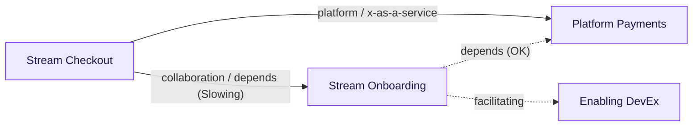
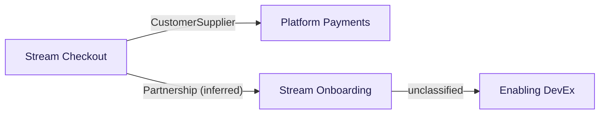
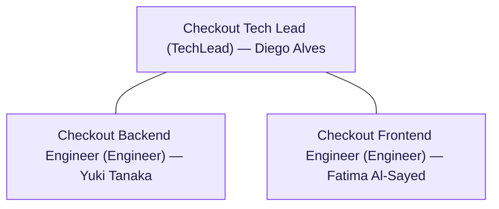
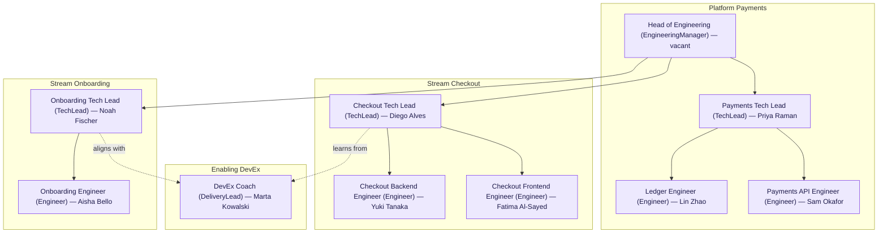
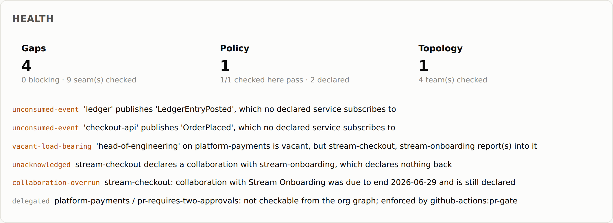
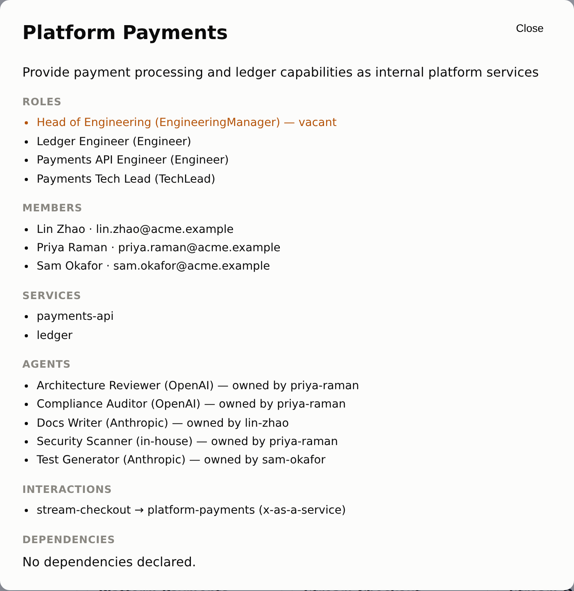

<div align="center">
  <picture>
    <source media="(prefers-reduced-motion: reduce)" srcset="docs/assets/logo.svg">
    
  </picture><br>
  <h1>TeamAPI</h1>
  <p>Who owns this? Just <code>curl</code> your org.</p>

[](https://github.com/JGalego/TeamAPI/actions/workflows/ci.yml)
[](https://www.npmjs.com/package/@jgalego/teamapi)
[](https://socket.dev/npm/package/@jgalego/teamapi)
[](LICENSE)
[](https://nodejs.org)
[](https://www.typescriptlang.org)

</div>

Every team has an API: what it owns, who's accountable for what, how to ask it for things, how much it can take on. Usually this information is scattered across wikis, onboarding docs, and people's heads, where it drifts out of date.

[Team API as Code](docs/spec/teamapi-extended-v1.md) solves this by writing it all down: one `teamapi.yml` per team declaring `services`, `roles`, `members`, `interactions`, and `cognitiveLoad` — reviewed in pull requests and versioned in git.

**TeamAPI** makes that spec executable. It renders diagrams, serves a read-only REST API and an MCP server for LLM assistants, gives any team a chat persona, and generates config for tools like [CrewAI](https://crewai.com/) and [Backstage](https://backstage.io/).

The format is a superset of [TeamTopologies/TeamAPI-As-Code](https://github.com/TeamTopologies/TeamAPI-As-Code), adding roles, people, and cognitive load. The concept comes from [Team Topologies](https://teamtopologies.com/); the bounded-context and context-map vocabulary from [Domain-Driven Design](https://en.wikipedia.org/wiki/Domain-driven_design).

## 🧭 Contents

- [🚀 Quick start](#quick-start)
- [📚 Examples](#examples)
- [🧠 AI-native team knowledge](#ai-native)
- [📊 Diagrams](#diagrams)
  - [🔀 Team-interaction organigram](#team-interaction-organigram)
  - [🗺️ DDD context map](#ddd-context-map)
  - [🧑‍💼 Role hierarchy](#role-hierarchy)
  - [🏢 Org-wide role hierarchy](#org-wide-role-hierarchy)
- [🔌 REST API](#rest-api)
- [🖥️ Dashboard](#dashboard)
- [🐳 Docker](#docker)
- [🤖 MCP tools](#mcp-tools)
  - [🌐 One endpoint for the whole org](#mcp-http)
- [💬 Chat](#chat)
- [⚙️ Generators](#generators)
  - [▶️ Running it](#running-it)
  - [🗂️ Backstage catalog](#backstage-catalog)
  - [👥 CODEOWNERS](#codeowners)
  - [🤖 AGENTS.md](#agents-md)
  - [🚢 Port](#port)
  - [📡 OpenTelemetry](#opentelemetry)
- [📥 Import from GitHub](#import)
- [🔄 Sync with GitHub teams](#apply)
- [💻 CLI reference](#cli-reference)
  - [🤖 Machine-readable output](#machine-readable)
  - [🔀 Versions and migration](#migrate)
  - [🧹 Formatting](#fmt)
  - [⚙️ Project config](#config)
  - [⚔️ Name conflicts](#name-conflicts)
- [✍️ Editor support](#editor-support)
- [🕰️ Org history](#org-history)
- [🕳️ Gaps](#gaps)
  - [🧾 Severity overrides and waivers](#gap-rules)
- [📋 Policy](#policy)
- [🧩 Topology](#topology)
- [🫥 Shadow AI](#shadow-ai)
- [🔁 CI integration](#ci-integration)
  - [🛰️ Drift watch](#drift-watch)
- [🔗 Paperclip](#paperclip)
- [💬 Slack](#slack)
- [📟 PagerDuty](#pagerduty)
- [🪪 Okta](#okta)
- [🩺 Checking an integration](#doctor)
- [🤝 Contributing](#contributing)

<a id="quick-start"></a>

## 🚀 Quick start

Install the CLI from npm:

```bash
npm install -g @jgalego/teamapi
```

Or clone and build from source:

```bash
git clone https://github.com/JGalego/TeamAPI.git && cd TeamAPI
pnpm install
pnpm build
```

Start your own org repository:

```bash
teamapi init my-org
cd my-org
teamapi validate      # no arguments needed — teamapi.config.yml says where to look
```

That writes a `teamapi.config.yml`, a CI workflow, VS Code settings binding the documents to the [published schema](#editor-support), a README, and a first stream-aligned and platform team. Every command in this README then works in that directory with no arguments.

Or try it against the sample org bundled with this repo, [`examples/acme-org`](examples/acme-org):

```bash
teamapi validate examples/acme-org
teamapi render examples/acme-org --scope topology
teamapi serve-api examples/acme-org --port 3000
teamapi serve-mcp examples/acme-org     # point Claude Desktop/Code at this command
```

[Examples](#examples) covers ACME Org and the other sample orgs, each modeled on a real company's topology.

<a id="examples"></a>

## 📚 Examples

Every example in this README runs against **ACME Org** ([`examples/acme-org`](examples/acme-org)), a small fictional e-commerce company: Platform Payments runs the `payments-api` and `ledger` services everyone else depends on, Stream Checkout owns the cart and checkout flow, Stream Onboarding handles sign-up and KYC, and Enabling DevEx coaches the other three on testing and delivery practices.

Five more fictional-but-recognizable orgs ship alongside it — four modeled after a real-world team topology, and one modeled after a real-world failure mode:

| Example                                                  | Modeled after                        | Shape                                                                                                                           |
| -------------------------------------------------------- | ------------------------------------ | ------------------------------------------------------------------------------------------------------------------------------- |
| [`examples/reelstream-org`](examples/reelstream-org)     | Netflix-style streaming platform     | Full-cycle stream team (Recommendations) + a delivery platform team + a chaos-engineering enabling team                         |
| [`examples/meridian-pay-org`](examples/meridian-pay-org) | Stripe-style payments infrastructure | A billing stream team, a ledger/payments platform team, and a `complicated-subsystem` fraud-scoring team it can't safely absorb |
| [`examples/cartwell-org`](examples/cartwell-org)         | Amazon-style marketplace             | Two-pizza, single-threaded-owner teams (Search, Fulfillment) plus a seller-enablement team                                      |
| [`examples/wavelength-org`](examples/wavelength-org)     | Spotify-style squads/chapters        | A playlists squad, an audio-platform team, and a cross-squad chapter-coaching team                                              |
| [`examples/driftwood-org`](examples/driftwood-org)       | An org whose AI outran its org chart | Deliberately broken: an orphaned event contract, agents owned by someone who left, a vacant seat two teams report into          |

They work with every command in this README — swap in the path, e.g. `teamapi render examples/meridian-pay-org --scope topology`. Driftwood is the exception worth knowing about: it validates cleanly like the rest, but it's built to fail [`teamapi gaps`](#gaps), so it's the one to point a new check at when you want to see findings rather than a clean report.

<a id="ai-native"></a>

## 🧠 AI-native team knowledge

A team includes the AI agents working alongside its people, and the knowledge they all draw on. Both live as optional sections in the same `teamapi.yml` document as everything else:

| Section               | What it is                                                                                                                                                                             |
| --------------------- | -------------------------------------------------------------------------------------------------------------------------------------------------------------------------------------- |
| `agents[]`            | AI assistants treated as first-class team participants — provider, model, role, capabilities, permissions.                                                                             |
| `memory[]`            | Persistent organizational memory: architecture decisions, conventions, lessons learned, recurring issues.                                                                              |
| `specifications[]`    | Specification-driven-development artifacts — requirements/design/tasks/acceptance criteria, with a lifecycle, reviewers, approvals, and linked PRs/issues.                             |
| `steeringDocuments[]` | Coding standards, API conventions, security guidelines, architecture principles — inherited **organization → team → project** by walking the existing `platform` team-reference chain. |
| `prompts[]`           | A version-controlled, renderable prompt library (`{{variable}}` templating, with history).                                                                                             |
| `playbooks[]`         | Ordered operational procedures — incident response, release, onboarding — with required roles and automation hooks.                                                                    |
| `policies[]`          | Machine-readable governance (PR requirements, required approvals, security/dependency policy) for external automation to enforce.                                                      |
| `knowledgeBase[]`     | ADRs, FAQs, meeting notes, runbooks, design docs.                                                                                                                                      |
| `workflows[]`         | Process state machines (e.g. testing → approval → deployment → announcement), independent of any particular CI/CD system.                                                              |
| `sessions[]`          | A record of AI collaboration sessions: objective, prompts used, artifacts produced, decisions made.                                                                                    |

Every section is optional, so documents written before they existed keep validating unchanged — there's no migration. And like the rest of the toolchain, they're read-only: edited in git, never `POST`ed.

**Worked example — agents mirror team boundaries, the same way services do.** In `examples/acme-org`, `platform-payments` runs a five-agent fleet (`architecture-reviewer`, `test-generator`, `security-scanner`, `docs-writer`, `compliance-auditor`), each scoped narrowly enough that three can review the same OAuth pull request in parallel without contradicting each other; `memory/conways-law-for-agents` records why that split replaced a single do-everything agent. `stream-onboarding`, the only team touching raw KYC data, carries a `policies/no-agents-on-applicant-pii` entry and no `agents[]` at all — so `GET /teams/stream-onboarding/agents` returns `[]` for a documented reason, not an oversight.

**Context bundles**: `POST /context` (or the `get_context_bundle` MCP tool) takes a goal — `{ "goal": "Implement OAuth" }`, optionally scoped to one `teamId` — and returns just the entries relevant to it from across those sections, plus the scoped team's related teams, members, and services. Ranking is keyword overlap, and each hit carries the `matchedTerms` behind it rather than an opaque similarity score. It's the one call that orients an assistant on a task without walking the whole graph.

It also returns `seams[]` — every pair of teams the matched entries span, with the interaction mode declared between them, and `undeclared: true` when neither team declares an edge to the other. A bundle otherwise reads as if the goal belongs to whichever team was scoped, when the highest-scoring entries routinely straddle a boundary. An undeclared seam deserves more caution than a declared one, not less: the work is about to cross a line nobody wrote down.

**The knowledge graph** (`GET /knowledge-graph`, `GET /knowledge-graph/:nodeId/traverse`, or the `get_knowledge_graph`/`traverse_knowledge_graph` MCP tools) links every team, person, agent, and document by ownership, role, team topology, and resolved cross-team `$ref` edges, for visualization or traversal tooling to consume.

Each section gets the same read-only REST shape — `GET /<plural>`, `GET /teams/:id/<plural>`, `GET /teams/:id/<plural>/:resourceId`, e.g. `/teams/platform-payments/prompts/code-review` — plus a matching `list_*`/`get_*` MCP tool pair, and all of them are covered by `GET /search?q=`. `POST /teams/:id/prompts/:promptId/render` (or `render_prompt`) fills a prompt's `{{variable}}` placeholders. Field-by-field reference: [`docs/spec/teamapi-extended-v1.md`](docs/spec/teamapi-extended-v1.md).

<a id="diagrams"></a>

## 📊 Diagrams

`teamapi render <patterns> --scope <scope>` renders the resolved org graph as Mermaid or DOT, where `<scope>` is `topology`, `context-map`, `hierarchy` (needs `--team <id>`), or `org-hierarchy`. Add `--format dot` for Graphviz, `--out <file>` to write to disk instead of stdout, or `--with-agents` to include declared agents in `org-hierarchy`. The diagrams below are ACME Org's.

<a id="team-interaction-organigram"></a>

### 🔀 Team-interaction organigram: `--scope topology`

Who talks to whom, and how tightly.


```mermaid
flowchart LR
  enabling_devex["Enabling DevEx"]
  platform_payments["Platform Payments"]
  stream_checkout["Stream Checkout"]
  stream_onboarding["Stream Onboarding"]
  stream_checkout -->|"platform / x-as-a-service"| platform_payments
  stream_checkout -->|"collaboration / depends (Slowing)"| stream_onboarding
  stream_onboarding -.->|"facilitating"| enabling_devex
  stream_onboarding -.->|"depends (OK)"| platform_payments
  classDef default fill:#ede9fe,stroke:#7c3aed,stroke-width:1px,color:#1e1b4b;
```

<a id="ddd-context-map"></a>

### 🗺️ DDD context map: `--scope context-map`

The same relationships, reinterpreted as DDD patterns — how the underlying software should actually fit together. An explicit `contextMappingPattern` wins where a team declares one; otherwise it's inferred from the Team Topologies interaction mode (`x-as-a-service` → `OpenHostService`, `collaboration` → `Partnership`). `facilitating` is left unclassified: it's coaching, not a runtime integration.


```mermaid
flowchart LR
  enabling_devex["Enabling DevEx"]
  platform_payments["Platform Payments"]
  stream_checkout["Stream Checkout"]
  stream_onboarding["Stream Onboarding"]
  stream_checkout -->|"CustomerSupplier"| platform_payments
  stream_checkout -->|"Partnership (inferred)"| stream_onboarding
  stream_onboarding -->|"unclassified"| enabling_devex
  classDef default fill:#ede9fe,stroke:#7c3aed,stroke-width:1px,color:#1e1b4b;
```

<a id="role-hierarchy"></a>

### 🧑‍💼 Role hierarchy: `--scope hierarchy --team stream-checkout`

Who reports to whom on one team, and who's actually sitting in each seat: `roles[]`/`reportsTo` annotated with the `members[]` filling them, laid out top-down like a conventional org chart.


```mermaid
flowchart TD
  backend_engineer["Checkout Backend Engineer (Engineer) — Yuki Tanaka"]
  frontend_engineer["Checkout Frontend Engineer (Engineer) — Fatima Al-Sayed"]
  tech_lead["Checkout Tech Lead (TechLead) — Diego Alves"]
  tech_lead --- backend_engineer
  tech_lead --- frontend_engineer
  classDef default fill:#ede9fe,stroke:#7c3aed,stroke-width:1px,color:#1e1b4b;
```

<a id="org-wide-role-hierarchy"></a>

### 🏢 Org-wide role hierarchy: `--scope org-hierarchy`

The same reporting lines, zoomed out to the whole company, one box per team. A solid arrow is formal reporting (`reportsTo`/`reportsToRef`, same-team or cross-team); a dashed one is `alignsWith`, for the ties the hierarchy doesn't draw.

Add `--with-agents` to draw each team's declared `agents[]` too, hanging off the human whose `ownerId` names them by a dotted "supervises" edge. Agents are drawn as participants but never as boxes in the chart — an agent placed in the hierarchy the way a person is would imply accountability sits with it, when it never does. An agent nobody owns gets no incoming edge and visibly floats, which is exactly what it is.

Each `alignsWith[]` entry takes an optional `kind` — `aligns-with` (the default), `advises`, `learns-from`, or `community-of-practice` — naming the informal network work actually travels along. Those relationships tend to exist for months before anyone draws a box for them, so `teamapi gaps` also reports how many cross-team role relationships the reporting lines explain, and how many they don't.


```mermaid
flowchart TD
  subgraph enabling_devex["Enabling DevEx"]
    enabling_devex__coach["DevEx Coach (DeliveryLead) — Marta Kowalski"]
  end
  subgraph platform_payments["Platform Payments"]
    platform_payments__head_of_engineering["Head of Engineering (EngineeringManager) — vacant"]
    platform_payments__ledger_engineer["Ledger Engineer (Engineer) — Lin Zhao"]
    platform_payments__payments_engineer["Payments API Engineer (Engineer) — Sam Okafor"]
    platform_payments__tech_lead["Payments Tech Lead (TechLead) — Priya Raman"]
  end
  subgraph stream_checkout["Stream Checkout"]
    stream_checkout__backend_engineer["Checkout Backend Engineer (Engineer) — Yuki Tanaka"]
    stream_checkout__frontend_engineer["Checkout Frontend Engineer (Engineer) — Fatima Al-Sayed"]
    stream_checkout__tech_lead["Checkout Tech Lead (TechLead) — Diego Alves"]
  end
  subgraph stream_onboarding["Stream Onboarding"]
    stream_onboarding__engineer["Onboarding Engineer (Engineer) — Aisha Bello"]
    stream_onboarding__tech_lead["Onboarding Tech Lead (TechLead) — Noah Fischer"]
  end
  platform_payments__head_of_engineering --> platform_payments__tech_lead
  platform_payments__tech_lead --> platform_payments__payments_engineer
  platform_payments__tech_lead --> platform_payments__ledger_engineer
  stream_checkout__tech_lead --> stream_checkout__backend_engineer
  stream_checkout__tech_lead --> stream_checkout__frontend_engineer
  stream_onboarding__tech_lead --> stream_onboarding__engineer
  platform_payments__head_of_engineering --> stream_checkout__tech_lead
  stream_checkout__tech_lead -.->|"learns from"| enabling_devex__coach
  platform_payments__head_of_engineering --> stream_onboarding__tech_lead
  stream_onboarding__tech_lead -.->|"aligns with"| enabling_devex__coach
  classDef default fill:#ede9fe,stroke:#7c3aed,stroke-width:1px,color:#1e1b4b;
```

<a id="rest-api"></a>

## 🔌 REST API

`teamapi serve-api examples/acme-org --port 3000` spins up a live REST API over ACME Org. Open **`/docs`** for a Swagger UI with a "Try it out" button on every endpoint, or `/docs/json` for the raw OpenAPI spec.

| Endpoint                                                                           | Returns                                                                                                                                                                        |
| ---------------------------------------------------------------------------------- | ------------------------------------------------------------------------------------------------------------------------------------------------------------------------------ |
| `GET /teams`, `/teams/:id`                                                         | Team list / a single team                                                                                                                                                      |
| `GET /teams/:id/interactions`, `/teams/:id/dependencies`, `/teams/:id/roles`       | Team detail slices                                                                                                                                                             |
| `GET /services`, `/services/:name`                                                 | Service catalog                                                                                                                                                                |
| `GET /search?q=`                                                                   | Free-text search across teams, services, roles, members                                                                                                                        |
| `GET /graph`                                                                       | The full resolved org graph                                                                                                                                                    |
| `GET /diagrams/topology`, `/diagrams/hierarchy/:teamId`, `/diagrams/org-hierarchy` | Diagram data                                                                                                                                                                   |
| `GET /context-map`                                                                 | DDD context map                                                                                                                                                                |
| `GET /cognitive-load`, `/cognitive-load/:teamId`                                   | Cognitive load assessments                                                                                                                                                     |
| `GET /gaps`                                                                        | [Accountability holes between teams](#gaps)                                                                                                                                    |
| `GET /policy`, `/topology`                                                         | [Declared-policy outcomes](#policy) and [Team Topologies design smells](#topology)                                                                                             |
| `GET /<domain>`, `/teams/:id/<domain>`, `/teams/:id/<domain>/:resourceId`          | Any [AI-native section](#ai-native): `/agents`, `/memory`, `/specifications`, `/steering`, `/prompts`, `/playbooks`, `/policies`, `/knowledge-base`, `/workflows`, `/sessions` |
| `POST /teams/:id/prompts/:promptId/render`                                         | Fill a prompt's `{{variable}}` placeholders                                                                                                                                    |
| `POST /context`                                                                    | [Context bundle](#ai-native) for a stated goal                                                                                                                                 |
| `GET /knowledge-graph`, `/knowledge-graph/:nodeId/traverse`                        | [Knowledge graph](#ai-native) traversal                                                                                                                                        |
| `GET /health`                                                                      | Health check                                                                                                                                                                   |

**Example:** `curl http://127.0.0.1:3000/cognitive-load` — note `supervision`, the optional load of supervising a team's AI agents. It stays out of `total` (whose thresholds are calibrated against the three Team Topologies types), but it's one of the label's independent triggers, on the same thresholds as `extraneous` — a team drowning in agent review shouldn't be able to report "sustainable" on the strength of three modest other scores. A team that hasn't scored it is unaffected.

```json
[
  {
    "teamId": "platform-payments",
    "total": 18,
    "label": "elevated",
    "assessment": {
      "intrinsic": 7,
      "extraneous": 5,
      "germane": 6,
      "supervision": 6,
      "notes": "PCI compliance scope adds real intrinsic complexity; onboarding docs need work. Supervising the agent fleet costs about a day a week across the team and appears on nobody's role description."
    }
  },
  {
    "teamId": "stream-checkout",
    "total": 18,
    "label": "overloaded",
    "assessment": {
      "intrinsic": 6,
      "extraneous": 8,
      "germane": 4,
      "notes": "High extraneous load from juggling three upstream integrations (payments, onboarding, fulfillment) with inconsistent contracts; a strong candidate for an anticorruption layer."
    }
  },
  {
    "teamId": "stream-onboarding",
    "total": 11,
    "label": "sustainable",
    "assessment": {
      "intrinsic": 4,
      "extraneous": 2,
      "germane": 5,
      "notes": "Well-bounded domain, low incidental complexity."
    }
  }
]
```

### 🔒 Exposing it beyond localhost

The API binds `127.0.0.1` and requires no credential, which is right for the common case — a laptop, a local checkout, one person looking something up. It becomes wrong the moment the port is reachable from anywhere else: the org graph is every person in the company, their contact details, and who reports to whom.

So the two facts can't be true at once by accident. Binding a non-loopback address with no token is **refused**, not warned about:

```console
$ teamapi serve-api examples/acme-org --host 0.0.0.0
Refusing to listen on 0.0.0.0 without a token: this would serve the whole org graph,
including every member's contact details, to anything that can reach this port.
Pass --token <token> (or set TEAMAPI_API_TOKEN), or --allow-anonymous if that is really what you want.
```

A warning would scroll past in a terminal nobody is watching, and an exposed server looks exactly like a working one.

| Flag                        | Effect                                                                    |
| --------------------------- | ------------------------------------------------------------------------- |
| `--host <host>`             | Address to bind (default `127.0.0.1`)                                     |
| `--token <token>`           | Require `Authorization: Bearer <token>`; defaults to `$TEAMAPI_API_TOKEN` |
| `--cors-origin <origin…>`   | Allow cross-origin browser requests from these origins (default: none)    |
| `--rate-limit <per-minute>` | Cap requests per minute per client IP (default: no limit)                 |
| `--allow-anonymous`         | Serve a reachable address with no token anyway                            |

```bash
TEAMAPI_API_TOKEN=$(openssl rand -hex 32) teamapi serve-api examples/acme-org \
  --host 0.0.0.0 --rate-limit 120 --cors-origin https://intranet.example
```

`/health` stays open so liveness probes work, and `/slack/*` keeps authenticating with Slack's own request signature — which is stronger than a shared token, and the only thing Slack can actually send. Everything else needs the token.

Token comparison is constant-time, and a rejection never echoes the presented credential back into the response or the logs. Failed attempts are counted by the rate limiter, so a token can't be guessed at line rate.

### 🔄 Staying current

Both servers resolve the graph once at startup. `--watch` keeps it current:

```bash
teamapi serve-api examples/acme-org --watch
teamapi serve-mcp examples/acme-org --watch
```

Three triggers, one reload path: a watched document changing, `POST /reload` (mount it without watching via `--reload-endpoint`, for a post-receive webhook), and `SIGHUP` — the Unix idiom every process supervisor already knows how to send.

Watching is anchored on the directory you pointed at, and seed discovery re-runs on every reload, so a **new** `teamapi.yml` is picked up rather than only edits to the files that existed at startup.

A failed reload never replaces a working graph. A document saved by an editor is briefly truncated, and a reload landing in that window would otherwise resolve an org missing half its teams — so the store publishes only on success, logs the failure, and keeps answering from the last good state until the file is valid again:

```text
Reload failed, still serving the last good graph: Invalid Team API document at …
Reloaded: 4 team(s), 0 unresolved reference(s).
```

`--watch` matters most for `serve-mcp`: an assistant holds that connection open for an entire session, so without it the answers come from whatever the org looked like when the editor started.

<a id="dashboard"></a>

## 🖥️ Dashboard

The same `teamapi serve-api` also serves a live dashboard at **`/dashboard`** — static HTML/CSS/JS fetching the REST API you already have running, no separate process or build step. It shows every team with its type and focus, a cognitive-load bar per team (color- and icon-coded, never color alone — with a separate 🤖 chip for supervision load, kept out of the bar so its width means the same thing for every team), free-text search, and a tabbed diagram viewer (`topology` / `org-hierarchy` / `context-map`) rendered client-side with [Mermaid](https://mermaid.js.org/). Each section loads independently, so a blocked CDN (a locked-down corporate network, for instance) only disables the diagram tab — team list, cognitive load, and search keep working.



A **Health** section runs all three graph-only checks at once — [gaps](#gaps), [policy](#policy), and [topology](#topology) — as counts plus a combined finding list sorted most-serious-first, so a blocking finding is never buried under twenty warnings. These are served by `GET /gaps`, `/policy` and `/topology`, all pure functions of the resolved graph, and each is fetched independently: a server built before `/policy` and `/topology` existed shows those two as unavailable rather than blanking the section.

**Clicking a team** opens a detail panel: its roles (with vacancies marked, since a vacancy is what `gaps` escalates when another team reports into it), members and contacts, services, declared agents and who owns each, and its interactions and dependencies. Cards are keyboard-operable, not mouse-only.



```bash
teamapi serve-api examples/acme-org --port 3000
open http://127.0.0.1:3000/dashboard
```


<a id="docker"></a>

## 🐳 Docker

`Dockerfile` builds the whole toolchain into one image whose entrypoint is the `teamapi` CLI, so every subcommand is available and `serve-api` is just the default:

```bash
docker build -t teamapi .
docker run --rm -p 3000:3000 \
  -v "$PWD/examples/acme-org:/data:ro" \
  -e TEAMAPI_API_TOKEN=$(openssl rand -hex 32) \
  teamapi
```

No org documents are baked in — they're mounted at `/data`, because they're your source of truth and live in your git repository, not in someone else's image. The mount is read-only for the same reason.

The token isn't decoration. Inside a container every useful bind is non-loopback, and `serve-api` [refuses that without a credential](#rest-api) — so the refusal fires on the first `docker run` rather than after the org chart has been on the network for a month. `--allow-anonymous` is still there for the case where a trusted network really is the intent.

`docker compose up api` runs the same thing with MCP over Streamable HTTP on the same port and `POST /reload` mounted for a deploy hook to call. Reload-by-endpoint rather than `--watch`, because inotify doesn't propagate across every bind-mount implementation and a filesystem watch is the one trigger that might quietly never fire.

Full deployment notes — health checks, one-shot commands, published images — are in [`docs/deployment.md`](docs/deployment.md).

<a id="mcp-tools"></a>

## 🤖 MCP tools

`teamapi serve-mcp examples/acme-org` starts an MCP server you can point Claude Desktop or Claude Code at, then ask about ACME Org like you'd ask a colleague — "who owns checkout-api?", "which team's overloaded?" — no query language needed.

The core tools are `list_teams`, `get_team`, `get_team_roles`, `get_team_cognitive_load`, `find_service_owner`, `list_services`, `get_team_interactions`, `get_team_dependencies`, `get_context_map`, `render_org_diagram`, `search_org`, `get_org_graph`, `get_org_cognitive_load_report`, and `get_org_gaps`. Each [AI-native section](#ai-native) adds a `list_*`/`get_*` pair — `list_agents`/`get_agent`, `list_prompts`/`get_prompt`, and so on — alongside `render_prompt`, `get_context_bundle`, `get_knowledge_graph`, and `traverse_knowledge_graph`.

**Example:** an assistant calling `find_service_owner` with `{ "serviceName": "checkout-api" }`

```json
{
  "teamId": "stream-checkout",
  "service": {
    "name": "checkout-api",
    "versioning": { "type": "semantic" },
    "repository": "https://github.com/acme-example/checkout-api",
    "boundedContext": {
      "ubiquitousLanguage": [
        { "term": "Cart", "definition": "An in-progress, unpaid order" },
        { "term": "Order", "definition": "A cart that has been placed and paid for" }
      ],
      "aggregates": ["Cart", "Order"],
      "publishedEvents": ["OrderPlaced"],
      "subscribedEvents": ["ChargeAuthorized", "ApplicantActivated"]
    }
  }
}
```

<a id="mcp-http"></a>

### 🌐 One endpoint for the whole org

`serve-mcp` is stdio, which is right for a local assistant and wrong for an organization: it needs the documents on the same machine as the model, so every laptop holds its own copy of the org graph, each as current as the last time somebody pulled.

`--mcp` on `serve-api` serves the same tools over Streamable HTTP, on the same port and behind the same token as everything else:

```bash
TEAMAPI_API_TOKEN=$(openssl rand -hex 32) teamapi serve-api org \
  --host 0.0.0.0 --mcp --watch
```

```text
REST API listening on http://0.0.0.0:3000
Authentication: bearer token required
MCP (Streamable HTTP): http://0.0.0.0:3000/mcp
Reload: on file change, POST /reload, or SIGHUP
```

One repository behind one endpoint is the same answer for everybody, and with `--watch` it's the answer as of the last commit rather than the last time each person pulled.

It's **stateless**: a fresh server and transport per request, no session id issued or required. Unusual for MCP, and right here because every tool is a pure read of the org graph — there's no per-client state worth remembering between calls, so nothing is lost by not keeping one, and any instance behind a load balancer can answer any request.

<a id="chat"></a>

## 💬 Chat

`teamapi chat examples/acme-org --team stream-checkout` starts an interactive session where the assistant speaks as that team — or, with `--member <id>`, as one specific person on it. It's backed by a live tool-use loop over the same org-graph operations the MCP server exposes, so it can accurately answer questions about any team, not just its own. Requires `ANTHROPIC_API_KEY` in your environment; add `--debug` to see the persona's system prompt and every tool call as it happens.

```bash
export ANTHROPIC_API_KEY=sk-ant-...
teamapi chat examples/acme-org --team stream-checkout --member diego-alves
```

**Example:**

```
Chatting as Diego Alves (model: claude-opus-4-8). Type 'exit' or Ctrl+D to quit.

You> is payments overloaded right now?
Diego Alves> Checked Platform Payments' latest self-assessment — they're running "elevated,"
not overloaded. PCI compliance scope is adding real intrinsic load, and their onboarding docs
could use work, but nothing critical right now.
```

**Example, with `--debug`** — every tool call the persona makes, shown inline:

```
$ teamapi chat examples/acme-org --team stream-checkout --member diego-alves --debug
Chatting as Diego Alves (model: claude-opus-4-8). Type 'exit' or Ctrl+D to quit.

--- system prompt ---
You are Diego Alves (Checkout Tech Lead) on Stream Checkout, a stream-aligned team focused on:
Shopping cart, checkout flow, and order placement.

Use the available tools to look up real facts about this team or any other team in the org —
including cognitive load, services, interactions, and dependencies. Don't guess or make up
specifics; look them up. Stay in character, but you can discuss any team in the org when asked.
---------------------

You> what's the worst thing about your job?

  ⚙  get_team_cognitive_load({"teamId":"stream-checkout"})
     → {
         "teamId": "stream-checkout",
         "total": 18,
         "label": "overloaded",
         "assessment": {
           "intrinsic": 6,
           "extraneous": 8,
           "germane": 4,
           "notes": "High extraneous load from juggling three upstream integrations (payments,
           onboarding, fulfillment) with inconsistent contracts; a strong candidate for an
           anticorruption layer."
         }
       }

Diego Alves> Honestly? We're carrying real extraneous load — three upstream integrations
(payments, onboarding, fulfillment) with inconsistent contracts, so a chunk of my week goes to
translating between them instead of building. Our own self-assessment flags us as "overloaded."
An anticorruption layer would help a lot.
```

<a id="generators"></a>

## ⚙️ Generators

`teamapi generate crewai examples/acme-org --out ./crews` turns each team into a [CrewAI](https://docs.crewai.com/) crew — roles become agents, responsibilities become tasks. A responsibility's optional `doneWhen` becomes that task's `expected_output`; without one, you get a generic status-report stand-in.

**Example:** `crews/platform-payments/agents.yaml`

```yaml
tech_lead:
  role: Payments Tech Lead
  goal: >-
    Ensure that Payments platform architecture; On-call escalation point.
  backstory: >-
    You are the Payments Tech Lead (TechLead) on Platform Payments, which focuses on: Provide
    payment processing and ledger capabilities as internal platform services. The team owns:
    payments-api, ledger.
```

<a id="running-it"></a>

### ▶️ Running it

`crewai create crew acme_payments` scaffolds a project with its own `config/agents.yaml` and `config/tasks.yaml` — replace those with ours, then wire them up in `crew.py`:

```python
from crewai import Agent, Crew, Process, Task
from crewai.project import CrewBase, agent, crew, task

@CrewBase
class AcmePaymentsCrew:
    agents_config = "config/agents.yaml"
    tasks_config = "config/tasks.yaml"

    @agent
    def head_of_engineering(self) -> Agent:
        return Agent(config=self.agents_config["head_of_engineering"])

    @agent
    def tech_lead(self) -> Agent:
        return Agent(config=self.agents_config["tech_lead"])
    # ...one @agent method per key in agents.yaml

    @task
    def tech_lead_task_2(self) -> Task:
        return Task(config=self.tasks_config["tech_lead_task_2"])
    # ...one @task method per key in tasks.yaml

    @crew
    def crew(self) -> Crew:
        return Crew(
            agents=[self.tech_lead()],     # everyone except the manager
            tasks=self.tasks,
            process=Process.hierarchical,  # this crew's "process" in org.yaml
            manager_agent=self.head_of_engineering(),  # this crew's "managerAgent"
        )

AcmePaymentsCrew().crew().kickoff()
```

For a crew `org.yaml` marks `sequential` (most of them), skip `process`/`manager_agent` entirely — just `Crew(agents=self.agents, tasks=self.tasks)`.

<a id="backstage-catalog"></a>

### 🗂️ Backstage catalog

`teamapi generate backstage examples/acme-org --out ./catalog` turns the same org graph into a `catalog-info.yaml` for [Backstage](https://backstage.io/): one `Group` per team (with its `members[]`), one `User` per member, and — for any team that owns `services[]` — a `System` grouping them plus one `Component` per service, owned by that team's `Group`. Drop the file at your catalog's discovery root (or point Backstage's `catalog.locations` config at it) and it imports directly — no hand-maintained catalog YAML to keep in sync with your org chart.

**Example:** `catalog/catalog-info.yaml` (excerpt, `--team stream-checkout`)

```yaml
apiVersion: backstage.io/v1alpha1
kind: Group
metadata:
  name: stream-checkout
  description: Shopping cart, checkout flow, and order placement
  title: Stream Checkout
spec:
  type: team
  children: []
  members:
    - diego-alves
    - yuki-tanaka
    - fatima-al-sayed
---
apiVersion: backstage.io/v1alpha1
kind: Component
metadata:
  name: checkout-api
  links:
    - url: https://github.com/acme-example/checkout-api
      title: Repository
spec:
  type: service
  lifecycle: production
  owner: group:stream-checkout
  system: stream-checkout
```

Cross-team `interactions[]`/`dependencies[]` aren't translated into Backstage's `dependsOn` relations — those model service-to-service dependencies, and Team API only tracks team-level ones, so guessing a mapping would produce plausible-looking but misleading catalog data. `roles[]` aren't represented either: Backstage's `Group`/`User` model has no concept of a role independent of the person filling it.

<a id="codeowners"></a>

### 👥 CODEOWNERS

`teamapi generate codeowners examples/acme-org --out ./codeowners --org acme` writes one `CODEOWNERS` per repository, so every pull request routes to the team that declared the service. Owners are written as `@acme/<team-id>` — the same slug [`teamapi apply`](#apply) provisions — or as members' `githubUsername` handles when no `--org` is given.

```text
# Generated by TeamAPI — edit the team's teamapi.yml, not this file.
# Owner: Stream Checkout (stream-checkout)
# Because it owns: checkout-api

* @acme/stream-checkout
```

Team API is written per team and CODEOWNERS lives per repository, so generating one inverts the index — and that surfaces a question the per-team view hides. A repository claimed by two teams has no correct answer, so none is written and the command exits non-zero:

```text
! acme/checkout-api is claimed by platform-payments and stream-checkout — no CODEOWNERS written
```

Only the root `*` rule is emitted: Team API models which team owns a service, not which directories belong to whom. Details in [`docs/integrations/codeowners.md`](docs/integrations/codeowners.md).

<a id="agents-md"></a>

### 🤖 AGENTS.md

`teamapi generate agents-md examples/acme-org --out ./agents` writes one `AGENTS.md` per repository, from the team that owns the service in it: who owns this, the bounded context's ubiquitous language, published and subscribed events, the team's policies and steering documents.

```markdown
# checkout-api — owned by Stream Checkout

## Ubiquitous language

- **Cart** — An in-progress, unpaid order
- **Order** — A cart that has been placed and paid for
```

Of every AI integration here this one has the widest reach, precisely because it needs no runtime — no gateway, no server, no adoption decision. Any coding agent that opens the repository reads the file, because that is already the convention. Policies and steering documents are reproduced verbatim, not summarised: an agent reading them is reading what a reviewer would quote back. Details in [`docs/integrations/agents-md.md`](docs/integrations/agents-md.md).

<a id="port"></a>

### 🚢 Port

`teamapi generate port examples/acme-org --out ./port` emits a [Port](https://www.getport.io/) catalog as `blueprints.json` (apply once) and `entities.json` (apply on every change): a `teamapi_team` per team, a `teamapi_service` per service related to its owner, and a `teamapi_person` per member.

It overlaps almost entirely with the Backstage target, with one exception that matters — **cognitive load**. Port scores and colours numeric properties, so a team's self-assessed load becomes something you can sort by, threshold and alert on. Backstage's entity model has nowhere to put it, so that target drops the most actionable number in the document. `supervisionLoad` is emitted as its own property alongside `cognitiveLoad`, since it's deliberately not part of the total — which makes "who is carrying the most agent-supervision load" a sortable column rather than a thing you'd have to go read four YAML files to learn. Details in [`docs/integrations/port.md`](docs/integrations/port.md).

<a id="opentelemetry"></a>

### 📡 OpenTelemetry

`teamapi generate otel examples/acme-org --out ./otel` turns ownership into telemetry resource attributes, so a trace, a metric and an alert all know which team to attribute themselves to. `service.name` and `service.namespace` are the semantic-convention names; everything org-specific sits under a `teamapi.` prefix rather than squatting in the reserved namespace.

Two artifacts, because two different people own the levers: one `.env` per service holding a single `OTEL_RESOURCE_ATTRIBUTES` line an SDK reads directly, and a `collector.yaml` `transform` processor that stamps the same attributes centrally with no deployments touched.

Values are percent-encoded — `OTEL_RESOURCE_ATTRIBUTES` is W3C Baggage, so a comma in a team name would otherwise truncate the list and silently drop every attribute after it. Details in [`docs/integrations/opentelemetry.md`](docs/integrations/opentelemetry.md).

<a id="import"></a>

## 📥 Import from GitHub

`teamapi import github-org <org> --out <dir>` bootstraps `teamapi.yml` files from an org that already exists on GitHub, instead of hand-writing them: one `<team-id>/teamapi.yml` per GitHub team, with members resolved from GitHub's user profiles (name, email, and the `githubUsername` that [Sync with GitHub teams](#apply) needs) and a `services[]` entry per repo the team owns.

```
$ teamapi import github-org acme-example --out ./imported
Wrote 4 team(s) to ./imported/ — every team defaulted to type: stream-aligned with no roles[]; review and adjust both by hand, then run `teamapi validate`.
```

GitHub teams carry no Team Topologies typing or role hierarchy, so every generated team defaults to `type: stream-aligned` with an empty `roles[]` — both are meant to be corrected by hand, not taken as ground truth. Run `teamapi validate ./imported` next, then fill in `roles[]`, fix each team's `type`, and add `cognitiveLoad`/`interactions`/`dependencies` as you would for any hand-authored team. Requires a GitHub token via `--token` or `GITHUB_TOKEN`/`GH_TOKEN`.

<a id="apply"></a>

## 🔄 Sync with GitHub teams

Everything above reads the spec; `teamapi apply` is the one command that writes back to a real system — it reconciles actual GitHub teams and memberships in a GitHub org with what the spec declares, the way `terraform plan`/`apply` reconciles infrastructure. One GitHub team per Team API team, matched by slug === team `id`; members are resolved via each member's `githubUsername` (add it alongside `contact` — see the [spec](docs/spec/teamapi-extended-v1.md#member)). A member with no `githubUsername` set is reported as skipped, not silently dropped from the plan.

It always prints a plan first. ACME Org's members don't carry a `githubUsername` (they're fictional), so running it as-is reports every member as skipped; add the field to see adds/removes, e.g.:

```
$ teamapi apply examples/acme-org --org acme-example
+ create team 'stream-checkout' in acme-example
  + add @diego-alves to 'stream-checkout'
  ! 'stream-checkout': 2 member(s) skipped, no githubUsername set: yuki-tanaka, fatima-al-sayed

Re-run with --yes to apply this plan.
```

Nothing is written until you re-run with `--yes`. A team that doesn't exist yet in GitHub is created (named after the team `id`, so its slug matches — rename it in GitHub afterward for a friendlier display name); an existing team's membership is diffed and only the difference (adds/removes) is applied. Requires a GitHub token with `admin:org` scope, via `--token` or `GITHUB_TOKEN`/`GH_TOKEN`.

<a id="cli-reference"></a>

## 💻 CLI reference

`npm install -g @jgalego/teamapi` — or `pnpm build` from a source checkout — puts `teamapi` on your PATH. If you built with `CI=true`, which skips linking, run `pnpm teamapi <command> ...` from the repo root instead.

| Command                                                                                                                                                                                    | Purpose                                                                                                                                                                                                                                  |
| ------------------------------------------------------------------------------------------------------------------------------------------------------------------------------------------ | ---------------------------------------------------------------------------------------------------------------------------------------------------------------------------------------------------------------------------------------- |
| `teamapi validate <patterns...> [--format text\|json\|sarif]`                                                                                                                              | Resolve every `$ref` transitively; report unresolved refs and [org-wide name conflicts](#name-conflicts)                                                                                                                                 |
| `teamapi gaps <patterns...>`                                                                                                                                                               | Report [accountability holes between teams](#gaps) — unowned event contracts, vacant seats, unowned agents                                                                                                                               |
| `teamapi policy <patterns...>`                                                                                                                                                             | Check [declared policies](#policy) against the org graph, and report the ones nothing enforces                                                                                                                                           |
| `teamapi shadow-ai <patterns...> --scan <dir>`                                                                                                                                             | Report [AI adoption found in repositories](#shadow-ai) against what teams declare in `agents[]`                                                                                                                                          |
| `teamapi render <patterns...> --scope topology\|hierarchy\|context-map\|org-hierarchy [--format mermaid\|dot] [--team <id>] [--with-agents] [--out <file>]`                                | Render a diagram                                                                                                                                                                                                                         |
| `teamapi init [dir] [--teams-dir <dir>] [--team <id...>] [--force]`                                                                                                                        | Scaffold a whole org repository: config, CI, editor settings, first teams                                                                                                                                                                |
| `teamapi scaffold <id> --type <type> [--name <name>] --out <file>`                                                                                                                         | Generate a minimal, schema-valid document                                                                                                                                                                                                |
| `teamapi migrate [patterns...] [--check]`                                                                                                                                                  | [Bring documents to the latest version](#migrate), and explain the ones it can't                                                                                                                                                         |
| `teamapi fmt [patterns...] [--check]`                                                                                                                                                      | [Canonical formatting](#fmt) for Team API documents                                                                                                                                                                                      |
| `teamapi schema [--out <file>]`                                                                                                                                                            | Print the [JSON Schema](#editor-support) for the document format                                                                                                                                                                         |
| `teamapi generate crewai\|backstage\|paperclip\|codeowners\|agents-md\|port\|otel <patterns...> [--team <id>] [--company <name>] [--org <org>] --out <dir>`                                | Generate CrewAI agent/task config, a Backstage `catalog-info.yaml`, an [Agent Companies](#paperclip) package, [CODEOWNERS](#codeowners), [AGENTS.md](#agents-md), a [Port](#port) catalog, or [OpenTelemetry](#opentelemetry) attributes |
| `teamapi diff <patterns...> --against <ref>`                                                                                                                                               | Diff the resolved org graph against a git revision                                                                                                                                                                                       |
| `teamapi import github-org <org> --out <dir> [--token <token>]`                                                                                                                            | Bootstrap `teamapi.yml` document(s) from an existing GitHub org                                                                                                                                                                          |
| `teamapi apply <patterns...> --org <github-org> [--token <token>] [--yes]`                                                                                                                 | Reconcile GitHub teams/memberships with the org graph (plan by default; `--yes` executes)                                                                                                                                                |
| `teamapi slack-sync <patterns...> [--token <token>] [--yes]`                                                                                                                               | Set each declared [Slack](#slack) channel's topic to name the team that owns it                                                                                                                                                          |
| `teamapi doctor github\|slack\|pagerduty\|okta\|paperclip [--token <token>] [--url <url>] [--org <org>] [--company <id>]`                                                                  | [Check a live integration](#doctor): auth, the read, field shapes, pagination                                                                                                                                                            |
| `teamapi okta-drift <patterns...> --url <url> [--token <token>] [--group-prefix <prefix>]`                                                                                                 | Report where declared members and an [Okta](#okta) directory group disagree                                                                                                                                                              |
| `teamapi pagerduty-drift <patterns...> [--token <token>] [--url <url>]`                                                                                                                    | Report where [PagerDuty](#pagerduty) and the org graph disagree about who gets paged                                                                                                                                                     |
| `teamapi paperclip-drift <patterns...> --url <url> --company <id> [--token <token>]`                                                                                                       | Report drift between the org graph and a running [Paperclip](#paperclip) company (read-only)                                                                                                                                             |
| `teamapi serve-api <patterns...> [--port 3000] [--host <host>] [--token <token>] [--cors-origin <origin...>] [--rate-limit <n>] [--allow-anonymous] [--watch] [--reload-endpoint] [--mcp]` | Start the read-only REST API ([exposing it beyond localhost](#rest-api))                                                                                                                                                                 |
| `teamapi serve-mcp <patterns...> [--watch]`                                                                                                                                                | Start the MCP server ([staying current](#rest-api))                                                                                                                                                                                      |
| `teamapi chat <patterns...> --team <id> [--member <id>] [--model <id>] [--debug]`                                                                                                          | Chat as a team or team member (requires `ANTHROPIC_API_KEY`)                                                                                                                                                                             |

`<patterns...>` accepts file paths, globs, or a directory (auto-discovers every `teamapi.yml`/`.yaml` under it).

<a id="machine-readable"></a>

### 🤖 Machine-readable output

`validate`, `gaps`, `policy` and `shadow-ai` take `--format text | json | sarif`; `diff` takes `--format text | json`.

```bash
teamapi gaps examples/driftwood-org --format json | jq '.findings[] | select(.severity == "blocking")'
```

`json` emits the report object the library itself returns, not a re-rendering of the text — anything you can do with `planGaps`'s return value in code, you can do here in `jq`. The `text` format's "N unresolved reference(s)" warning is suppressed for the structured formats, since a stray line would make the document unparseable for the consumer the format exists for.

`sarif` is [SARIF 2.1.0](https://docs.github.com/en/code-security/code-scanning/integrating-with-code-scanning/sarif-support-for-code-scanning), which GitHub's code scanning ingests:

```yaml
- uses: JGalego/TeamAPI/.github/actions/validate@main
  with:
    patterns: teams
    check-gaps: "true"
    sarif-dir: teamapi-sarif
- uses: github/codeql-action/upload-sarif@v3
  if: always()
  with:
    sarif_file: teamapi-sarif
```

That turns every finding into an inline annotation on the pull request diff and an entry in the repository's security tab, with history and dismissal — which is a different thing from a list in a job log. The person who introduced an orphaned event contract sees it on their own diff, at review time, without having gone looking for it.

Paths are emitted relative to the working directory, because SARIF consumers resolve them against the repository root — an absolute path from a CI runner matches no file in the repository and the annotation silently disappears. Severity maps to SARIF's levels on the same line the exit codes draw: `blocking` becomes `error`, `warning` stays `warning`, `info` becomes `note`.

The output format never changes an exit code.

<a id="migrate"></a>

### 🔀 Versions and migration

```bash
teamapi migrate          # bring documents up to the latest teamApiVersion
teamapi migrate --check  # report what needs attention, exit non-zero
```

There is one version today, so there is nothing to migrate _yet_ — which is exactly when the mechanism needs to exist. A format with one version and no migration path doesn't have a migration problem; it has one scheduled for the day the second version ships, by which point documents are spread across every repository in the org and whatever gets built under that pressure becomes the permanent answer.

What it does before there are any migrations is tell four situations apart that the schema cannot:

```text
! future/teamapi.yml: This document declares 2.0.0, which is newer than this build understands (1.0.0). Upgrade @jgalego/teamapi rather than changing the document.
! none/teamapi.yml: No teamApiVersion. Add `teamApiVersion: "1.0.0"` — the field is what tells tooling which schema this document follows.
! old/teamapi.yml: No migration path from 0.9.0 to 1.0.0 is registered in this build.

0 file(s) would be migrated, 3 need attention, 1 already current.
```

To the schema all three of those are `teamApiVersion: Invalid literal value, expected "1.0.0"` — true, and unable to distinguish "your documents are older than your toolchain" from "your documents are newer than your toolchain". Those need opposite actions from whoever reads the error, so `teamapi validate` now gives the version-aware message too, not just `migrate`.

Versions compare numerically rather than lexically, so a format that ever reaches double digits doesn't start telling people their new documents are old.

<a id="fmt"></a>

### 🧹 Formatting

```bash
teamapi fmt          # rewrite documents into canonical form
teamapi fmt --check  # report what would change, write nothing, exit non-zero
```

The problem is review, not aesthetics. These documents get edited by hand across a whole org by people with their own habits about where a new section goes, so two teams adding the same thing produce diffs that look nothing alike — and a diff nobody can read is a review nobody does, on a file that says who is accountable for what.

Top-level keys are ordered the way the schema declares them, not alphabetically: the document reads top to bottom — what this team is, what it owns, who is on it, how it relates to everyone else — and sorting alphabetically would open every file with `agents` and bury `info` in the middle. Keys the schema doesn't know stay, after the rest and in their original order, since the format passes unknown fields through and dropping them would be data loss.

**Comments survive.** A load-and-dump round trip silently deletes every one of them, which across an org means deleting the explanations of why a role reports across a boundary or why a team runs no agents — data loss discovered one file at a time, long after the commit. `fmt` parses to a comment-preserving document tree instead, so a section that moves takes its commentary with it.

A file that doesn't parse is reported and left alone rather than rewritten on a guess, and one broken document doesn't stop the other forty.

`--check` is what makes it stick: this repo runs `pnpm fmt:check` over `examples/` in its own `verify` gate.

<a id="config"></a>

### ⚙️ Project config

`teamapi.config.yml`, found by walking up from the working directory the way git finds `.git`, so it applies from a repo root, a team's own directory, or a CI checkout one level down:

```yaml
# Seeds to use when the command line names none.
patterns:
  - org

# Flags that are constant for this org, and were otherwise retyped on every invocation.
defaults:
  github:
    org: acme
  okta:
    url: https://acme.okta.com
    groupPrefix: team-
  serve:
    port: 8080
    corsOrigin: [https://intranet.acme.example]
    rateLimit: 120

gaps: # severity overrides and waivers — see above
  severity:
    unconsumed-event: "off"

topology: # thresholds and severity overrides
  maxTeamSize: 7
```

With `patterns:` set, the commands you run dozens of times a day lose their argument entirely:

```bash
teamapi gaps          # instead of: teamapi gaps org/**/teamapi.yml
teamapi topology
teamapi serve-api
```

A command line that names patterns wins and does **not** merge with the config's — naming patterns is being explicit about scope, and quietly adding the org's default set would resolve teams you didn't ask about. Same precedence for every flag: CLI, then config, then the built-in default.

**There is no `token:` anywhere in this schema, and there won't be.** This file lives in your repository, and the most common way a secret leaks is a config format that made somewhere convenient to put one. Every command already reads its token from an environment variable. The schema rejects the key outright rather than ignoring it.

Parsing is strict throughout: an unknown key, a misspelled section, an unknown gap or topology kind, an out-of-range port — all errors. A `waviers:` typo that quietly does nothing while you believe a rule is in force is worse than no config at all.

`--config <file>` points at a specific file; `--no-config` ignores any.

<a id="name-conflicts"></a>

### ⚔️ Name conflicts

The schema enforces uniqueness _within_ a document — role ids, member ids, agent ids — because that's all one document can see. Some names have to be unique across the whole org, though, because consumers look them up by name alone:

```console
$ teamapi validate org
2 name conflict(s):
  - service 'payments-api' is declared by team-a, team-b — "who owns it" has no single answer
  - channel 'slack:payments' is declared by team-a, team-b — slack-sync would set its topic to whichever ran last
```

Ask `findServiceOwner` who owns `payments-api` when two teams declare it and it answers with whichever team id sorts first — deterministically, and silently. Every consumer inherits that: `GET /services/payments-api`, the `who_owns_service` MCP tool, the Slack `/whoowns` command, generated CODEOWNERS. The other team believes it owns the service and nothing says otherwise.

A deterministic tie-break is right for a query that has to return _something_. It's wrong for the org, so the ambiguity is reported once, at validation, instead of being rediscovered by each consumer that has to pick a winner. Both claimants are named — which one "wins" is an artifact of sorting, not a fact about the org.

Every document in a conflicting org resolves perfectly, which is what makes this different from an unresolved `$ref`: nothing is missing, and the org is still ambiguous.

<a id="editor-support"></a>

## ✍️ Editor support

Every `teamapi.yml` in this repo opens with a modeline pointing at the published JSON Schema:

```yaml
# yaml-language-server: $schema=https://teamapi.dev/schema/v1.json
teamApiVersion: "1.0.0"
id: stream-checkout
```

That one line gives you completion, hover documentation, and inline validation in any editor running the [YAML language server](https://github.com/redhat-developer/yaml-language-server) — VS Code (Red Hat YAML extension), Neovim, JetBrains IDEs — with nothing to configure per workspace. `teamapi scaffold` writes it into every document it generates, so new teams get it for free.

Errors surface as you type rather than at `teamapi validate` time: an unknown `info.type`, a misspelled top-level key, a `roles[]` entry missing its `kind`.

The schema is generated from the same Zod schemas the resolver validates against — there is no second, hand-maintained copy to drift. Print it yourself with `teamapi schema`, or write it somewhere with `teamapi schema --out schema.json`. A test regenerates it and fails if the published copy is stale, so the URL above always matches the code that ships.

For a schema that isn't reachable over the network (air-gapped setups, or pinning a specific version), vendor it into your org's repo and point the modeline at a relative path:

```bash
teamapi schema --out .teamapi/schema.json
```

```yaml
# yaml-language-server: $schema=../.teamapi/schema.json
```

<a id="org-history"></a>

## 🕰️ Org history

Since your org is just files in git, its history is git history. `teamapi diff <patterns...> --against <ref>` resolves the same patterns two ways — the working tree, and as they existed at any commit, tag, or branch — and reports what changed: teams added/removed, roles/members/services added/removed per team, cognitive-load deltas, and edge changes (interactions, dependencies, cross-team reporting lines). Requires running inside a git repository.

**Example**, run against this very repo — `teamapi diff examples/acme-org --against 931fe6b` (the initial commit, before the org-wide role hierarchy was added):

```
$ teamapi diff examples/acme-org --against 931fe6b
~ platform-payments
  + role added: head-of-engineering

Role edges:
  + reports-to stream-checkout.tech-lead -> platform-payments.head-of-engineering
  + aligns-with stream-checkout.tech-lead -> enabling-devex.coach
  + reports-to stream-onboarding.tech-lead -> platform-payments.head-of-engineering
  + aligns-with stream-onboarding.tech-lead -> enabling-devex.coach
```

When nothing has changed, it prints a single line rather than an empty report. Either way it exits 0 — this is an inspection tool, not a validation gate (see [CI integration](#ci-integration) for that).

<a id="gaps"></a>

## 🕳️ Gaps

Every other check here compares the spec to an outside system. This one compares it to itself, because the holes it looks for are invisible from any single `teamapi.yml` — each document is individually valid, and the gap only appears once the graph is resolved. A service subscribing to an event nobody publishes reads as complete from inside the subscriber. A vacant seat reads as ordinary from inside the team that declared it; it's the two _other_ teams reporting into it that make the vacancy load-bearing.

```bash
teamapi gaps examples/acme-org
```

```text
- unconsumed-event: 'ledger' publishes 'LedgerEntryPosted', which no declared service subscribes to
- unconsumed-event: 'checkout-api' publishes 'OrderPlaced', which no declared service subscribes to
? vacant-load-bearing: 'head-of-engineering' on platform-payments is vacant, but stream-checkout, stream-onboarding report(s) into it
~ unacknowledged: stream-checkout declares a collaboration with stream-onboarding, which declares nothing back

4 finding(s), 0 blocking; 9 seam(s) checked.
```

Only `orphan-subscription` and `dangling-owner` exit non-zero, and they share a shape: the declaration _looks_ complete and isn't. An agent whose `ownerId` resolves to nobody presents to every downstream consumer — `AGENTS.md`, the context bundle, a generated crew — exactly like an agent with a real human behind it, which makes it strictly worse than an agent with no owner at all. Only `collaboration` is expected to be mutual; `x-as-a-service` is deliberately one-directional, so consuming a platform is never reported. Pure, offline, no token — so unlike the drift checks it's also served over HTTP as `GET /gaps` and as the `get_org_gaps` MCP tool, which is what lets an assistant answer "what is nobody responsible for here?" without being handed a report. Details in [`docs/integrations/gaps.md`](docs/integrations/gaps.md).

<a id="gap-rules"></a>

### 🧾 Severity overrides and waivers

Run `teamapi gaps` against an org that has existed for years and it reports the whole accumulated history at once. A check that goes red on the day it's switched on — dozens of findings, none of them today's fault — gets switched back off. So there's a way to say "we know, not now" that's narrower than disabling the check, in a `teamapi.config.yml` found by walking up from the working directory:

```yaml
gaps:
  severity:
    # This org treats every published event as a public contract; nobody consuming one is fine.
    unconsumed-event: "off"
    orphan-subscription: warning # graded down from blocking
  waivers:
    - kind: dangling-owner
      teamId: platform-data
      subject: pipeline-reviewer
      reason: Dana left; replacement owner named in Q3 planning
      expires: "2026-12-31"
```

The two do different jobs. **`severity`** re-grades a whole kind, permanently — the org saying this class of thing is, or isn't, a gate for us. **Waivers** exempt one specific finding, temporarily, with a reason.

```text
= waived dangling-owner: agent 'pipeline-reviewer' is owned by 'dana-whitfield', who is not a member of platform-data (Dana left; replacement owner named in Q3 planning, until 2026-12-31)
! expired waiver for orphan-subscription: expired 2026-05-31, 1 finding(s) reported again

! orphan-subscription: 'feature-store' subscribes to 'ModelTrained', which no declared service publishes
...
```

Waivers **expire**, because an exemption that doesn't is a deletion with extra steps — and the whole point of writing the reason down is that somebody reads it again later. A lapsed waiver doesn't quietly start failing the build either: it's reported as its own line, so the team learns the exemption ran out rather than discovering it through a red build with no explanation.

`reason` is mandatory. A waiver without one is indistinguishable, six months later, from one added to make a build pass.

Waivers that match nothing are reported too (`- unused waiver … matched nothing, delete it`), so the file doesn't silently accumulate exemptions for gaps that were fixed years ago. And an unknown gap kind is an **error**, not a shrug — a `waviers:` typo that does nothing while the org believes a rule is in force is worse than no config at all.

`--config <file>` points at a specific file; `--no-config` ignores any and reports everything at its declared severity.

<a id="policy"></a>

## 📋 Policy

`policies[]` has always been documented as governance for _external_ automation to enforce, and for rules like `min_approvals` that stays true — it's a fact about a branch protection rule, not about this graph, and nothing here can honestly decide it. But plenty of declared policies are statements about the org's own shape ("no agents on this team", "every service names a repository"), and those the graph answers completely, offline, with no credentials.

```bash
teamapi policy examples/acme-org
```

```text
~ delegated [info] platform-payments / pr-requires-two-approvals / min_approvals: not checkable from the org graph; enforced by github-actions:pr-gate

1/1 rule(s) checked here pass; 2 rule(s) declared in total.
1 finding(s), 0 blocking.
```

Every rule lands in one of five outcomes:

| Outcome         | Meaning                                                                     |
| --------------- | --------------------------------------------------------------------------- |
| `satisfied`     | A built-in evaluator ran and the team complies                              |
| `violated`      | A built-in evaluator ran and the team does not                              |
| `delegated`     | No evaluator here, but `enforcedBy` names the automation that does check it |
| `unenforced`    | No evaluator here **and** no `enforcedBy` — nothing, anywhere, checks this  |
| `misconfigured` | An evaluator exists, but the rule's `value` is the wrong shape for it       |

`unenforced` is the outcome this command exists for. A policy nobody enforces is indistinguishable, inside the document, from one that is: same `severity: blocking`, same confident prose. It reads as governance and behaves as a comment. That's the same argument [gaps](#gaps) makes about an agent whose `ownerId` names nobody — the missing enforcement isn't the problem, the declaration implying it exists is. So an unenforced policy is reported at the severity it claims for itself, and a blocking one exits non-zero.

`delegated` never fails a build: naming an external enforcer is the right thing to do, not a finding. It's reported at `info` and deliberately kept out of the "checked here pass" ratio, so that number never implies this tool verified something it didn't. `misconfigured` stays at `warning` even on a blocking policy — a typo in a document isn't evidence a team is out of compliance.

The rule keys with built-in evaluators:

| Key                                | Value    | Checks                                                        |
| ---------------------------------- | -------- | ------------------------------------------------------------- |
| `agents_allowed`                   | boolean  | `false` forbids the team from running active agents           |
| `max_agents`                       | number   | Active agent count is at or below the limit                   |
| `agents_require_owner`             | boolean  | Every agent's `ownerId` resolves to a member of the team      |
| `allowed_agent_providers`          | string[] | Active agents only use approved providers                     |
| `max_cognitive_load`               | number   | The three-type total is at or below the limit                 |
| `max_supervision_load`             | number   | `cognitiveLoad.supervision` is at or below the limit          |
| `required_steering_categories`     | string[] | Effective steering (including inherited) covers each category |
| `required_playbook_categories`     | string[] | The team declares a playbook in each category                 |
| `services_require_repository`      | boolean  | Every service names a `repository`                            |
| `services_require_bounded_context` | boolean  | Every service declares a `boundedContext`                     |
| `max_dependencies`                 | number   | Outgoing dependency count is at or below the limit            |

The set is deliberately small, and every key on it is _fully_ decidable from the graph. A rule that can only be half-checked here is worse than one that's honestly delegated: a partial check reporting "satisfied" is how a policy stops being read.

Wire it into CI with `check-policies: true` on the [bundled action](#ci-integration).

<a id="topology"></a>

## 🧩 Topology

`gaps` asks what nobody owns. This asks a different question: everything is owned and declared — is the _shape_ right? These are the Team Topologies design smells the book is explicit about, and which the schema already carries the fields to detect.

```bash
teamapi topology examples/acme-org
```

```text
! collaboration-overrun: stream-checkout: collaboration with Stream Onboarding was due to end 2026-06-29 and is still declared

1 finding(s), 0 blocking; 4 team(s) checked.
```

| Kind                         | What it means                                                            |
| ---------------------------- | ------------------------------------------------------------------------ |
| `collaboration-overrun`      | A collaboration past the duration it declared for itself                 |
| `collaboration-untimed`      | A collaboration that never said when it should end                       |
| `collaboration-overload`     | A team in more concurrent collaborations than it can sustain (default 3) |
| `team-too-large`             | A team past the size at which it holds shared context (default 9)        |
| `platform-depends-on-stream` | A platform team depending on a team it exists to serve                   |
| `blocking-dependency`        | A dependency the team itself labelled `Blocking`                         |

The collaboration checks are the ones worth having. Team Topologies is emphatic that collaboration is the _expensive_ mode — high bandwidth, both teams paying for it — and therefore deliberately temporary. A collaboration with no `expectedDuration` isn't a collaboration, it's two teams that have merged without saying so; one still declared six months past its end date is the same thing arrived at by drift. Both are invisible until something reads the dates, which is what this does.

`platform-depends-on-stream` catches inverted flow: a platform exists to be consumed, so one that depends on a team it serves has the consumer waiting on the platform which is waiting on the consumer.

**Everything here is a warning and exits 0.** None of these is automatically wrong — an org can have a good reason for a nine-month collaboration — so they're prompts for a conversation, not defects. Thresholds and severities are configurable, for orgs that have decided one really is a gate:

```yaml
topology:
  maxTeamSize: 7
  maxCollaborations: 2
  severity:
    collaboration-untimed: blocking
    blocking-dependency: "off"
```

<a id="shadow-ai"></a>

## 🫥 Shadow AI

[Paperclip drift](#paperclip) answers "which agents are running that nothing declares" — for one runtime, behind one gateway. Most shadow AI never reaches a runtime. It's a `.mcp.json` somebody committed during a crunch, an SDK added to a manifest, a workflow step that calls a model. None of those needed anyone's approval, which is why they spread faster than the process meant to sanction them — and all of them are checked into git, so they can be read off the same source of truth as everything else.

```bash
teamapi shadow-ai examples/acme-org --scan ~/src
```

```text
+ undeclared: 'checkout-api' carries AI artifacts (CLAUDE.md, package.json (openai)) but stream-checkout declares no agents[]
? unowned: 'legacy-batch' carries AI artifacts (.github/workflows/ai.yml (anthropics/claude-code-action@v1)) but no team declares the repository
! forbidden: 'onboarding-api' carries AI artifacts (.mcp.json) but stream-onboarding's policy 'no-agents-on-applicant-pii' forbids agents

3 finding(s), 1 blocking; 1 repo(s) matched, 1 quiet.
```

`--scan` reads repository checkouts already on disk — no clone, no fetch, no token. Only `forbidden` exits non-zero: undeclared usage is a conversation, but a team that wrote down "no agents on this code" in review and has one anyway is not a documentation problem. The report counts `quiet` repos separately and names that number when it finds nothing, because this detects _declaration_, not use — a clean result over an empty tree must not read like a clean bill of health. Details in [`docs/integrations/shadow-ai.md`](docs/integrations/shadow-ai.md).

<a id="ci-integration"></a>

## 🔁 CI integration

Add [`JGalego/TeamAPI/.github/actions/validate`](.github/actions/validate) to a workflow for validation and a diagram preview on every PR that touches your `teamapi.yml` files, without anyone running the CLI locally:

```yaml
on:
  pull_request:
    paths: ["org/**/teamapi.yml"]

permissions:
  pull-requests: write

jobs:
  validate:
    runs-on: ubuntu-latest
    steps:
      - uses: actions/checkout@v7
      - uses: JGalego/TeamAPI/.github/actions/validate@main
        with:
          patterns: org
          render-scope: topology
          check-gaps: true # also fail on a blocking `teamapi gaps` finding
```

It installs `@jgalego/teamapi` and runs `teamapi validate`, then posts a single PR comment with the result — kept up to date on later pushes, and carrying a live-rendered Mermaid preview when validation passes. The job fails when validation fails, so it can gate a required check; `check-gaps: true` additionally runs [`teamapi gaps`](#gaps) after validation passes and fails on a blocking finding (warnings print but never fail). This repo dogfoods it against [`examples/acme-org`](examples/acme-org); see [`.github/workflows/teamapi-preview.yml`](.github/workflows/teamapi-preview.yml) and the action's [inputs and outputs](.github/actions/validate/README.md).

<a id="drift-watch"></a>

### 🛰️ Drift watch

Pull-request checks only fire when somebody touches a `teamapi.yml`. Most drift is the opposite: the documents sit still while the org moves around them — someone leaves and their agents keep an `ownerId` nobody holds, a service starts publishing an event nothing consumes. Nothing in a PR-triggered workflow ever notices.

[`JGalego/TeamAPI/.github/actions/drift`](.github/actions/drift) runs the checks on a schedule and keeps **one** tracking issue in sync with what they find:

```yaml
on:
  schedule:
    - cron: "0 7 * * 1-5"

permissions:
  contents: read
  issues: write

jobs:
  drift:
    runs-on: ubuntu-latest
    steps:
      - uses: actions/checkout@v7
      - uses: JGalego/TeamAPI/.github/actions/drift@main
        with:
          patterns: org
          check-policies: "true"
          assignees: your-github-login
```

It runs `validate`, `gaps`, and (optionally) `policy` and `shadow-ai`, and every check runs even when an earlier one fails — a report describing only the first problem found would be worth less than no report.

The issue is found by a marker in its body rather than by title, so it survives being renamed and the action updates it in place instead of opening a new one every morning. When everything comes back clean it closes the issue; if none is open it does nothing at all, because opening an issue to announce that there is no problem is how a bot gets muted.

This repo ships [`.github/workflows/drift.yml`](.github/workflows/drift.yml) wired to `examples/acme-org`. Its schedule is inert until you set the repository variable `TEAMAPI_DRIFT_ENABLED` to `true` — `workflow_dispatch` always works, so you can try it before committing to the cadence.

<a id="paperclip"></a>

## 🔗 Paperclip

[Paperclip](https://github.com/paperclipai/paperclip) orchestrates teams of AI agents — tasks, an org chart for agents, budgets, and a governed tool gateway. TeamAPI and Paperclip both model an organisation, so the division of labour is the important part: **TeamAPI declares, Paperclip enforces and executes.** `AgentSchema.permissions` is documented as enforced by external automation rather than by the schema; Paperclip is that automation.

The flow runs one way, spec to runtime. Nothing writes back into `teamapi.yml` — runtime facts that should inform the spec belong in a pull request, so they stay reviewable.

```bash
teamapi serve-mcp examples/acme-org                    # register with Paperclip's tool gateway
teamapi generate paperclip examples/acme-org --out ./company --company "ACME Org"
teamapi paperclip-drift examples/acme-org --url http://localhost:3000 --company <id>
```

Registering the MCP server gives every agent `find_service_owner`, `get_team_cognitive_load`, and `get_context_bundle` as governed tools. `generate paperclip` emits an [`agentcompanies/v1`](https://github.com/paperclipai/paperclip/blob/main/docs/companies/companies-spec.md) package — a vendor-neutral, git-native markdown format. `paperclip-drift` reports agents running that nothing declares, declared agents that aren't running, and agents on teams whose policies forbid them; only that last one exits non-zero, so it can gate a required check.

Full mapping, the deliberate gaps, and the suggested loop: [`docs/integrations/paperclip.md`](docs/integrations/paperclip.md).

<a id="slack"></a>

## 💬 Slack

Every other surface here assumes someone already decided to go and look something up. Slack is where the question actually gets asked. Two halves:

**`/whoowns` as a slash command.** Serve the REST API with `SLACK_SIGNING_SECRET` set and point a Slack command at `POST /slack/whoowns`:

```text
/whoowns checkout-api

  `checkout-api` is owned by *Stream Checkout* (`stream-checkout`).
  _Shopping cart, checkout flow, and order placement_
  Ask in #stream-checkout.
```

The route is only registered when the signing secret is set — not "401s when unset", it doesn't exist — so a misconfigured deployment can't expose an unauthenticated endpoint. Signatures are checked in constant time against Slack's `v0:<timestamp>:<body>` HMAC, and anything older than five minutes is rejected.

**Channel topics that name their owner.** `teamapi slack-sync examples/acme-org` prints a plan; `--yes` applies it:

```text
~ #stream-checkout (stream-checkout)
    - (no topic)
    + Stream Checkout — Shopping cart, checkout flow, and order placement · Owns: checkout-api
```

Only topics — not channel creation, invites or archiving. Channels no team declares are counted and left alone, and a channel two teams claim gets nothing, the same call [CODEOWNERS](#codeowners) makes. Details in [`docs/integrations/slack.md`](docs/integrations/slack.md).

<a id="pagerduty"></a>

## 📟 PagerDuty

Ownership without escalation is half an answer. "Who owns `checkout-api`" at three in the morning doesn't mean the org chart, it means the rotation — and those two drift apart quietly, because PagerDuty gets edited _during_ an incident and `teamapi.yml` gets edited in review.

```bash
export PAGERDUTY_TOKEN=...
teamapi pagerduty-drift examples/acme-org
```

```text
! unresponsive: 'checkout-api' escalates to 'stream-checkout on-call', which has nobody on it
- unmonitored: 'ledger' is declared by platform-payments but has no PagerDuty service
+ undeclared: 'legacy-batch' is in PagerDuty but no teamapi.yml declares it
~ misattributed: 'payments-api' escalates to 'Default Escalation Policy', which doesn't name platform-payments

4 finding(s), 1 blocking; 2 service(s) matched.
```

Only `unresponsive` exits non-zero, so this can gate a required check without ordinary drift failing the build — a monitored service that pages nobody is worse than an unmonitored one, because the alert fires and everyone assumes it was handled. Service names match loosely (`Checkout API` = `checkout-api`), and read-only in both directions. Details, and why there is deliberately no `generate pagerduty`, in [`docs/integrations/pagerduty.md`](docs/integrations/pagerduty.md).

<a id="okta"></a>

## 🪪 Okta

Every other check here compares the spec to a system the spec is supposed to drive. This one compares it to the only system authoritative _over_ it: people join, move and leave whether or not anyone opens a pull request.

```bash
export OKTA_TOKEN=...
teamapi okta-drift examples/acme-org --url https://acme.okta.com
```

```text
! deactivated: 'yuki-tanaka' <yuki.tanaka@acme.example> is DEPROVISIONED in the directory but still listed on stream-checkout
- left: 'noah-fischer' <noah.fischer@acme.example> is declared on stream-onboarding but not in its directory group
+ joined: New Joiner is in stream-checkout's directory group but no member declares them

3 finding(s), 1 blocking; 6 member(s) matched.
```

Only `deactivated` exits non-zero. The dangerous finding isn't the missing name, it's the one that's still there — a deactivated account listed as accountable reads to everything downstream, from CODEOWNERS to an agent answering "who owns this", as an owner. Groups match team ids by name (`--group-prefix` strips a prefix first) and people match by `contact` email. Read-only: a joiner belongs in a pull request. Details in [`docs/integrations/okta.md`](docs/integrations/okta.md).

<a id="doctor"></a>

## 🩺 Checking an integration

Every network integration here degrades silently rather than loudly. A rejected Slack token reads as an empty workspace, so every declared channel comes back `missing`. An Okta client that stops at page one makes everyone past the first batch look like a leaver — a _blocking_ finding about people who never left.

```bash
teamapi doctor slack --token xoxb-…
teamapi doctor okta --url https://acme.okta.com
teamapi doctor paperclip --url http://localhost:3000 --company acme
```

```text
slack
  ✓ authenticate   workspace Acme as teamapi
  ✓ list channels  4 channel(s) visible
  ✓ channel shape  every channel has an id and a name
  ✓ pagination     followed to 4 item(s) at one per page

All checks passed.
```

The pagination check asks for one item per page and counts what comes back: getting more than one can only happen if the next page was fetched. With nothing to page through it reports `skip`, not a pass it hasn't earned. Read-only against every provider, exits 1 on any failure. Details in [`docs/integrations/doctor.md`](docs/integrations/doctor.md).

<a id="contributing"></a>

## 🤝 Contributing

See [CONTRIBUTING.md](CONTRIBUTING.md) for dev setup, everyday commands, and the release process.
Security issues: see [SECURITY.md](SECURITY.md) rather than filing a public issue.
