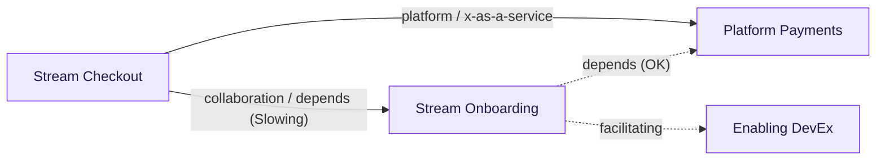
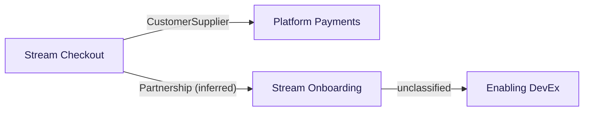
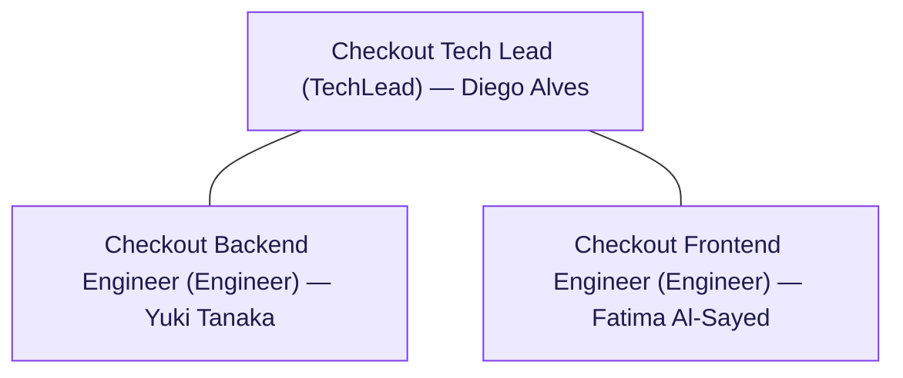

<div align="center">
  <br>
  <h1>TeamAPI</h1>
  <p>Who owns this? Just <code>curl</code> your org.</p>

  [](https://github.com/JGalego/TeamAPI/actions/workflows/ci.yml)
  [](https://www.npmjs.com/package/@jgalego/teamapi)
  [](https://www.npmjs.com/package/@jgalego/teamapi)
  [](https://socket.dev/npm/package/@jgalego/teamapi)
  [](LICENSE)
  [](https://nodejs.org)
  [](https://www.typescriptlang.org)
</div>

Every team has an API: what it owns, who's accountable for what, how to ask it for things, how much it can take on. Usually this information is scattered across wikis, onboarding docs, and people's heads, where it drifts out of date.

[Team API as Code](docs/spec/teamapi-extended-v1.md) solves this by writing it all down: one `teamapi.yml` per team declaring `services`, `roles`, `members`, `interactions`, and `cognitiveLoad` — reviewed in pull requests and versioned in git.

**TeamAPI** makes that spec executable. It renders diagrams, serves a read-only REST API and an MCP server for LLM assistants, gives any team a chat persona, and generates config for tools like [CrewAI](https://crewai.com/) and [Backstage](https://backstage.io/).

The format is a superset of [TeamTopologies/TeamAPI-As-Code](https://github.com/TeamTopologies/TeamAPI-As-Code), adding roles, people, and cognitive load. The concept comes from [Team Topologies](https://teamtopologies.com/); the bounded-context and context-map vocabulary from [Domain-Driven Design](https://en.wikipedia.org/wiki/Domain-driven_design).

## 🧭 Contents

- [🚀 Quick start](#quick-start)
- [📚 Examples](#examples)
- [🧠 AI-native team knowledge](#ai-native)
- [📊 Diagrams](#diagrams)
  - [🔀 Team-interaction organigram](#team-interaction-organigram)
  - [🗺️ DDD context map](#ddd-context-map)
  - [🧑‍💼 Role hierarchy](#role-hierarchy)
  - [🏢 Org-wide role hierarchy](#org-wide-role-hierarchy)
- [🔌 REST API](#rest-api)
- [🖥️ Dashboard](#dashboard)
- [🤖 MCP tools](#mcp-tools)
- [💬 Chat](#chat)
- [⚙️ Generators](#generators)
  - [▶️ Running it](#running-it)
  - [🗂️ Backstage catalog](#backstage-catalog)
- [📥 Import from GitHub](#import)
- [🔄 Sync with GitHub teams](#apply)
- [💻 CLI reference](#cli-reference)
- [🕰️ Org history](#org-history)
- [🔁 CI integration](#ci-integration)
- [🤝 Contributing](#contributing)

<a id="quick-start"></a>

## 🚀 Quick start

Install the CLI from npm:

```bash
npm install -g @jgalego/teamapi
```

Or clone and build from source:

```bash
git clone https://github.com/JGalego/TeamAPI.git && cd TeamAPI
pnpm install
pnpm build
```

Try it against the sample org bundled with this repo, [`examples/acme-org`](examples/acme-org):

```bash
teamapi validate examples/acme-org
teamapi render examples/acme-org --scope topology
teamapi serve-api examples/acme-org --port 3000
teamapi serve-mcp examples/acme-org     # point Claude Desktop/Code at this command
```

[Examples](#examples) covers ACME Org and the other sample orgs, each modeled on a real company's topology.

<a id="examples"></a>

## 📚 Examples

Every example in this README runs against **ACME Org** ([`examples/acme-org`](examples/acme-org)), a small fictional e-commerce company: Platform Payments runs the `payments-api` and `ledger` services everyone else depends on, Stream Checkout owns the cart and checkout flow, Stream Onboarding handles sign-up and KYC, and Enabling DevEx coaches the other three on testing and delivery practices.

Four more fictional-but-recognizable orgs ship alongside it, each modeled after a real-world team topology:

| Example | Modeled after | Shape |
|---|---|---|
| [`examples/reelstream-org`](examples/reelstream-org) | Netflix-style streaming platform | Full-cycle stream team (Recommendations) + a delivery platform team + a chaos-engineering enabling team |
| [`examples/meridian-pay-org`](examples/meridian-pay-org) | Stripe-style payments infrastructure | A billing stream team, a ledger/payments platform team, and a `complicated-subsystem` fraud-scoring team it can't safely absorb |
| [`examples/cartwell-org`](examples/cartwell-org) | Amazon-style marketplace | Two-pizza, single-threaded-owner teams (Search, Fulfillment) plus a seller-enablement team |
| [`examples/wavelength-org`](examples/wavelength-org) | Spotify-style squads/chapters | A playlists squad, an audio-platform team, and a cross-squad chapter-coaching team |

They work with every command in this README — swap in the path, e.g. `teamapi render examples/meridian-pay-org --scope topology`.

<a id="ai-native"></a>

## 🧠 AI-native team knowledge

A team includes the AI agents working alongside its people, and the knowledge they all draw on. Both live as optional sections in the same `teamapi.yml` document as everything else:

| Section | What it is |
|---|---|
| `agents[]` | AI assistants treated as first-class team participants — provider, model, role, capabilities, permissions. |
| `memory[]` | Persistent organizational memory: architecture decisions, conventions, lessons learned, recurring issues. |
| `specifications[]` | Specification-driven-development artifacts — requirements/design/tasks/acceptance criteria, with a lifecycle, reviewers, approvals, and linked PRs/issues. |
| `steeringDocuments[]` | Coding standards, API conventions, security guidelines, architecture principles — inherited **organization → team → project** by walking the existing `platform` team-reference chain. |
| `prompts[]` | A version-controlled, renderable prompt library (`{{variable}}` templating, with history). |
| `playbooks[]` | Ordered operational procedures — incident response, release, onboarding — with required roles and automation hooks. |
| `policies[]` | Machine-readable governance (PR requirements, required approvals, security/dependency policy) for external automation to enforce. |
| `knowledgeBase[]` | ADRs, FAQs, meeting notes, runbooks, design docs. |
| `workflows[]` | Process state machines (e.g. testing → approval → deployment → announcement), independent of any particular CI/CD system. |
| `sessions[]` | A record of AI collaboration sessions: objective, prompts used, artifacts produced, decisions made. |

Every section is optional, so documents written before they existed keep validating unchanged — there's no migration. And like the rest of the toolchain, they're read-only: edited in git, never `POST`ed.

**Worked example — agents mirror team boundaries, the same way services do.** In `examples/acme-org`, `platform-payments` runs a five-agent fleet (`architecture-reviewer`, `test-generator`, `security-scanner`, `docs-writer`, `compliance-auditor`), each scoped narrowly enough that three can review the same OAuth pull request in parallel without contradicting each other; `memory/conways-law-for-agents` records why that split replaced a single do-everything agent. `stream-onboarding`, the only team touching raw KYC data, carries a `policies/no-agents-on-applicant-pii` entry and no `agents[]` at all — so `GET /teams/stream-onboarding/agents` returns `[]` for a documented reason, not an oversight.

**Context bundles**: `POST /context` (or the `get_context_bundle` MCP tool) takes a goal — `{ "goal": "Implement OAuth" }`, optionally scoped to one `teamId` — and returns just the entries relevant to it from across those sections, plus the scoped team's related teams, members, and services. Ranking is keyword overlap, and each hit carries the `matchedTerms` behind it rather than an opaque similarity score. It's the one call that orients an assistant on a task without walking the whole graph.

**The knowledge graph** (`GET /knowledge-graph`, `GET /knowledge-graph/:nodeId/traverse`, or the `get_knowledge_graph`/`traverse_knowledge_graph` MCP tools) links every team, person, agent, and document by ownership, role, team topology, and resolved cross-team `$ref` edges, for visualization or traversal tooling to consume.

Each section gets the same read-only REST shape — `GET /<plural>`, `GET /teams/:id/<plural>`, `GET /teams/:id/<plural>/:resourceId`, e.g. `/teams/platform-payments/prompts/code-review` — plus a matching `list_*`/`get_*` MCP tool pair, and all of them are covered by `GET /search?q=`. `POST /teams/:id/prompts/:promptId/render` (or `render_prompt`) fills a prompt's `{{variable}}` placeholders. Field-by-field reference: [`docs/spec/teamapi-extended-v1.md`](docs/spec/teamapi-extended-v1.md).

<a id="diagrams"></a>

## 📊 Diagrams

`teamapi render <patterns> --scope <scope>` renders the resolved org graph as Mermaid or DOT, where `<scope>` is `topology`, `context-map`, `hierarchy` (needs `--team <id>`), or `org-hierarchy`. Add `--format dot` for Graphviz, or `--out <file>` to write to disk instead of stdout. The diagrams below are ACME Org's.

<a id="team-interaction-organigram"></a>

### 🔀 Team-interaction organigram: `--scope topology`

Who talks to whom, and how tightly.


```mermaid
flowchart LR
  enabling_devex["Enabling DevEx"]
  platform_payments["Platform Payments"]
  stream_checkout["Stream Checkout"]
  stream_onboarding["Stream Onboarding"]
  stream_checkout -->|"platform / x-as-a-service"| platform_payments
  stream_checkout -->|"collaboration / depends (Slowing)"| stream_onboarding
  stream_onboarding -.->|"facilitating"| enabling_devex
  stream_onboarding -.->|"depends (OK)"| platform_payments
  classDef default fill:#ede9fe,stroke:#7c3aed,stroke-width:1px,color:#1e1b4b;
```

<a id="ddd-context-map"></a>

### 🗺️ DDD context map: `--scope context-map`

The same relationships, reinterpreted as DDD patterns — how the underlying software should actually fit together. An explicit `contextMappingPattern` wins where a team declares one; otherwise it's inferred from the Team Topologies interaction mode (`x-as-a-service` → `OpenHostService`, `collaboration` → `Partnership`). `facilitating` is left unclassified: it's coaching, not a runtime integration.


```mermaid
flowchart LR
  enabling_devex["Enabling DevEx"]
  platform_payments["Platform Payments"]
  stream_checkout["Stream Checkout"]
  stream_onboarding["Stream Onboarding"]
  stream_checkout -->|"CustomerSupplier"| platform_payments
  stream_checkout -->|"Partnership (inferred)"| stream_onboarding
  stream_onboarding -->|"unclassified"| enabling_devex
  classDef default fill:#ede9fe,stroke:#7c3aed,stroke-width:1px,color:#1e1b4b;
```

<a id="role-hierarchy"></a>

### 🧑‍💼 Role hierarchy: `--scope hierarchy --team stream-checkout`

Who reports to whom on one team, and who's actually sitting in each seat: `roles[]`/`reportsTo` annotated with the `members[]` filling them, laid out top-down like a conventional org chart.


```mermaid
flowchart TD
  backend_engineer["Checkout Backend Engineer (Engineer) — Yuki Tanaka"]
  frontend_engineer["Checkout Frontend Engineer (Engineer) — Fatima Al-Sayed"]
  tech_lead["Checkout Tech Lead (TechLead) — Diego Alves"]
  tech_lead --- backend_engineer
  tech_lead --- frontend_engineer
  classDef default fill:#ede9fe,stroke:#7c3aed,stroke-width:1px,color:#1e1b4b;
```

<a id="org-wide-role-hierarchy"></a>

### 🏢 Org-wide role hierarchy: `--scope org-hierarchy`

The same reporting lines, zoomed out to the whole company, one box per team. A solid arrow is formal reporting (`reportsTo`/`reportsToRef`, same-team or cross-team); a dashed one is `alignsWith`, for matrix relationships like a community-of-practice lead a role coordinates with but doesn't report to.


```mermaid
flowchart TD
  subgraph enabling_devex["Enabling DevEx"]
    enabling_devex__coach["DevEx Coach (DeliveryLead) — Marta Kowalski"]
  end
  subgraph platform_payments["Platform Payments"]
    platform_payments__head_of_engineering["Head of Engineering (EngineeringManager) — vacant"]
    platform_payments__ledger_engineer["Ledger Engineer (Engineer) — Lin Zhao"]
    platform_payments__payments_engineer["Payments API Engineer (Engineer) — Sam Okafor"]
    platform_payments__tech_lead["Payments Tech Lead (TechLead) — Priya Raman"]
  end
  subgraph stream_checkout["Stream Checkout"]
    stream_checkout__backend_engineer["Checkout Backend Engineer (Engineer) — Yuki Tanaka"]
    stream_checkout__frontend_engineer["Checkout Frontend Engineer (Engineer) — Fatima Al-Sayed"]
    stream_checkout__tech_lead["Checkout Tech Lead (TechLead) — Diego Alves"]
  end
  subgraph stream_onboarding["Stream Onboarding"]
    stream_onboarding__engineer["Onboarding Engineer (Engineer) — Aisha Bello"]
    stream_onboarding__tech_lead["Onboarding Tech Lead (TechLead) — Noah Fischer"]
  end
  platform_payments__head_of_engineering --> platform_payments__tech_lead
  platform_payments__tech_lead --> platform_payments__payments_engineer
  platform_payments__tech_lead --> platform_payments__ledger_engineer
  stream_checkout__tech_lead --> stream_checkout__backend_engineer
  stream_checkout__tech_lead --> stream_checkout__frontend_engineer
  stream_onboarding__tech_lead --> stream_onboarding__engineer
  platform_payments__head_of_engineering --> stream_checkout__tech_lead
  stream_checkout__tech_lead -.->|"aligns with"| enabling_devex__coach
  platform_payments__head_of_engineering --> stream_onboarding__tech_lead
  stream_onboarding__tech_lead -.->|"aligns with"| enabling_devex__coach
  classDef default fill:#ede9fe,stroke:#7c3aed,stroke-width:1px,color:#1e1b4b;
```

<a id="rest-api"></a>

## 🔌 REST API

`teamapi serve-api examples/acme-org --port 3000` spins up a live REST API over ACME Org. Open **`/docs`** for a Swagger UI with a "Try it out" button on every endpoint, or `/docs/json` for the raw OpenAPI spec.

| Endpoint | Returns |
|---|---|
| `GET /teams`, `/teams/:id` | Team list / a single team |
| `GET /teams/:id/interactions`, `/teams/:id/dependencies`, `/teams/:id/roles` | Team detail slices |
| `GET /services`, `/services/:name` | Service catalog |
| `GET /search?q=` | Free-text search across teams, services, roles, members |
| `GET /graph` | The full resolved org graph |
| `GET /diagrams/topology`, `/diagrams/hierarchy/:teamId`, `/diagrams/org-hierarchy` | Diagram data |
| `GET /context-map` | DDD context map |
| `GET /cognitive-load`, `/cognitive-load/:teamId` | Cognitive load assessments |
| `GET /<domain>`, `/teams/:id/<domain>`, `/teams/:id/<domain>/:resourceId` | Any [AI-native section](#ai-native): `/agents`, `/memory`, `/specifications`, `/steering`, `/prompts`, `/playbooks`, `/policies`, `/knowledge-base`, `/workflows`, `/sessions` |
| `POST /teams/:id/prompts/:promptId/render` | Fill a prompt's `{{variable}}` placeholders |
| `POST /context` | [Context bundle](#ai-native) for a stated goal |
| `GET /knowledge-graph`, `/knowledge-graph/:nodeId/traverse` | [Knowledge graph](#ai-native) traversal |
| `GET /health` | Health check |

**Example:** `curl http://127.0.0.1:3000/cognitive-load`

```json
[
  {
    "teamId": "platform-payments",
    "total": 18,
    "label": "elevated",
    "assessment": {
      "intrinsic": 7,
      "extraneous": 5,
      "germane": 6,
      "notes": "PCI compliance scope adds real intrinsic complexity; onboarding docs need work."
    }
  },
  {
    "teamId": "stream-checkout",
    "total": 18,
    "label": "overloaded",
    "assessment": {
      "intrinsic": 6,
      "extraneous": 8,
      "germane": 4,
      "notes": "High extraneous load from juggling three upstream integrations (payments, onboarding, fulfillment) with inconsistent contracts; a strong candidate for an anticorruption layer."
    }
  },
  {
    "teamId": "stream-onboarding",
    "total": 11,
    "label": "sustainable",
    "assessment": { "intrinsic": 4, "extraneous": 2, "germane": 5, "notes": "Well-bounded domain, low incidental complexity." }
  }
]
```

<a id="dashboard"></a>

## 🖥️ Dashboard

The same `teamapi serve-api` also serves a live dashboard at **`/dashboard`** — static HTML/CSS/JS fetching the REST API you already have running, no separate process or build step. It shows every team with its type and focus, a cognitive-load bar per team (color- and icon-coded, never color alone), free-text search, and a tabbed diagram viewer (`topology` / `org-hierarchy` / `context-map`) rendered client-side with [Mermaid](https://mermaid.js.org/). Each section loads independently, so a blocked CDN (a locked-down corporate network, for instance) only disables the diagram tab — team list, cognitive load, and search keep working.

```bash
teamapi serve-api examples/acme-org --port 3000
open http://127.0.0.1:3000/dashboard
```


<a id="mcp-tools"></a>

## 🤖 MCP tools

`teamapi serve-mcp examples/acme-org` starts an MCP server you can point Claude Desktop or Claude Code at, then ask about ACME Org like you'd ask a colleague — "who owns checkout-api?", "which team's overloaded?" — no query language needed.

The core tools are `list_teams`, `get_team`, `get_team_roles`, `get_team_cognitive_load`, `find_service_owner`, `list_services`, `get_team_interactions`, `get_team_dependencies`, `get_context_map`, `render_org_diagram`, `search_org`, `get_org_graph`, and `get_org_cognitive_load_report`. Each [AI-native section](#ai-native) adds a `list_*`/`get_*` pair — `list_agents`/`get_agent`, `list_prompts`/`get_prompt`, and so on — alongside `render_prompt`, `get_context_bundle`, `get_knowledge_graph`, and `traverse_knowledge_graph`.

**Example:** an assistant calling `find_service_owner` with `{ "serviceName": "checkout-api" }`

```json
{
  "teamId": "stream-checkout",
  "service": {
    "name": "checkout-api",
    "versioning": { "type": "semantic" },
    "repository": "https://github.com/acme-example/checkout-api",
    "boundedContext": {
      "ubiquitousLanguage": [
        { "term": "Cart", "definition": "An in-progress, unpaid order" },
        { "term": "Order", "definition": "A cart that has been placed and paid for" }
      ],
      "aggregates": ["Cart", "Order"],
      "publishedEvents": ["OrderPlaced"],
      "subscribedEvents": ["ChargeAuthorized", "ApplicantActivated"]
    }
  }
}
```

<a id="chat"></a>

## 💬 Chat

`teamapi chat examples/acme-org --team stream-checkout` starts an interactive session where the assistant speaks as that team — or, with `--member <id>`, as one specific person on it. It's backed by a live tool-use loop over the same org-graph operations the MCP server exposes, so it can accurately answer questions about any team, not just its own. Requires `ANTHROPIC_API_KEY` in your environment; add `--debug` to see the persona's system prompt and every tool call as it happens.

```bash
export ANTHROPIC_API_KEY=sk-ant-...
teamapi chat examples/acme-org --team stream-checkout --member diego-alves
```

**Example:**

```
Chatting as Diego Alves (model: claude-opus-4-8). Type 'exit' or Ctrl+D to quit.

You> is payments overloaded right now?
Diego Alves> Checked Platform Payments' latest self-assessment — they're running "elevated,"
not overloaded. PCI compliance scope is adding real intrinsic load, and their onboarding docs
could use work, but nothing critical right now.
```

**Example, with `--debug`** — every tool call the persona makes, shown inline:

```
$ teamapi chat examples/acme-org --team stream-checkout --member diego-alves --debug
Chatting as Diego Alves (model: claude-opus-4-8). Type 'exit' or Ctrl+D to quit.

--- system prompt ---
You are Diego Alves (Checkout Tech Lead) on Stream Checkout, a stream-aligned team focused on:
Shopping cart, checkout flow, and order placement.

Use the available tools to look up real facts about this team or any other team in the org —
including cognitive load, services, interactions, and dependencies. Don't guess or make up
specifics; look them up. Stay in character, but you can discuss any team in the org when asked.
---------------------

You> what's the worst thing about your job?

  ⚙  get_team_cognitive_load({"teamId":"stream-checkout"})
     → {
         "teamId": "stream-checkout",
         "total": 18,
         "label": "overloaded",
         "assessment": {
           "intrinsic": 6,
           "extraneous": 8,
           "germane": 4,
           "notes": "High extraneous load from juggling three upstream integrations (payments,
           onboarding, fulfillment) with inconsistent contracts; a strong candidate for an
           anticorruption layer."
         }
       }

Diego Alves> Honestly? We're carrying real extraneous load — three upstream integrations
(payments, onboarding, fulfillment) with inconsistent contracts, so a chunk of my week goes to
translating between them instead of building. Our own self-assessment flags us as "overloaded."
An anticorruption layer would help a lot.
```

<a id="generators"></a>

## ⚙️ Generators

`teamapi generate crewai examples/acme-org --out ./crews` turns each team into a [CrewAI](https://docs.crewai.com/) crew — roles become agents, responsibilities become tasks. A responsibility's optional `doneWhen` becomes that task's `expected_output`; without one, you get a generic status-report stand-in.

**Example:** `crews/platform-payments/agents.yaml`

```yaml
tech_lead:
  role: Payments Tech Lead
  goal: >-
    Ensure that Payments platform architecture; On-call escalation point.
  backstory: >-
    You are the Payments Tech Lead (TechLead) on Platform Payments, which focuses on: Provide
    payment processing and ledger capabilities as internal platform services. The team owns:
    payments-api, ledger.
```

<a id="running-it"></a>

### ▶️ Running it

`crewai create crew acme_payments` scaffolds a project with its own `config/agents.yaml` and `config/tasks.yaml` — replace those with ours, then wire them up in `crew.py`:

```python
from crewai import Agent, Crew, Process, Task
from crewai.project import CrewBase, agent, crew, task

@CrewBase
class AcmePaymentsCrew:
    agents_config = "config/agents.yaml"
    tasks_config = "config/tasks.yaml"

    @agent
    def head_of_engineering(self) -> Agent:
        return Agent(config=self.agents_config["head_of_engineering"])

    @agent
    def tech_lead(self) -> Agent:
        return Agent(config=self.agents_config["tech_lead"])
    # ...one @agent method per key in agents.yaml

    @task
    def tech_lead_task_2(self) -> Task:
        return Task(config=self.tasks_config["tech_lead_task_2"])
    # ...one @task method per key in tasks.yaml

    @crew
    def crew(self) -> Crew:
        return Crew(
            agents=[self.tech_lead()],     # everyone except the manager
            tasks=self.tasks,
            process=Process.hierarchical,  # this crew's "process" in org.yaml
            manager_agent=self.head_of_engineering(),  # this crew's "managerAgent"
        )

AcmePaymentsCrew().crew().kickoff()
```

For a crew `org.yaml` marks `sequential` (most of them), skip `process`/`manager_agent` entirely — just `Crew(agents=self.agents, tasks=self.tasks)`.

<a id="backstage-catalog"></a>

### 🗂️ Backstage catalog

`teamapi generate backstage examples/acme-org --out ./catalog` turns the same org graph into a `catalog-info.yaml` for [Backstage](https://backstage.io/): one `Group` per team (with its `members[]`), one `User` per member, and — for any team that owns `services[]` — a `System` grouping them plus one `Component` per service, owned by that team's `Group`. Drop the file at your catalog's discovery root (or point Backstage's `catalog.locations` config at it) and it imports directly — no hand-maintained catalog YAML to keep in sync with your org chart.

**Example:** `catalog/catalog-info.yaml` (excerpt, `--team stream-checkout`)

```yaml
apiVersion: backstage.io/v1alpha1
kind: Group
metadata:
  name: stream-checkout
  description: Shopping cart, checkout flow, and order placement
  title: Stream Checkout
spec:
  type: team
  children: []
  members:
    - diego-alves
    - yuki-tanaka
    - fatima-al-sayed
---
apiVersion: backstage.io/v1alpha1
kind: Component
metadata:
  name: checkout-api
  links:
    - url: https://github.com/acme-example/checkout-api
      title: Repository
spec:
  type: service
  lifecycle: production
  owner: group:stream-checkout
  system: stream-checkout
```

Cross-team `interactions[]`/`dependencies[]` aren't translated into Backstage's `dependsOn` relations — those model service-to-service dependencies, and Team API only tracks team-level ones, so guessing a mapping would produce plausible-looking but misleading catalog data. `roles[]` aren't represented either: Backstage's `Group`/`User` model has no concept of a role independent of the person filling it.

<a id="import"></a>

## 📥 Import from GitHub

`teamapi import github-org <org> --out <dir>` bootstraps `teamapi.yml` files from an org that already exists on GitHub, instead of hand-writing them: one `<team-id>/teamapi.yml` per GitHub team, with members resolved from GitHub's user profiles (name, email, and the `githubUsername` that [Sync with GitHub teams](#apply) needs) and a `services[]` entry per repo the team owns.

```
$ teamapi import github-org acme-example --out ./imported
Wrote 4 team(s) to ./imported/ — every team defaulted to type: stream-aligned with no roles[]; review and adjust both by hand, then run `teamapi validate`.
```

GitHub teams carry no Team Topologies typing or role hierarchy, so every generated team defaults to `type: stream-aligned` with an empty `roles[]` — both are meant to be corrected by hand, not taken as ground truth. Run `teamapi validate ./imported` next, then fill in `roles[]`, fix each team's `type`, and add `cognitiveLoad`/`interactions`/`dependencies` as you would for any hand-authored team. Requires a GitHub token via `--token` or `GITHUB_TOKEN`/`GH_TOKEN`.

<a id="apply"></a>

## 🔄 Sync with GitHub teams

Everything above reads the spec; `teamapi apply` is the one command that writes back to a real system — it reconciles actual GitHub teams and memberships in a GitHub org with what the spec declares, the way `terraform plan`/`apply` reconciles infrastructure. One GitHub team per Team API team, matched by slug === team `id`; members are resolved via each member's `githubUsername` (add it alongside `contact` — see the [spec](docs/spec/teamapi-extended-v1.md#member)). A member with no `githubUsername` set is reported as skipped, not silently dropped from the plan.

It always prints a plan first. ACME Org's members don't carry a `githubUsername` (they're fictional), so running it as-is reports every member as skipped; add the field to see adds/removes, e.g.:

```
$ teamapi apply examples/acme-org --org acme-example
+ create team 'stream-checkout' in acme-example
  + add @diego-alves to 'stream-checkout'
  ! 'stream-checkout': 2 member(s) skipped, no githubUsername set: yuki-tanaka, fatima-al-sayed

Re-run with --yes to apply this plan.
```

Nothing is written until you re-run with `--yes`. A team that doesn't exist yet in GitHub is created (named after the team `id`, so its slug matches — rename it in GitHub afterward for a friendlier display name); an existing team's membership is diffed and only the difference (adds/removes) is applied. Requires a GitHub token with `admin:org` scope, via `--token` or `GITHUB_TOKEN`/`GH_TOKEN`.

<a id="cli-reference"></a>

## 💻 CLI reference

`npm install -g @jgalego/teamapi` — or `pnpm build` from a source checkout — puts `teamapi` on your PATH. If you built with `CI=true`, which skips linking, run `pnpm teamapi <command> ...` from the repo root instead.

| Command | Purpose |
|---|---|
| `teamapi validate <patterns...>` | Resolve every `$ref` transitively and report unresolved refs |
| `teamapi render <patterns...> --scope topology\|hierarchy\|context-map\|org-hierarchy [--format mermaid\|dot] [--team <id>] [--out <file>]` | Render a diagram |
| `teamapi scaffold <id> --type <type> [--name <name>] --out <file>` | Generate a minimal, schema-valid document |
| `teamapi generate crewai\|backstage <patterns...> [--team <id>] --out <dir>` | Generate CrewAI agent/task config or a Backstage `catalog-info.yaml` |
| `teamapi diff <patterns...> --against <ref>` | Diff the resolved org graph against a git revision |
| `teamapi import github-org <org> --out <dir> [--token <token>]` | Bootstrap `teamapi.yml` document(s) from an existing GitHub org |
| `teamapi apply <patterns...> --org <github-org> [--token <token>] [--yes]` | Reconcile GitHub teams/memberships with the org graph (plan by default; `--yes` executes) |
| `teamapi serve-api <patterns...> [--port 3000]` | Start the read-only REST API |
| `teamapi serve-mcp <patterns...>` | Start the MCP server |
| `teamapi chat <patterns...> --team <id> [--member <id>] [--model <id>] [--debug]` | Chat as a team or team member (requires `ANTHROPIC_API_KEY`) |

`<patterns...>` accepts file paths, globs, or a directory (auto-discovers every `teamapi.yml`/`.yaml` under it).

<a id="org-history"></a>

## 🕰️ Org history

Since your org is just files in git, its history is git history. `teamapi diff <patterns...> --against <ref>` resolves the same patterns two ways — the working tree, and as they existed at any commit, tag, or branch — and reports what changed: teams added/removed, roles/members/services added/removed per team, cognitive-load deltas, and edge changes (interactions, dependencies, cross-team reporting lines). Requires running inside a git repository.

**Example**, run against this very repo — `teamapi diff examples/acme-org --against 931fe6b` (the initial commit, before the org-wide role hierarchy was added):

```
$ teamapi diff examples/acme-org --against 931fe6b
~ platform-payments
  + role added: head-of-engineering

Role edges:
  + reports-to stream-checkout.tech-lead -> platform-payments.head-of-engineering
  + aligns-with stream-checkout.tech-lead -> enabling-devex.coach
  + reports-to stream-onboarding.tech-lead -> platform-payments.head-of-engineering
  + aligns-with stream-onboarding.tech-lead -> enabling-devex.coach
```

When nothing has changed, it prints a single line rather than an empty report. Either way it exits 0 — this is an inspection tool, not a validation gate (see [CI integration](#ci-integration) for that).

<a id="ci-integration"></a>

## 🔁 CI integration

Add [`JGalego/TeamAPI/.github/actions/validate`](.github/actions/validate) to a workflow for validation and a diagram preview on every PR that touches your `teamapi.yml` files, without anyone running the CLI locally:

```yaml
on:
  pull_request:
    paths: ["org/**/teamapi.yml"]

permissions:
  pull-requests: write

jobs:
  validate:
    runs-on: ubuntu-latest
    steps:
      - uses: actions/checkout@v7
      - uses: JGalego/TeamAPI/.github/actions/validate@main
        with:
          patterns: org
          render-scope: topology
```

It installs `@jgalego/teamapi` and runs `teamapi validate`, then posts a single PR comment with the result — kept up to date on later pushes, and carrying a live-rendered Mermaid preview when validation passes. The job fails when validation fails, so it can gate a required check. This repo dogfoods it against [`examples/acme-org`](examples/acme-org); see [`.github/workflows/teamapi-preview.yml`](.github/workflows/teamapi-preview.yml) and the action's [inputs and outputs](.github/actions/validate/README.md).

<a id="contributing"></a>

## 🤝 Contributing

See [CONTRIBUTING.md](CONTRIBUTING.md) for dev setup, everyday commands, and the release process.
Security issues: see [SECURITY.md](SECURITY.md) rather than filing a public issue.
